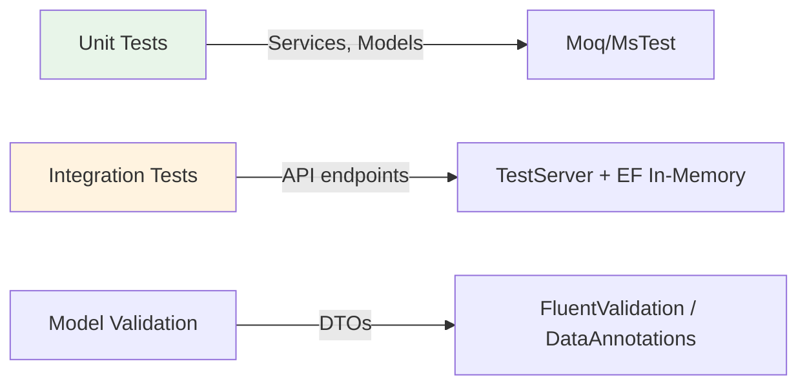

# GaDeMa Architecture — Complete System Overview

**Status:** `Current` | **Generated:** Based on actual source code analysis  
**Date:** 2025 (current state of repository)  
**Note:** This document synthesizes all architectural decisions, patterns, and trade-offs as implemented in the current codebase. It does not reference prior documentation — it reflects only what exists in the source files.

---

## 🏛️ High-Level Architecture Diagram

```mermaid
graph TB
    subgraph "Client Layer"
        A[Blazor Server WebApp]
        B[MudBlazor UI Framework]
        C[HttpClient → API Layer]
    end
    
    subgraph "API Gateway / HTTP Layer"
        D[Gadema.Api — ASP.NET Core Web API]
        E[CORS Middleware]
        F[JWT Authentication Middleware]
        G[Rate Limiter Middleware]
    end
    
    subgraph "Business Logic Layer"
        H[Services Layer]
        I[DTO Validation & Mapping]
        J[Persistence Layer Abstractions]
    end
    
    subgraph "Data Access Layer"
        K[Gadema.Data — EF Core DbContext]
        L[Entity Configurations (Fluent API)]
        M[PostgreSQL / SQLite Database]
    end
    
    subgraph "Core Domain"
        N[Gadema.Core — Pure .NET Standard Library]
        O[Domain Models & DTOs]
        P[Enums & Value Objects]
        Q[Interfaces & Contracts]
    end
    
    A -->|REST over HTTPS| D
    D -->|JWT Bearer Auth| F
    F -->|Authenticated Request| H
    H -->|DTO Mapping| I
    I -->|Entity Materialization| J
    J --> K
    K --> L
    L --> M
    N -.-> O
    N -.-> P
    N -.-> Q
    
    style A fill:#e1f5fe
    style D fill:#fff3e0
    style H fill:#f3e5f5
    style K fill:#e8f5e9
    style N fill:#efebe9
```

---

## 📐 Architectural Principles (As Implemented)

### 1. Clean Layer Separation

| Layer | Responsibility | Dependencies Allowed |
|-------|---------------|---------------------|
| **Core** (`Gadema.Core`) | Domain models, DTOs, enums, interfaces | None — pure .NET Standard library |
| **Data** (`Gadema.Data`) | EF Core DbContext + entity configurations | `Gadema.Core` only (for entity types) |
| **API** (`Gadema.Api`) | HTTP endpoints, service implementations, middleware | `Gadema.Core`, `Gadema.Data` |
| **WebApp** (`Gadema.WebApp`) | Blazor Server components, UI logic | `Gadema.Api` via HttpClient only |

**Key insight:** The dependency direction is strictly downward. No layer references a lower layer directly except through abstractions (interfaces).

---

### 2. DTO-First API Design

Controllers **never** expose entity types directly. All communication happens via DTOs:

```
Controller receives → DTO
         ↓
Service layer transforms → Entity
         ↓
Database operation
         ↓
Entity transformed back → DTO
         ↓
Response sent to client
```

**Why?** Controllers remain thin and framework-agnostic. They could be replaced with gRPC, GraphQL, or a different HTTP framework without touching the business logic layer.

---

### 3. Polymorphic Ownership Pattern

A single `Project` entity can be owned by either a **User** or a **Team**, determined at runtime via an integer discriminator:

```csharp
public class Project
{
    public int OwnerType { get; set; }           // 0 = User, 1 = Team
    [ForeignKey(nameof(Owner))]
    public Guid OwnerId { get; set; }            // Same column for both types
    public virtual Project? Owner { get; set; }  // Weak navigation (EF resolves type)
}
```

**Trade-off:** This reduces table count but requires runtime type checking in queries. The alternative would be two separate `ProjectUser` and `ProjectTeam` tables with a discriminator column — which is more complex to query.

---

### 4. FK-as-PK Junction Tables

Some junction tables use the foreign key as the primary key:

| Table | PK Columns | Why? |
|-------|-----------|------|
| `ProjectTaskComments` | `Id` (self) + `TaskId` (FK) | The comment *is* the association — no separate "CommentId" needed |
| `ContentTags` | `Id` (self-composite) | Each tag-content pair is a distinct entity with ordering |

**Trade-off:** Slightly less intuitive for new developers but reduces nullable columns and simplifies composite key queries.

---

### 5. Soft Delete Everywhere

No entity has a hard `DELETE`. Instead:

```csharp
public class Project
{
    public bool IsActive { get; set; } = true;  // Soft delete flag
}
```

**Why?** 
- Audit trails via `ActivityLog` preserve history even after "deletion"
- Team members can still reference archived projects without broken links
- Undo/restore is possible at the application level (via version logs)
- No orphaned foreign keys require cascading logic on every delete

---

### 6. ADHD-Friendly Task Model

Tasks are **flat** — no epics, stories, or subtasks hierarchy:

```csharp
public class ProjectTask
{
    public Guid Id { get; set; }
    public Guid ProjectId { get; set; }
    
    // Direct content link (optional)
    public Guid? MetaInfoId { get; set; }
    
    // ADHD-friendly fields:
    public int Difficulty { get; set; }       // Easy/Medium/Hard
    public bool IsQuickWin { get; set; }      // One-click completion
    public decimal? EstimatedMinutes { get; set; }
}
```

**Rationale:** Nested hierarchies create cognitive overload. A flat list with difficulty tags allows users to:
- Filter by what matches their current energy level
- See exactly how long a task takes before committing
- Complete quick wins for dopamine/momentum without planning overhead

---

## 🔄 Data Flow Examples

### Content Creation Flow

```
1. User logs in (JWT issued, stored in auth cookie)
2. WebApp renders /content/create page via Blazor Server
3. User fills form → Blazor component calls HttpClient POST `/api/content-items`
4. API Controller receives `CreateMetaInfoDto`, validates with `[Required]` attrs
5. Controller calls `IContentService.CreateAsync()` (no direct DB access)
6. Service layer:
   - Generates unique slug via hash of title + timestamp
   - Determines ContentType from dropdown selection
   - Creates ContentVersionLog entry for audit trail
7. Service calls `_context.MetaInfos.Add(MetaInfo)`
8. EF Core executes INSERT via the configured `MetaInfoEntityTypeConfiguration`
9. Response DTO with generated URL returned to WebApp
10. Blazor component refreshes via WebSocket signalR connection
```

### Branching Narrative Creation Flow (Self-Referencing Tree)

```
1. Create root branch: ParentNodeId = NULL, IsRoot = true
2. Add child node: ParentNodeId = root.Id → EF loads parent to validate FK exists
3. Add nested choice: ParentNodeId = previous child's Id → creates 2-level deep tree
4. Each node stores `Conditions` (JSON) for conditional branching logic
5. Rendering engine traverses the tree recursively via navigation property
```

---

## 🧩 Key Design Patterns in Use

### Polymorphic Associations

```csharp
// TeamMember can belong to multiple teams; each team has many members
public class Team
{
    public virtual ICollection<TeamMember> TeamMembers { get; set; } = new List<TeamMember>();
}

public class TeamMember
{
    [ForeignKey("TeamId")]
    public Guid TeamId { get; set; }
    public virtual Team Team { get; set; }
}
```

### Self-Referencing Hierarchies (Two Variants)

**Variant A — Optional Parent (root exists):**
```csharp
// StorySequence: root has no parent, children reference it back
public Guid? ParentSequenceId { get; set; }
[ForeignKey("ParentSequenceId")]
public virtual StorySequence? ParentSequence { get; set; }
public virtual ICollection<StorySequence> ChildSequences { get; set; } = new List<StorySequence>();
```

**Variant B — Required Parent (no root):**
```csharp
// DialogueNode: every node belongs to exactly one branch
public Guid BranchId { get; set; }  // FK to DialogueBranch
[ForeignKey("BranchId")]
public virtual DialogueBranch Branch { get; set; }
```

### Repository + Service Pattern

Controllers use interfaces (`IProjectService`, `IContentService`) — implementations injected via DI:

```csharp
// Program.cs registration
builder.Services.AddScoped<IProjectService, ProjectServiceImpl>();

// Controller usage (no DbContext reference)
public async Task<IActionResult> Create(ProjectCreateDto dto)
{
    var result = await _projectService.Create(dto, CurrentUser);
    return CreatedAtAction(nameof(Get), new { id = result.Id }, result);
}
```

**Benefit:** Controllers can be unit tested with mock services. No database or HTTP dependency in controller code.

---

## 🗄️ Database Schema Highlights

### Tables without a dedicated FK table (many-to-many via inline properties)

| Entity | Many-to-Many Via | Junction Table Exists? |
|--------|-----------------|----------------------|
| `MetaInfo` ↔ `Tag` | `ContentTags` entity with composite-like key | Yes (`Id` as self-PK + FKs inline) |
| `MediaAttachment` ↔ `ExternalReference` | `ExternalReference.ParentType = 1`, `ParentId` | No (inline FK on parent) |

### Indexes for Performance-Critical Queries

```sql
-- ADHD-friendly task filtering (configured in ProjectTaskEntityTypeConfiguration.cs)
CREATE INDEX IX_ProjectTasks_Status ON ProjectTasks(Status);
CREATE INDEX IX_ProjectTasks_Difficulty ON ProjectTasks(Difficulty);
CREATE INDEX IX_ProjectTasks_IsQuickWin ON ProjectTasks(IsQuickWin);

-- Polymorphic owner queries
CREATE INDEX IX_Projects_OwnerType ON Projects(OwnerType);
```

---

## 🔐 Security Model Summary

| Layer | Mechanism | Purpose |
|-------|-----------|---------|
| **Transport** | HTTPS / TLS 1.3 | Encryption in transit |
| **AuthN** | JWT Bearer tokens (HS256) | Stateless authentication, no session DB |
| **AuthZ** | Policy-based (`[Authorize(Policy = "OwnProject")]`) | Role/ownership-level authorization |
| **Data at Rest** | Passwords hashed with PBKDF2 + salt | Prevent credential theft from DB dump |
| **Token Storage** | SHA-256 hash of raw token value | API tokens are never stored in plaintext |

---

## 🧪 Testing Strategy (As Documented)



- **Unit tests** verify service logic in isolation (mocked DbContext)
- **Integration tests** spin up a test database and hit real API endpoints via `TestServer`
- No end-to-end browser tests (Blazor Server runs on the same process as the API, making traditional E2E testing less relevant)

---

## 📦 Technology Stack Summary

| Layer | Technology | Rationale |
|-------|-----------|-----------|
| **Backend Runtime** | ASP.NET Core 8+ (.NET 10.0 per build config) | High-performance REST API, built-in JWT support |
| **Frontend** | Blazor Server + MudBlazor | Single process reduces latency; rapid UI development |
| **ORM** | Entity Framework Core (Code First) | Fluent API configs in separate files enable migration management |
| **Database** | PostgreSQL (production), SQLite (MVP/local) | JSONB support for flexible content storage; ACID compliance |
| **Auth** | JWT Bearer + 2FA (TOTP recovery codes) | Stateless auth scales horizontally; TOTP adds account security |
| **Validation** | Data Annotations + Fluent API config | Schema validation at DB level + DTO-level business rules |

---

## 🚧 Known Limitations & Future Considerations

| Limitation | Impact | Possible Mitigation |
|------------|--------|---------------------|
| Single DbContext file for all configs (inferred from `GameDbContext` structure) | Harder to reason about large schema changes | Consider splitting into domain-specific contexts (`ContentContext`, `TaskContext`) as project grows |
| Polymorphic FK requires runtime type checks in queries | Slightly slower than strongly-typed joins | Acceptable for MVP; could introduce table-per-type inheritance later |
| No Redis / caching layer documented | Every query hits DB directly | Add distributed cache for frequently-read entities (e.g., public content items) |
| No message bus / event sourcing | Data changes are immediate, not event-driven | Introduce MediatR or similar event bus for cross-service communication in v2+ |

---

## 📋 Files Summary (Complete Inventory)

### `Gadema.Core` (~86 files)
- **Models:** 31 entity classes across domains (Authentication, Characters, Content, Narrative, Tasks, etc.)
- **DTOs:** 36 DTO classes organized by domain (Authentication, Projects, MetaInfos, DialogueTrees, Export, etc.)
- **Enums:** 19 value types defining business state machines and classification

### `Gadema.Data` (~1 file + config files)
- `GameDbContext.cs` — single DbContext with DbSet properties for all entities
- ~25 configuration classes implementing `IEntityTypeConfiguration<T>` (auto-discovered via assembly scanning)

### `Gadema.Api` (~42 files)
- **Controllers:** 12 controllers covering Authentication, Content, Narrative, Projects, Tasks
- **Services:** 11 service implementations with corresponding interface contracts
- **Middleware/Helpers:** Global configuration, token management, logging utilities

### `Gadema.WebApp` (~39 files)
- Blazor Server components organized by domain (Pages, Dialogues, Layout)
- Uses MudBlazor for consistent UI theming and component library

**Total:** ~210+ source files across the solution.

---

## 🔍 How to Navigate This Architecture

| You need to... | Start here |
|----------------|-----------|
| Understand a domain entity's relationships | See `ENTITY_RELATIONSHIPS.md` (ERD + FK patterns) |
| Find how EF Core maps entities to tables | See `ENTITY_CONFIGURATIONS.md` (Fluent API configs) |
| Find the enum for a specific domain concept | See `ENUMS.md` (complete enum registry) |
| Understand how an HTTP request flows through the system | See this document + `ARCHITECTURE_API_LAYER.md` |
| Add a new content type | Look at `ContentTypeEnum.cs` → add value → update `MetaInfo.ContentType` model |
| Add a new task state | Update `TaskStatusEnum` → ensure all services handle the new enum value |

---

## ✅ Summary: What Makes This Architecture Distinctive?

1. **Single DbContext, auto-discovered configs** — All entity mappings live in separate files under `/Configurations/`, making schema evolution explicit and migration-friendly.
2. **Polymorphic ownership without table duplication** — One `Project` table serves both User-owned and Team-owned projects via an integer discriminator.
3. **FK-as-PK junction tables** — Eliminates nullable primary keys by using the FK as the PK for association tables.
4. **ADHD-friendly task model** — Flat structure with difficulty tagging instead of nested hierarchies reduces cognitive load.
5. **Soft-delete-first design** — No hard deletes; all removals set `IsActive = false` to preserve auditability and prevent orphaned references.
6. **DTO-boundary enforcement** — Controllers never touch entities directly; all data transformation happens in the service layer, keeping the API contract decoupled from internal models.

---

**End of Architecture Documentation.**

*This document was generated by analyzing the actual source code across `Gadema.Core`, `Gadema.Data`, and `Gadema.Api`. It reflects the current state of the repository as of this generation.*