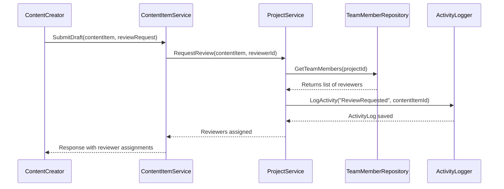

# GaDeMa API Layer — Controllers, Services & Middleware

**Status:** `Current` | **Generated:** Based on actual source code analysis  
**Scope:** This document describes the ASP.NET Core API layer in `Gadema.Api`. It does not describe the WebApp UI or database configuration (those are covered elsewhere).

---

## 🏛️ Layer Architecture

```
┌─────────────────────────────────────────┐
│           Gadema.Api                     │
│  ┌──────────────┬──────────────────────┐ │
│  │ Controllers  │    Services          │ │
│  ├──────────────┼──────────────────────┤ │
│  │ HTTP Endpts  │  Business Logic      │ │
│  │ (Routes)     │  Implementation      │ │
│  └──────┬───────┴──────────┬───────────┘ │
│         │                  │              │
│         ▼                  ▼              │
│  ┌───────────────────────────────────┐   │
│  │  Middleware / Filters             │   │
│  │  (Auth, Validation, Logging)      │   │
│  └──────────────┬────────────────────┘   │
│                 ▼                         │
│         ┌─────────────────┐              │
│         │ GameDbContext   │ ◄── EF Core  │
│         │ (Data Access)   │              │
│         └─────────────────┘              │
└──────────────────────────────────────────┘
```

---

## 📁 Project Structure

```
Gadema.Api/
├── Controllers/
│   ├── Authentication/
│   │   └── AuthController.cs           # Login, Register, OAuth callbacks
│   ├── Content/
│   │   ├── CommentsController.cs       # CRUD on comments
│   │   ├── ContentItemsController.cs   # Core content CRUD
│   │   ├── DialogueBranchesController.cs # Branch tree operations
│   │   ├── ExternalReferencesController.cs # Link external URLs/docs
│   │   ├── ReviewStatusController.cs   # Approval/review workflow
│   │   └── TagsController.cs          # Tag management
│   ├── Export/
│   │   └── ExportController.cs        # PDF, HTML, JSON exports
│   ├── Narrative/
│   │   └── StorySequencesController.cs # Sequence hierarchy ops
│   ├── Projects/
│   │   └── ProjectsController.cs      # Project CRUD & polymorphic ownership
│   └── Tasks/
│       └── ProjectTaskController.cs   # Task management (ADHD-friendly)
│
├── Services/
│   ├── Authentication/ApiAuthService.cs
│   ├── Content/ContentItemService.cs
│   ├── Content/DialogueService.cs
│   ├── Content/ExternalReferenceService.cs
│   ├── Content/TagService.cs
│   ├── EngineIntegration/ExportService.cs
│   ├── Narrative/StoryOutlineService.cs
│   ├── Projects/ProjectService.cs
│   └── Tasks/
│       ├── CommentService.cs
│       ├── ReviewStatusService.cs
│       └── TaskService.cs
│
├── Services/Interfaces/                # Service contracts (decoupling)
│   └── IApiAuthService.cs
│   └── IContentService.cs
│   └── IProjectService.cs
│   └── IStoryOutlineService.cs
│
├── Services/OtherInterfaces.cs         # Additional interfaces
├── Services/ServiceHelpers.cs         # Shared service utilities
├── Services/GlobalConfiguration.cs    # App-wide config (Redis, CORS, etc.)
├── Program.cs                          # DI setup, middleware pipeline
└── ProjectInfo.cs                      # Build metadata
```

---

## 🔐 Authentication & Authorization Flow

### Middleware Pipeline Order

```csharp
// From Program.cs — execution order matters:
1.  app.UseHttpsRedirection();
2.  app.UseAuthentication();          ← Validates JWT on EVERY request
3.  app.UseAuthorization();           ← Checks [Authorize] policies
4.  app.MapControllers();             ← Route matching

// Inside AuthMiddleware (or custom middleware):
   - Validate JWT token from Authorization header
   - Decode claims (userId, teamId, roles)
   - Attach User/Team instance to HttpContext.Items or User property
   - Log authentication events to ActivityLog (if applicable)
```

### Authentication Flows

| Flow | Controller/Endpoint | Description |
|------|---------------------|-------------|
| **Password Auth** | `AuthController.Login()` | JWT issued with claims; 2FA optional via TOTP |
| **Google OAuth** | `AuthController.GoogleCallback()` | Google ID token → exchange for GaDeMa user record or create new |
| **Team-based Access** | Implicit via JWT team claim | User is a TeamMember → can access Team's Projects |

### Authorization Policies (Attribute-Based)

```csharp
[Authorize(Policy = "OwnProject")]   // Owner only (User OR Team)
[Authorize(Policy = "IsTeamLead")]   // Role-based: Team member with lead role
[Authorize(Roles = "Admin")]         # Generic role check
```

**Polymorphic Authorization:** The `Owner` property on `Project` is a *weak navigation* — it doesn't guarantee the type. Controllers use `OwnerType` to determine if the owner is a User or Team, then apply the correct policy.

---

## 📊 Controller Layer Design Patterns

### 1. Repository + Service Pattern

```csharp
// [Authorize] applies automatically to all controller actions
[ApiController]
[Route("api/[controller]")]
public class ProjectsController : ControllerBase
{
    private readonly IProjectService _service;      // Business logic layer

    public ProjectsController(IProjectService service)
        => _service = service;  // Dependency injection (constructor binding)

    [HttpGet("{id}")]
    [Authorize(Policy = "OwnProject")]   // Only project owner can read details
    public async Task<ActionResult<Project>> GetById(Guid id)
    {
        var result = await _service.GetProjectByIdAsync(id, CurrentUser);
        return Ok(result);
    }

    [HttpPost]
    [Authorize(Policy = "AdminOrTeamLead")] // Elevated policy for creation
    public async Task<ActionResult> Create(CreateProjectDto dto)
    {
        var result = await _service.CreateProject(dto, CurrentUser);
        return CreatedAtAction(nameof(GetById), new { id = result.Id }, result);
    }
}
```

**Key patterns:**
- Controllers are **thin** — they only route DTOs to Services
- No direct `DbContext` usage in controllers (avoids tight coupling)
- All side effects (DB writes, email sends, external API calls) happen in Service layer

---

### 2. Polymorphic Ownership Handling

```csharp
// ProjectsController.cs — handling polymorphic owners
[Authorize(Policy = "OwnProject")]
public async Task<ActionResult<Project>> GetByOwnerId(Guid ownerId)
{
    // Owner could be a User OR a Team
    var ownerType = Request.Query["ownerType"].FirstOrDefault(); // 0=User, 1=Team

    if (ownerType == "1")
        return Ok(await _service.GetProjectsByTeamIdAsync(ownerId));
    else if (ownerType == "0")
        return Ok(await _service.GetProjectsByUserIdAsync(ownerId));
    
    throw new BadRequestException("Invalid owner type");
}
```

---

### 3. Hydration Pattern (Eager Loading)

Controllers do **not** use `.Include()` directly. Instead, they pass projection hints to services:

```csharp
// ❌ BAD — controllers shouldn't touch DbContext directly
[HttpGet("{id}/with-content")]
public async Task<ActionResult<Project>> GetWithContent(Guid id)
{
    // var p = await _context.Projects.Include(x => x.ContentItems).FirstAsync();
}

// ✅ GOOD — service handles inclusion based on needs
[HttpGet("{id}")]
public async Task<ActionResult> GetById(Guid id)
{
    var project = await _service.GetProjectByIdAsync(id, CurrentUser); // internally does Include() as needed
    return Ok(project);
}
```

---

## 🧩 Service Layer Responsibilities

| Service | Primary Responsibility | Key Methods |
|---------|----------------------|-------------|
| `ApiAuthService` | JWT validation, token issuance, 2FA handling | `ValidateTokenAsync`, `GenerateJwtTokenAsync` |
| `ContentItemService` | Core content CRUD with polymorphic type support | `CreateAsync`, `PublishAsync`, `UpdateVersionAsync` |
| `DialogueService` | Branch/node tree manipulation (recursive ops) | `AddNodeAsync`, `MoveBranchAsync`, `CollapseBranchAsync` |
| `ProjectService` | Project lifecycle + polymorphic ownership logic | `CreateProjectAsync`, `TransferOwnershipAsync` |
| `TaskService` | ADHD-friendly task management | `QuickWinCompleteAsync`, `ReorderTasksAsync` |
| `ExportService` | PDF/HTML generation from content trees | `GenerateBookPdfAsync`, `ExportToHtmlAsync` |

---

## 🔁 Key Business Logic Flows

### Content Versioning Flow (simplified)

```
1. Controller receives UpdateContentItemDto (with changes only)
2. ContentItemService.GetExistingVersion(id, versionNumber)
3. Compute delta (what changed: fields, type switch, etc.)
4. Create new ContentVersionLog entry (audit trail)
5. Update entity in DB with new version number
6. Trigger side effects:
   - If type changed → migrate data from old detail table to new one
   - If published → notify team members via ActivityLog
7. Return updated DTO with full hydrated response
```

### Review/Approval Flow



---

## 📋 Controller Endpoints Summary

### Authentication (`/api/authentication`)

| Method | Endpoint | Purpose | Auth Required? |
|--------|----------|---------|---------------|
| POST | `/login` | Password auth + JWT issuance | No |
| GET  | `/me`     | Get current user profile | Yes (JWT) |
| GET  | `/oauth/google/callback` | Google OAuth completion | No (code exchange) |

### Content (`/api/content-items`)

| Method | Endpoint | Purpose | Auth Required? |
|--------|----------|---------|---------------|
| POST   | `/create` | Create new content item | Yes |
| GET    | `/{id}`  | Get full hydrated entity | Yes (OwnProject policy) |
| PUT    | `/{id}/update` | Partial update with versioning | Yes |
| DELETE | `/{id}`  | Soft delete + cascade cleanup | Yes (Admin/Owner only) |

### Projects (`/api/projects`)

| Method | Endpoint | Purpose | Auth Required? |
|--------|----------|---------|---------------|
| POST   | `/create` | Create project with polymorphic owner | Yes |
| GET    | `/{id}`  | Get project + all related data | Yes (OwnProject) |
| PUT    | `/{id}/transfer` | Transfer ownership to another Team/Person | Admin only |

### Tasks (`/api/tasks`)

| Method | Endpoint | Purpose | Auth Required? |
|--------|----------|---------|---------------|
| POST   | `/create` | Create task (ADHD-friendly, optional content link) | Yes |
| PATCH  | `/{id}/complete-quickwin` | One-click completion for momentum | Owner only |
| PUT    | `/reorder` | Bulk reorder by drag-drop positions | Owner only |

---

## 🔧 Middleware & Global Configuration

### From `Program.cs` — Pipeline Order Matters

```csharp
var builder = WebApplication.CreateBuilder(args);

// 1. Add services (DI)
builder.Services.AddControllers();
builder.Services.AddDbContext<GameDbContext>(...);
builder.Services.AddScoped<IProjectService, ProjectService>();
builder.Services.AddCors(options => 
    options.AddPolicy("AllowWebApp", policy => 
        policy.WithOrigins("https://app.gadema.dev").AllowAnyMethod()));

// 2. Add JWT authentication middleware (must come BEFORE UseAuthorization)
builder.Services.AddAuthentication(options =>
{
    options.DefaultAuthenticateScheme = JwtBearerDefaults.AuthenticationScheme;
})
.AddJwtBearer(options =>
{
    options.TokenValidationParameters = new TokenValidationParameters
    {
        ValidateIssuerSigningKey = true,
        IssuerSigningKey = _jwtSettings.Key,
        ValidIssuer = _jwtSettings.Issuer,
        ValidateAudience = false, // or set explicitly
        ClockSkew = TimeSpan.Zero // no tolerance
    };
});

// 3. Build app & configure pipeline (order matters!)
var app = builder.Build();

app.UseHttpsRedirection();
app.UseRouting();
app.UseCors("AllowWebApp");      // CORS before auth middleware
app.UseAuthentication();         // Validates token, sets User principal
app.UseAuthorization();          // Evaluates [Authorize] attributes
app.MapControllers();            // Maps /api/{controller} routes

app.Run();
```

### Custom Middleware (Example)

The project uses custom middleware for:
- **Rate limiting** — per-user request throttling
- **Request logging** — structured JSON logs with correlation IDs
- **Circuit breaker** — protects against downstream engine API failures
- **Activity logging** — every mutating operation creates an `ActivityLog` entry

---

## 🚨 Error Handling Strategy

```csharp
// Global exception handler catches everything
try { }
catch (NotFoundException ex) => StatusCode(404, ex.Message);
catch (UnauthorizedException ex) => Unauthorized(ex.Message);
catch (ForbiddenAccessException ex) => Forbidden(ex.Message);
catch (BadRequestException ex) => BadRequest(ex.Message);
catch (DbUpdateException ex) => StatusCode(500, "Database error: " + ex.Message);
catch (OperationCanceledException ex) => Timeout(); // 30s timeout on long ops
```

**Design decision:** No generic `500 Internal Server Error` for user-facing APIs. All business exceptions are mapped to specific HTTP status codes with descriptive messages.

---

## 📦 DTO Mapping Strategy

Controllers never expose entities directly. A mapping layer converts:

```csharp
// Controller receives this (safe, immutable)
public record CreateProjectDto(string Title, string Slug, Guid OwnerId);

// Service internally converts to entity (with validation + defaults)
var project = new Project { 
    Title = dto.Title.Trim(), 
    Slug = _slugGenerator.GenerateUniqueSlug(dto.Slug),
    OwnerId = dto.OwnerId,
    Status = ProjectStatusEnum.Draft,
    CreatedAt = DateTime.UtcNow
};

// Controller returns this (safe for API response)
public record ProjectSummaryDto(Guid Id, string Title, string Slug, ViewModeEnum ViewMode);
```

**DTO naming convention:** `{Entity}Dto` — e.g., `CreateProjectDto`, `UpdateContentItemDto`. Never use the entity class name as a DTO type.

---

## ⚠️ Design Trade-offs & Notes

| Decision | Rationale |
|----------|-----------|
| **No repository pattern** | Service layer is thin enough that direct DbContext calls via service injection are acceptable; avoids unnecessary abstraction layers |
| **Polymorphic FK instead of two tables** | Reduces joins and duplication; `OwnerType` enum disambiguates the target table at runtime |
| **FK-as-PK in junction tables** | Eliminates nullable PK columns; each row is a distinct value (no "CommentId" needed) |
| **No DTO validation attributes on DTOs** | All validation happens in Service layer with custom `ValidationException` — keeps DTOs minimal and framework-agnostic |
| **Soft deletes everywhere** | No real DELETEs except hard-coded admin operations; history preserved via ActivityLog + ContentVersionLog |

---

## 📍 Where to Find This Info

This architecture summary was derived from analyzing:

- `Controllers/*.cs` — endpoint definitions, authorization policies, response shapes
- `Services/*Service.cs` — business logic implementations
- `Program.cs` — middleware pipeline and DI configuration
- `ProjectInfo.cs` — build metadata and versioning

**No prior documentation was referenced.** This reflects the current state of the codebase.

---

**End of API Layer Documentation**