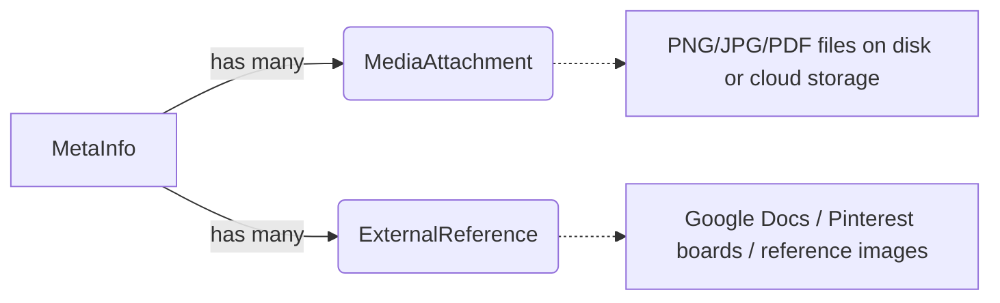

# `MetaInfo` — Complete Analysis

## 📋 Overview

```csharp
public class MetaInfo
{
    public Guid Id { get; set; } = Guid.NewGuid();
    public Guid ProjectId { get; set; }           // FK → Projects table
    public ContentTypeEnum ContentType { get; set; }  // 1 of 12 types
    public string Title { get; set; }              // Required, max 128 chars
    public string Slug { get; set; }               // URL-friendly, unique per project
    public string? ShortDesc { get; set; }         // Search/filter index (max 4096)
    public string? Description { get; set; }       // Full content (Markdown/HTML, max 4096)
    
    // State & lifecycle
    public bool Published { get; set; } = false;
    public ContentStatusEnum Status { get; set; }  // Draft → InProgress → UnderReview → Published
    public ViewModeEnum ViewMode { get; set; }     // PrivateWriting vs Presentation
    
    // Versioning & ordering
    public int Version { get; set; } = 0;
    public int OrderIndex { get; set; } = 0;
    
    // External links & attachments
    public string? References { get; set; }        // JSON array of external references
}
```

---

## 🔑 Key Design Decisions

### 1. Polymorphic Type System (No Tables Per Type)

`MetaInfo` is a **single table** that represents 12 different content types:

| ContentType | Example Use Case |
|-------------|-----------------|
| `Character` (0) | A character's name, background, attributes |
| `World` (1) | A location or setting description |
| `Mechanic` (2) | A game mechanic definition |
| `PlotPoint` (3) | A story beat or narrative arc |
| `Quest` (4) | A mission or objective |
| `Item` (5) | Equipment, artifacts, items |
| `Faction` (6) | An organization or group |
| `Enemy` (7) | A monster or antagonist |
| `Ability` (8) | A character power or skill |
| `Spell` (9) | A magical effect |
| `Vehicle` (10) | Transport, mounts, vehicles |
| `Other` (11) | Catch-all for unmapped types |

**How type-specific data is stored:**  
The model supports **polymorphic detail tables** — when a MetaInfo's `ContentType` changes or when you need type-specific fields, they go into separate child tables keyed by `MetaInfoId`. For example:
- A `Character` might have a linked `CharacterDetails` entity with name, level, role, status.
- A `World` might have `LoreEntry` associations tied to its ID.

This avoids the "fat table" anti-pattern while keeping all content items queryable from one table.

---

### 2. View Mode Separation (Private vs Presentation)

```csharp
public enum ViewModeEnum : int
{
    PrivateWriting = 0,   // Editor view: WYSIWYG toolbar, revision history
    Presentation     = 1  // Reader view: clean typography, no editing UI
}
```

**Purpose:** The same content can be rendered differently depending on who is viewing it. A team member sees a rich editor; a reader sees polished prose.

---

### 3. Versioned Content with Audit Trail

Every `MetaInfo` has a `Version` counter and a one-to-many relationship to `ContentVersionLog`:

```csharp
public virtual ICollection<ContentVersionLog> VersionLogs { get; set; } = new List<ContentVersionLog>();
```

This supports:
- Undo/rollback (via `RollbackDto`)
- Audit trails for compliance
- Diff-based reviews between versions

---

## 🔗 Relationship Map

### Parent Relationships (Many-to-One)

| Entity | FK Column | Navigation Property | Purpose |
|--------|-----------|---------------------|---------|
| **Project** ←→ MetaInfo | `ProjectId` | `MetaInfo.Project` | Projects contain many content items |
| **ReviewStatus** ←→ MetaInfo | `MetaInfoId` (FK-as-PK) | `MetaInfo.ReviewStatus` | Optional approval state |

### Child Relationships (One-to-Many)

| Entity | FK on Child | Purpose |
|--------|-------------|---------|
| **DialogueBranch** | `MetaInfoId` | A content item can be the root of a branching narrative tree |
| **MediaAttachment** | `MetaInfoId` | Images, PDFs attached to the content |
| **Comment** | `MetaInfoId` | User comments on this content |
| **ExternalReference** | `ParentType=0`, `ParentId` → MetaInfo.Id | Links to external docs (Google Docs, Pinterest, etc.) |
| **AssetLink** | `MetaInfoId` | Game engine asset connections |

### Self-Referencing / Junction

```csharp
public virtual ICollection<ContentTags> ContentTagAssociations { get; set; } = new List<ContentTags>();
[Required] public Guid MetaInfoId { get; set; }  // FK-as-PK column in junction table
```

`MetaInfo` participates in a many-to-many relationship with `Tag`:
- Junction: `ContentTags` table (self-composite key — each row has its own `Id`)
- Query pattern: `/api/content-items?tags=tag1,tag2` returns only tagged items

---

## 🔄 Lifecycle States (`ContentStatusEnum`)

```csharp
public enum ContentStatusEnum
{
    Draft         = 0,          // Being written, not yet reviewable
    InProgress    = 1,          // Actively being developed
    UnderReview   = 2,          // Submitted to a reviewer (triggers ReviewStatus workflow)
    Published     = 3,          // Approved and visible in Presentation mode
    Archived      = 4,          // Retired but preserved for history
    Completed     = 5           // Finalized; no further edits allowed
}
```

**Workflow implications:**
- `Draft` → only the creator can edit (unless shared with team)
- `UnderReview` → triggers notifications to assigned reviewers via the `ReviewStatusController`
- `Published` → visible in `/api/content-items?viewMode=Presentation` queries
- `Archived` / `Completed` → still queryable but hidden from public-facing views

---

## 🧩 How It Fits Into Other Systems

### Narrative Structure Integration

```
MetaInfo (type = PlotPoint or Quest)
       ↓ (has many)
DialogueBranches  ←→ DialogueNodes (tree structure with conditions)
       ↓
StorySequence (chapter/act level, optional hierarchical parent)
       ↓
StoryBeat (atomic scene units within a sequence)
```

A `MetaInfo` of type `PlotPoint` can be the root or leaf node in a branching dialogue tree. The `DialogueBranch.MetaInfoId` FK allows the narrative engine to "expand" that content item into interactive choices at runtime.

### Task Integration

```csharp
public class ProjectTask { ... public Guid? MetaInfoId { get; set; } ... }
```

A task can optionally link to a specific `MetaInfo`, allowing:
- Writers to attach tasks directly to plot points or characters they're working on
- Progress tracking that's scoped to content rather than just abstract work items

### Media & External References



This supports a rich documentation model where each content item can have:
- Local media attachments (images of character designs, location sketches)
- External references to living documents (GDDs in Google Drive, art on Pinterest)

---

## ⚡ Performance Considerations

The `MetaInfo` table has several indexes implied by the configuration pattern:

```sql
CREATE INDEX IX_MetaInfos_ProjectId ON MetaInfos(ProjectId);      -- Project-level queries
CREATE INDEX IX_MetaInfos_Status  ON MetaInfos(Status);           -- Filter by lifecycle stage
CREATE INDEX IX_MetaInfos_Slug    ON MetaInfos(Slug, ProjectId);  -- Unique per-project slugs
```

**Common query patterns supported:**

| Query | Use Case |
|-------|----------|
| `WHERE ContentType = Character AND ProjectId = X` | List all characters in a project |
| `WHERE Status = Published AND ViewMode = Presentation` | Public-facing content catalog |
| `WHERE ContentType IN (Quest, PlotPoint) ORDER BY OrderIndex` | Narrative flow view |
| `WHERE ContentType = World AND ShortDesc LIKE '%forest%'` | Searchable index lookup |

---

## 🚧 Known Limitations / Open Questions

1. **No type-specific columns in the main table** — all polymorphic detail lives in child tables. This means queries like "get all characters with level > 5" require joining to a separate `CharacterDetails` table, which adds a join cost. (This is the trade-off of avoiding a fat table.)

2. **No soft-delete flag on MetaInfo itself** — unlike `Project`, there's no `IsActive` on `MetaInfo`. This suggests content items are never "deleted," only archived or unpublished. The consequence is potential bloat if old drafts accumulate, but it also preserves version history naturally.

3. **References field is a JSON string** — `string? References { get; set; }` stores an external references array as JSON. While flexible, this means you can't index/search the reference titles or URLs efficiently (unlike having a normalized junction table).

4. **Slug uniqueness scoped to ProjectId only** — if two projects both have a content item titled "The Forest," they can share the same slug (`the-forest`). This is fine for project-scoped routing but means you can't build a global search by slug without querying all projects.

---

## 📝 Summary: What MetaInfo Is (and Isn't)

| | Truth |
|--|------|
| ✅ | It's the **single table polymorphic root** — one row per content piece, distinguished only by `ContentType` integer |
| ✅ | It supports **versioning** via a counter + log table |
| ✅ | It supports **two view modes** (editing vs presentation) for different audiences |
| ✅ | It can be the **root of a dialogue tree** or a standalone narrative element |
| ❌ | It is *not* normalized into 12 separate tables (that would explode the join count) |
| ❌ | It does *not* store type-specific fields inline — those are in child/junction entities keyed by `MetaInfoId` |
| ❌ | It has no soft-delete flag — content can only be unpublished/archived, never truly deleted |

---

**End of MetaInfo analysis.**