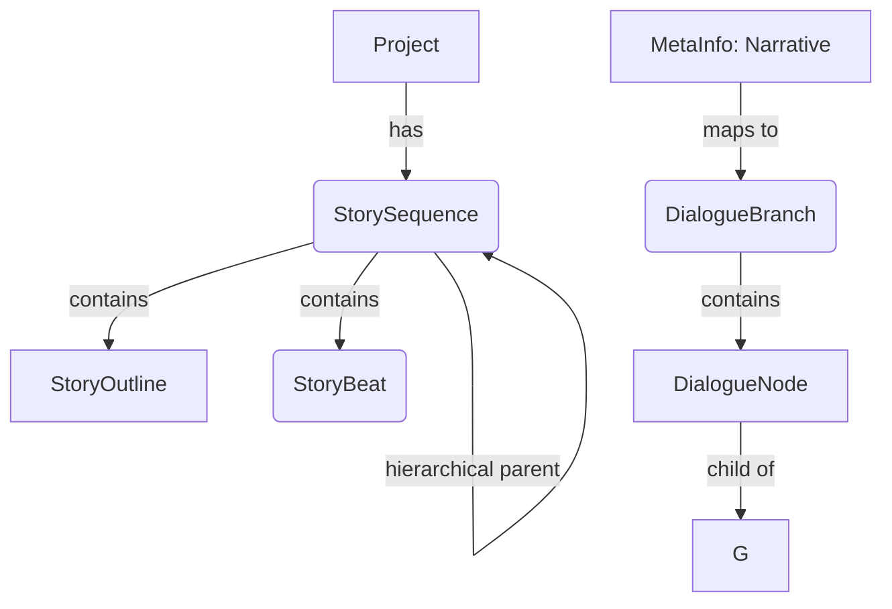
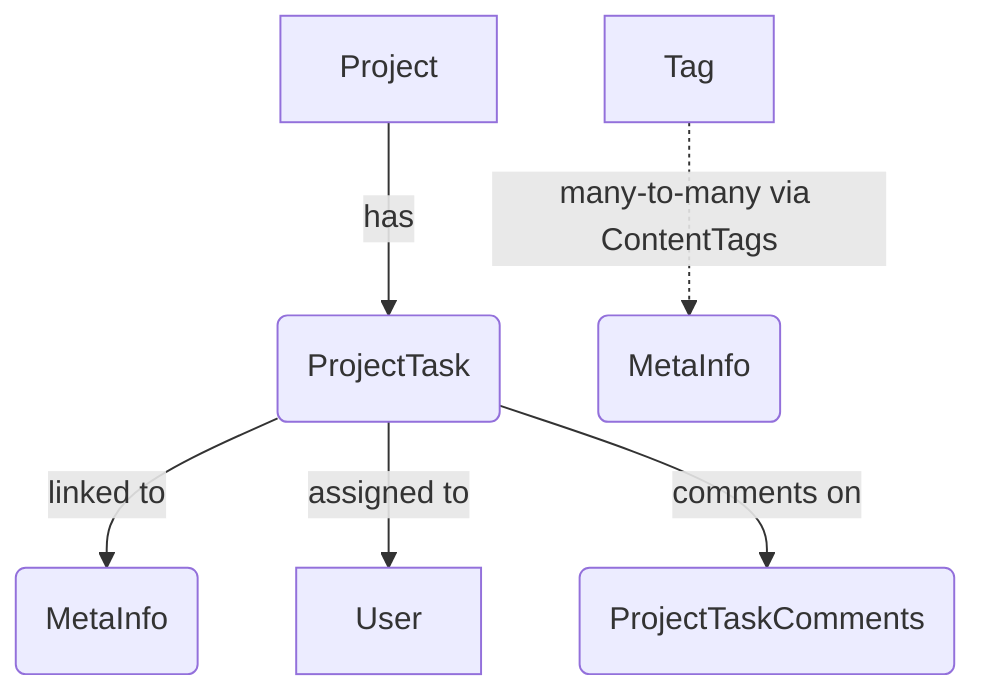
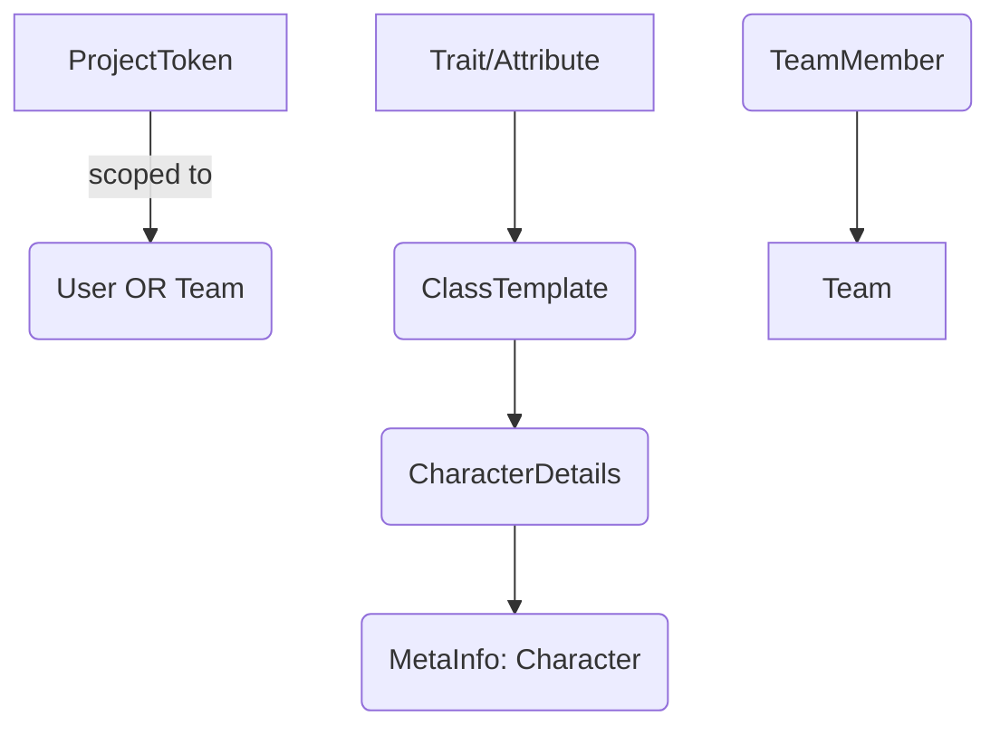

# Entity Relationships — GaDeMa Core Domain Model

**Status:** `Current` | **Generated:** Based on actual source code analysis  
**Note:** This document reflects the *actual* entity relationships as defined in the C# models. Cross-references to old documentation are minimal and only where relevant patterns were preserved.

---

## 📊 Entity Relationship Diagram (ERD)

```mermaid
erDiagram
    %% === AUTHENTICATION & IDENTITY ===
    User ||--o{ TeamMember : "owns"
    User }|--|| ProjectToken : "has tokens"
    User ||--o{ MetaInfo : "creates"
    Team }|--o{ TeamMember : "contains"
    Team ||--o{ Project : "owns (polymorphic)"
    
    %% === PROJECTS & CONTENT ===
    Project ||--o{ MetaInfo : "contains"
    Project ||--o{ StorySequence : "has sequences"
    Project ||--o{ ProjectTask : "has tasks"
    Project ||--o{ ActivityLog : "logs events"
    Project ||--o{ MediaAttachment : "hosts media"
    Project }|--|| User : "created by"
    
    MetaInfo ||--o{ DialogueBranch : "has branches"
    MetaInfo ||--o{ DialogueNode : "contains nodes"
    MetaInfo ||--o{ CharacterDetails : "has details"
    MetaInfo ||--o{ MediaAttachment : "attaches media"
    MetaInfo }|--|| ReviewStatus : "has review status"
    
    %% === NARRATIVE STRUCTURE ===
    StorySequence }o--|| Project : "belongs to"
    StorySequence |o--|o{ StorySequence : "hierarchical parent"
    StorySequence ||--o{ StoryOutline : "contains outlines"
    StorySequence ||--o{ StoryBeat : "has beats"
    
    DialogueBranch }|--|{ DialogueNode : "contains nodes"
    DialogueNode |o--|| DialogueBranch : "belongs to branch"
    DialogueNode }o--|| User : "spoken by"
    DialogueNode }o--|o{ DialogueNode : "child of (tree)"
    
    %% === TASKS & WORKFLOW ===
    ProjectTask ||--|{ ProjectTaskComments : "has comments"
    ProjectTask |o--|| MetaInfo : "references content"
    ProjectTask |o--|| User : "assigned to"
    
    %% === IDENTITY SYSTEM (Polymorphic) ===
    TeamMember }|--|| Team : "belongs to team"
    TeamMember ||--|{ Tag : "has tags"
    
    %% === METADATA & TAGGING ===
    MetaInfo |o--o{ ContentTags : "tags content"
    Project |o--o{ Tag : "has tags"
    
    %% === VERSIONING & LOGGING ===
    MetaInfo ||--o{ ContentVersionLog : "version history"
    ActivityLog ||--|| User : "performed by (nullable)"
    ActivityLog }|--|| Project : "belongs to project"
```

---

## 📋 Entity Reference

### Core Entities by Domain Area

| Domain | Entity | Purpose |
|--------|--------|---------|
| **Authentication** | `User` | User accounts with OAuth + 2FA support |
| | `Team` | Team definition (polymorphic owner of Projects) |
| | `TeamMember` | User ↔ Team membership links |
| | `ProjectToken` | API tokens scoped to projects/users |
| **Projects** | `Project` | Project container with polymorphic ownership |
| | `StorySequence` | Hierarchical chapter/sequence organizer |
| | `StoryBeat` | Atomic scene/unit within a sequence |
| | `StoryOutline` | Narrative outline section (if exists) |
| **Content** | `MetaInfo` | Core content model (polymorphic types: characters, worlds, mechanics) |
| | `CharacterDetails` | Character-specific attributes |
| | `DialogueBranch` | Root nodes of branching narrative trees |
| | `DialogueNode` | Dialogue choices and conditions |
| **Tasks** | `ProjectTask` | Flat task model (ADHD-friendly, no epics/stories) |
| | `ProjectTaskComments` | Task-level discussion threads |
| **Identity System** | `CharacterIdentity` | Race/class/faction assignment for characters |
| | `AttributeDefinition` | Attribute templates |
| | `ClassTemplate` | Class archetypes |
| | `AbilityDefinition` / `AbilitySet` / `StatusEffectDefinition` | RPG ability system |
| **Metadata** | `LoreEntry` | World-building documentation |
| | `EndingDefinition` | Ending variants |
| | `Tag` | Reusable tags across entities |
| | `ContentTags` | Content ↔ Tag junction table |
| **Media & References** | `MediaAttachment` | File uploads linked to content items |
| | `ExternalReference` | External links (Google Docs, Pinterest, etc.) |
| **Versioning** | `ContentVersionLog` | Audit trail for content changes |
| | `ContentSnapshot` | Point-in-time snapshots |
| **Engine Integration** | `AssetLink` | Game engine asset connections |
| | `EngineExportConfig` | Export configuration per project |
| | `EngineFieldMapping` | Field mappings between systems |

---

## 🔗 Key Relationship Patterns Explained

### 1. Polymorphic Ownership Pattern

```csharp
// Project.OwnerId is a FK that points to either User.Id or Team.Id
public int OwnerType { get; set; } // 0 = User, 1 = Team
[ForeignKey(nameof(Owner))]
public Guid OwnerId { get; set; }
public virtual Project? Owner { get; set; } // Weak navigation — EF Core resolves to correct type
```

**Why?** Single table design avoids duplication of `Project` data. A project doesn't care *what* owns it, only *that* something owns it.

---

### 2. Self-Referencing Hierarchies (Two Patterns)

#### Pattern A: Optional Parent FK + Collection
```csharp
public Guid? ParentNodeId { get; set; }
[ForeignKey("ParentNodeId")]
public virtual DialogueNode? ParentNode { get; set; }
// ChildNodes is the reverse side — implicit in EF Core
```

Used for: `DialogueBranch`, `StorySequence` (optional parent → root node exists)

#### Pattern B: Self-Collection Navigation
```csharp
public virtual ICollection<DialogueNode> ChildNodes { get; set; } = new List<DialogueNode>();
```

This allows EF Core to lazy-load children without explicit configuration.

---

### 3. FK-as-PK (Foreign Key as Primary Key) Junction Tables

#### `ProjectTaskComments` — Task Comments Table

```csharp
public Guid ProjectTaskId { get; set; } // FK + PK for the junction table
[ForeignKey("ProjectTaskId")]
public virtual ProjectTask ProjectTask { get; set; }
public Guid CommentedByUserId { get; set; }
public string CommentText { get; set; } = "";
```

**Why?** The junction table *is* the content. No separate `CommentId` needed — every row is a distinct comment.

---

### 4. Many-to-Many via Junction Table with FK-as-PK

#### `ContentTags`

| MetaInfoId (FK+PK) | TagId (FK+PK) |
|------------------------|---------------|
| `Guid`                 | `Guid`        |

**Why?** No separate junction table — the column names encode the relationship. EF Core infers this from Fluent API configuration in `GameDbContext.cs`.

---

### 5. Optional FKs (Nullable Navigation)

```csharp
public Guid? MetaInfoId { get; set; }
[ForeignKey("MetaInfoId")]
public virtual MetaInfo? MetaInfo { get; set; }
```

Used when:
- A task may or may not be linked to content (`ProjectTask`)
- A dialogue node may belong to a branch or stand alone (`DialogueNode`)
- Polymorphic parents like `ExternalReference` (ParentType=0/1/2, ParentId = null if none)

---

## 🧩 Domain-Specific Relationship Maps

### Narrative Structure Chain



### Task Management Chain



### Identity System Chain (Polymorphic)



---

## 📐 Database Schema (Summary of Tables)

| Table | Primary Key | Foreign Keys | Cardinality Notes |
|-------|-------------|--------------|-------------------|
| `Users` | `Id` | — | 1:many to TeamMember, ProjectToken |
| `Teams` | `Id` | `CreatedByUserId` → Users.Id | 1:many to TeamMember (polymorphic) |
| `TeamMemberships` | `UserId + TeamId` | UserId, TeamId | Many-to-many via junction |
| `Projects` | `Id` | `OwnerId`, `SeriesProjectId` | Polymorphic owner; self-referencing series |
| `StorySequences` | `Id` | `ParentSequenceId`, `ProjectId` | Self-parenting tree |
| `MetaInfos` | `Id` | `ProjectId` | 1:many to all content entities |
| `DialogueBranches` | `Id` | `ParentNodeId` (nullable), `ProjectId` | Optional self-parent tree |
| `DialogueNodes` | `Id` | `ParentNodeId`, `BranchId`, `MetaInfoId` | Tree with optional root |
| `StoryOutlines` | `Id` | `SequenceId` | 1:many from sequences |
| `StoryBeats` | `Id` | `SequenceId` | 1:many from sequences |
| `ProjectTasks` | `Id` | `MetaInfoId` (nullable), `ProjectId` | Optional content link |
| `TaskComments` | `ProjectTaskId + CommentedByUserId` | ProjectTaskId, CommentedByUserId | FK-as-PK junction |
| `CharacterDetails` | `Id` | `ClassTemplateId`, `MetaInfoId` | Many-to-one to characters |
| `MediaAttachments` | `Id` | `MetaInfoId` | 1:many from content items |
| `ExternalReferences` | `Id` | `ParentId` (nullable) | Self-referencing tree |

---

## ⚠️ Design Decisions & Trade-offs

### Why FK-as-PK in some places?

**Junction tables like `ProjectTaskComments` use FK-as-PK because:**
- The junction *is* the value — each row is a distinct comment
- No need for an intermediate "CommentId" that serves no purpose
- Reduces nullable columns (every PK must be non-null)

### Why polymorphic ownership?

**Projects can be owned by Users OR Teams.** A single `OwnerId` column with an `OwnerType` discriminator avoids:
- Two separate owner columns (`UserId`, `TeamId`) where only one is ever used
- Duplication of project metadata
- Complex queries that would need UNIONs or CASE statements

### Why optional FKs for content links?

**Tasks and dialogue nodes are not always tied to specific content.** This allows:
- Tasks to exist independently (general todo items)
- Dialogue trees to be created without a parent MetaInfo
- Flexible data entry workflows

---

## 📍 Quick Reference: Entity Summary

### `User` — Authentication & Account
- `UserName`, `Email`, `FullName`, `GoogleSubjectId`, `TwoFactorEnabled`
- **Related:** TeamMemberships, Teams (owned), ProjectTokens, Projects (created)

### `Team` — Collaborative Grouping
- Polymorphic owner of Projects
- Defines attribute/class templates for team members
- **Related:** TeamMemberships, TeamMemberAttributes, Projects (owns)

### `Project` — Work Container
- Polymorphic owner (User or Team)
- Hierarchical series support via `SeriesId` FK back to parent project
- **Related:** MetaInfos, StorySequences, ProjectTasks, ActivityLogs, MediaAttachments, Tags

### `MetaInfo` — Core Domain Entity
- Type polymorphism: Character, World, Mechanic, Setting, etc. (via `ContentTypeEnum`)
- View mode separation: `PrivateWriting` vs `Presentation`
- **Related:** DialogueBranches, MediaAttachments, Comments, ReviewStatus, ContentTags, ExternalReferences, AssetLinks

### `DialogueNode` — Branching Narrative Unit
- Self-referencing tree (`ParentNodeId`) for nested choices
- Condition-based branching via JSON conditions field
- Speaker attribution to Users (characters)

### `StorySequence` → `StoryBeat` → `StoryOutline`
- **Three-tier narrative structure:**
  1. Sequence = Chapter/act level
  2. Outline = Section-level summary
  3. Beat = Scene-level atomic unit

### `ProjectTask` — ADHD-Friendly Task Model
- Flat structure: no epics/stories/subtasks (intentional simplicity)
- Difficulty/Easy-Medium-Hard prioritization
- Quick win flag for momentum
- Optional content linkage (task may or may not reference a specific MetaInfo)

### `CharacterIdentity` — Identity Assignment Table
- Links characters to identity definitions and values
- Supports multi-dimensional identity: race, class, faction, gender, etc.
- Primary/secondary distinction via `IsPrimary` flag

---

## 🔍 Cross-References (What You Need To Know)

| Concept | Documented In |
|---------|--------------|
| View Mode Pattern (PrivateWriting vs Presentation) | This document |
| Polymorphic FK pattern (`OwnerId`) | This document + `GameDbContext.cs` config |
| FK-as-PK junction tables | `ProjectTaskComments`, `ContentTags` configs in DbContext |
| Self-referencing trees | `DialogueNode.ParentNodeId`, `StorySequence.ParentSequenceId` |
| Optional FKs for flexibility | Design decision — see trade-offs above |

---

**End of Entity Relationships Documentation**

*This document was generated by analyzing the actual C# model files in `Gadema.Core/Models/`. It reflects the current state of the codebase, not any prior documentation.*