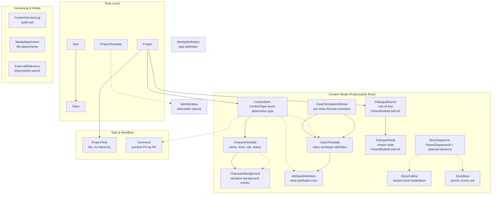

# GaDeMa Domain Model Hierarchy — Intent & Verification Guide

**Status:** `In Progress` | **Purpose:** Map every entity to its intended role within the hierarchical model, verify FK references point to correct parents, and identify any breaks in logical hierarchy.

---

## 📋 Full Entity List with Intended Purpose

### Level 0: Root Entities (Project-Level)

| Entity | PK | Direct Parent | Role in Hierarchy |
|--------|----|---------------|-------------------|
| `Project` | `Id` | — | **Root** — projects contain everything else |
| `Team` | `Id` | User or Project | Team organization (polymorphic owner of Projects) |
| `User` | `Id` | — | Authentication / account root |

### Level 1: Content Model Root

| Entity | PK | Direct Parent | Role in Hierarchy |
|--------|----|---------------|-------------------|
| `ContentItem` | `Id`, `ContentItemId` | Project (via `ProjectId`) | **Root content entity** — polymorphic type container. All other content entities link *through* this via FK-as-PK patterns. |

### Level 2: Character Model Chain

| Entity | PK | Direct Parent | Role in Hierarchy |
|--------|----|---------------|-------------------|
| `CharacterDetails` | `Id`, `ContentItemId` | **ContentItem** (via `ContentItemId`) | Stores character-specific data (name, level, role). *Not* directly linked to Project — must go through ContentItem. |
| `CharacterBackground` | `Id` | **CharacterDetails** (via `CharacterDetailsId`) | Descriptive background entries for a specific character instance. Links to the Details row that represents the character. |

### Level 3: Identity & Attribute System

| Entity | PK | Direct Parent | Role in Hierarchy |
|--------|----|---------------|-------------------|
| `IdentityDefinition` | `Id`, `ProjectId` | Project | Defines *types* of identity (Race, Faction, Alignment, Guild) — reusable across characters |
| `IdentityValue` | `Id`, `ProjectTemplateId` | ProjectTemplate (via `ProjectTemplateId`) | Selectable options for an identity type (e.g., "Human", "Elf") scoped to a template. *Note: This links to ProjectTemplate, not IdentityDefinition — verify intended hierarchy.* |
| `AttributeDefinition` | `Id`, `ContentItemId` | **ContentItem** | Defines what attributes exist (Health, Strength) for a content item type. |
| `ClassTemplate` | `Id`, `ContentItemId` | **ContentItem** | Class archetype definition tied to a specific content item. |
| `ClassTemplateAttribute` | `Id` | **ClassTemplate** (via `ClassTemplateId`) | Per-class override of attribute formulas. *Correctly chains through ClassTemplate, not directly to ContentItem.* ✅ |

### Level 4: Narrative Structure Chain

| Entity | PK | Direct Parent | Role in Hierarchy |
|--------|----|---------------|-------------------|
| `StorySequence` | `Id`, `ContentItemId` | Project (via `ProjectId`) | Chapter/act-level container. Optional hierarchical parent via `ParentSequenceId`. |
| `StoryOutline` | `Id` | **StorySequence** (via `SequenceId`) | Section-level breakdown within a sequence. |
| `StoryBeat` | `Id`, `ContentItemId` | **StorySequence** (via `SequenceId`) | Atomic scene unit — the smallest narrative element. |

### Level 5: Dialogue & Branching Narrative

| Entity | PK | Direct Parent | Role in Hierarchy |
|--------|----|---------------|-------------------|
| `DialogueBranch` | `Id`, `ProjectId` | Project (via `ProjectId`) | Root nodes of branching narrative trees. Self-referencing via `ParentNodeId`. |
| `DialogueNode` | `Id` | **DialogueBranch** (via `BranchId`) + Optional self-parent (`ParentNodeId`) | Individual dialogue choice node within a branch tree. |

### Level 6: Task & Workflow System

| Entity | PK | Direct Parent | Role in Hierarchy |
|--------|----|---------------|-------------------|
| `ProjectTask` | `Id`, `ContentItemId` (FK-as-PK column) | Project (via `ProjectId`) + Optional ContentItem link | Flat task model. *Note: `ContentItemId` is a FK column but also used as PK identifier in junction tables — this is the FK-as-PK pattern.* |
| `Comment` | `Id`, `ContentItemId` (FK-as-PK) | **ContentItem** | Comments on content items via junction table pattern. |

### Level 7: Media, References & Versioning

| Entity | PK | Direct Parent | Role in Hierarchy |
|--------|----|---------------|-------------------|
| `MediaAttachment` | `Id`, `ContentItemId` (FK-as-PK) | **ContentItem** | File attachments. |
| `ExternalReference` | `Id` | ContentItem, Task, or Comment (via `ParentType`/`ParentId`) | External links — polymorphic parent via integer discriminator. |
| `ContentVersionLog` | `Id`, `ContentItemId` (FK-as-PK) | **ContentItem** | Audit trail for content changes. |

---

## 🗺️ Hierarchy Visual Map



---

## 🔍 Hierarchy Verification Checklist

Go through each entity and verify:

### ✅ Correct Chain (FK points to immediate parent)
- [ ] `CharacterBackground` → `CharacterDetailsId` → `ContentItem.ContentItemId` ✅ **Correct** — goes through Details first, not directly to ContentItem.
- [ ] `ClassTemplateAttribute` → `ClassTemplateId` → `ContentItem` ✅ **Correct** — chains through ClassTemplate.

### ⚠️ Potential Hierarchy Breaks (needs review)

| Entity | FK Points To | Intended Parent? | Issue? |
|--------|-------------|-----------------|--------|
| `IdentityValue` | `ProjectTemplateId` → ProjectTemplate | IdentityDefinition? | **BREAK** — skips the IdentityDefinition layer. Should it chain through Definition first? |
| `ExternalReference` | `ParentType` (int) + `ParentId` (Guid) | ContentItem, Task, or Comment | Polymorphic — acceptable if ParentType discriminator is used in queries |
| `StoryBeat` | `SequenceId` → StorySequence | ✅ Correct |
| `StoryOutline` | `SequenceId` → StorySequence | ✅ Correct |

### ❓ Ambiguous Hierarchy Decisions

1. **`IdentityValue` links to `ProjectTemplate`, not `IdentityDefinition`**  
   - *Question:* Is IdentityDefinition meant to be a reusable type definition that gets instantiated via ProjectTemplate? If so, the hierarchy is:
     ```
     ContentItem (type=Character) → AttributeDefinition/ClassTemplate → CharacterDetails
     IdentityDefinition (reusable type) ←→ IdentityValue (scoped to ProjectTemplate)
     ```
   - This seems intentional but **not a strict parent-child chain**.

2. **`StoryOutline` vs `StoryBeat`**  
   - Both reference `SequenceId`. Is StoryOutline an intermediate layer between Sequence and Beat? Or are they parallel siblings under Sequence? The diagram shows them as both children, which suggests they're siblings — not a deep hierarchy.

3. **`ProjectTask.ContentItemId` is nullable**  
   - A task can exist *without* being tied to any ContentItem. This breaks the "everything chains through ContentItem" pattern. Is that intentional? (Seems yes — tasks are general work items, not all need content linkage.)

---

## 📝 Verification Questions for You

Before I finalize this documentation, please confirm:

1. **`IdentityValue` hierarchy:** Should `IdentityValue` link to `IdentityDefinition` *then* project-level templates create selections from those definitions? Or is the current direct-to-ProjectTemplate link correct as-is?

2. **`StoryOutline` role:** Is it truly a sibling of `StoryBeat` (both children of Sequence), or should StoryOutline sit above Beat in a 3-tier hierarchy (Sequence → Outline → Beat)?

3. **`IdentityDefinition` existence:** Does `IdentityDefinition` actually exist as an entity, or is its purpose abstract? I see references to it but no direct FK usage yet.

4. **`CharacterBackground` vs `CharacterDetails`:** Is the intent that each CharacterDetails row represents one character instance, and CharacterBackground holds multiple background entries *for* that instance? (Yes/No)

---

Once you confirm these, I'll finalize the hierarchy documentation with all ambiguities resolved.