# 📐 GaDeMa Architecture Guide

> **A visual guide to understanding how GaDeMa is built.**  
> This document complements `ARCHITECTURE.md` with diagrams, UI mockups, and flow explanations.

---

## Table of Contents

1. [System Overview](#system-overview) — Big picture architecture
2. [Layer Architecture](#layer-architecture) — How layers connect
3. [Data Flow Diagrams](#data-flow-diagrams) — Request/response flows
4. [UI Component Hierarchy](#ui-component-hierarchy) — Frontend structure
5. [Database Schema Overview](#database-schema-overview) — Entity relationships
6. [Security Architecture](#security-architecture) — Auth & authorization
7. [Deployment Architecture](#deployment-architecture) — Infrastructure

---

## System Overview

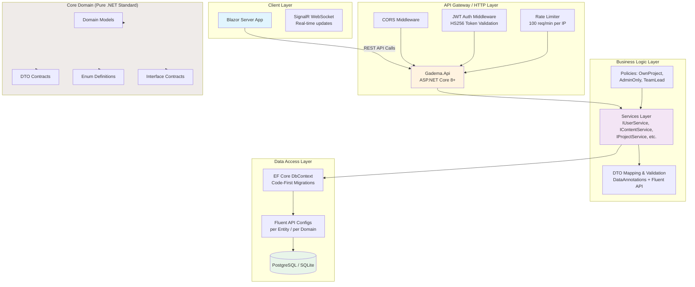

## Layer Architecture

### Dependency Flow (Dependency Injection)

Each layer **only** depends on layers below it. No circular dependencies.

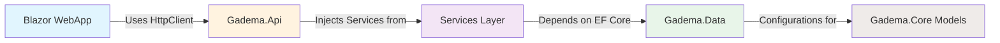

## Data Flow Diagrams

### 1. Content Item Creation Flow (Full Lifecycle)

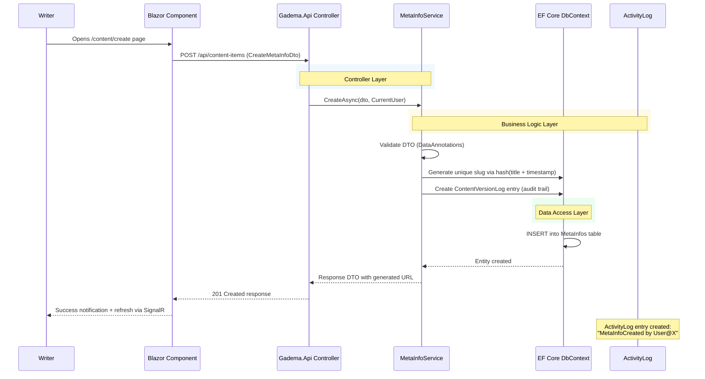

### 2. Branching Narrative Creation Flow (Self-Referencing Tree)

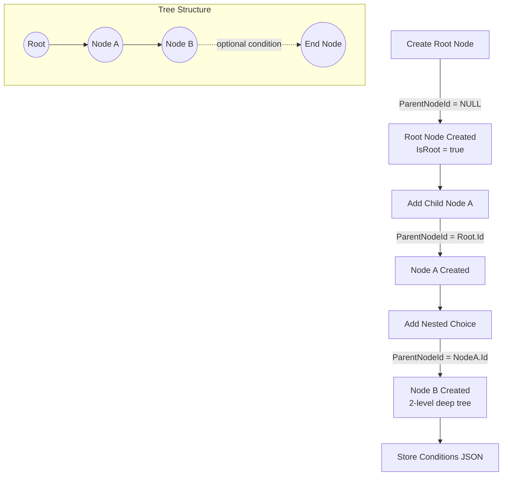

### 3. ADHD-Friendly Task Filtering Flow

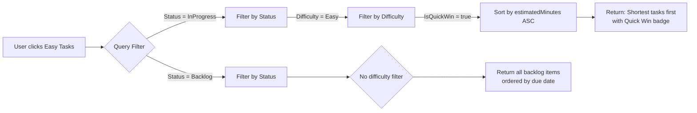

### 4. Authentication & Authorization Flow

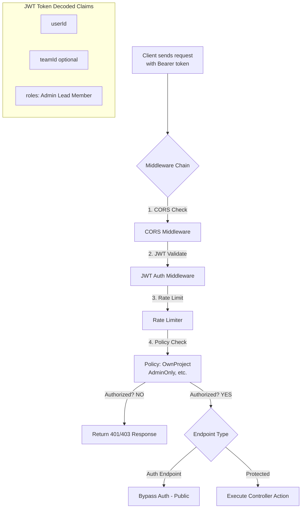

## Database Schema Overview

### Entity Relationship Diagram

```mermaid
erDiagram
    User ||--o{ TeamMember : owns
    User }|--|| ProjectToken : has tokens
    Team ||--o{ TeamMember : contains
    Team ||--o{ Project : polymorphic owner
    
    Project ||--o{ MetaInfo : contains
    Project ||--o{ StorySequence : chapters
    Project ||--o{ ProjectTask : tasks
    Project ||--o{ ActivityLog : events
    
    MetaInfo ||--o{ DialogueBranch : has branches
    MetaInfo ||--o{ MediaAttachment : files
    MetaInfo }|--|| ReviewStatus : approval state
    
    StorySequence }o--|o{ StorySequence : parent chapter
    StorySequence ||--o{ StoryBeat : scenes
    StoryOutline }|--|| StorySequence : section of
    
    ProjectTask ||--o{ Comment : discussions on task
    ProjectTask |o--|| MetaInfo : optional link
    
    Tag }|--o{ ContentTagAssociation : 
    Tag }|--o{ ProjectTagAssociation : 
    
    style User fill:#e1f5fe stroke:#333 stroke-width:2px
    style Team fill:#fff3e0 stroke:#333 stroke-width:2px
    style Project fill:#f3e5f5 stroke:#333 stroke-width:2px
```

### Polymorphic Ownership Visual

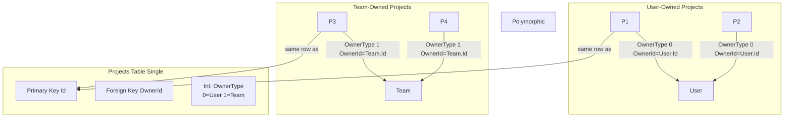

## Security Architecture

### Authorization Policy Decision Matrix

| User Role | Create Project | Edit Own Content | Delete Projects | Export to Engine | View Public Content |
|-----------|---------------|-----------------|-----------------|-----------------|---------------------|
| User | Yes | Yes own only | No | Yes own | Yes |
| Team Member | Yes | Yes | No | Yes | Yes team projects |
| Team Lead | Yes | Yes assign tasks | No | Yes | Yes |
| Admin | Yes | Yes all | Yes transfer/delete | Yes any | All |

## Deployment Architecture

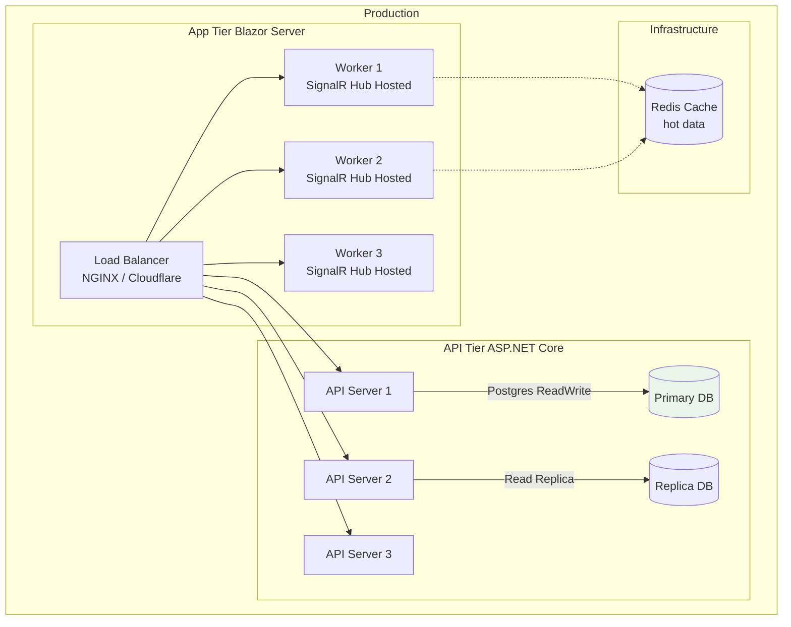

**Scaling Considerations:**

- Blazor Server is stateful — sticky sessions via SignalR handle distribution
- API layer scales horizontally — no shared in-memory state
- Redis caches session tokens and optimizes real-time broadcast
- Database read replicas handle heavy content queries

## Component Communication Patterns

### SignalR Real-Time Updates

```mermaid
sequenceDiagram
    participant Writer as Writer blazor
    participant Hub as SignalR Hub
    participant API as ContentService
    
    Writer->>Hub: Subscribe to project123-changes group
    Note over Writer,Hub: Client maintains connection<br/>via WebSocket + HTTP fallback
    
    Actor API->>API: User edits content
    API->>Hub: Broadcast content-updated id title
    
    rect rgb(240, 255, 240)
        Note over Hub, Writer: All subscribed clients<br/>receive update instantly
    end
    
    Hub-->>Writer1: MetaInfoChanged event
    Hub-->>Writer2: MetaInfoChanged event
    Hub-->>EditorC: MetaInfoChanged event
    
    Writer1->>Writer1: UI refreshes via StateHasChanged()
    Writer2->>Writer2: UI refreshes via StateHasChanged()
```

### Service-to-Service Communication (Mediator Pattern)

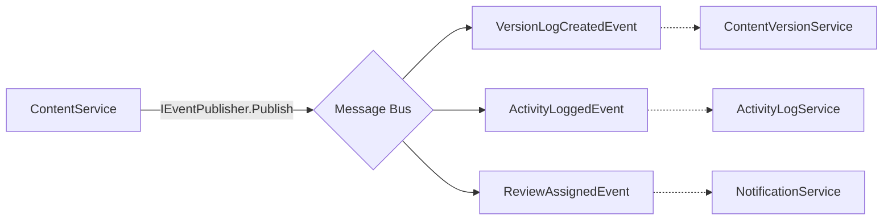

## Performance Optimization Strategies

### Query Pattern Library

| Pattern | Use Case | Example |
|---------|----------|---------|
| **Eager Loading** | Fetch nested data in one query | `.Include(ci => ci.MediaAttachments)` |
| **Projection Select** | Reduce payload size | `.Select(p => new ProjectSummaryDto(...))` |
| **Pagination** | Large lists | `Skip().Take(20)` with index |
| **Filtering Indexes** | Common filters | IX_MetaInfos_Status IX_ProjectTasks_Difficulty |
| **Soft Delete Filter** | Preserve history | `.Where(p => p.IsActive == true)` |

### Caching Strategy (Redis)

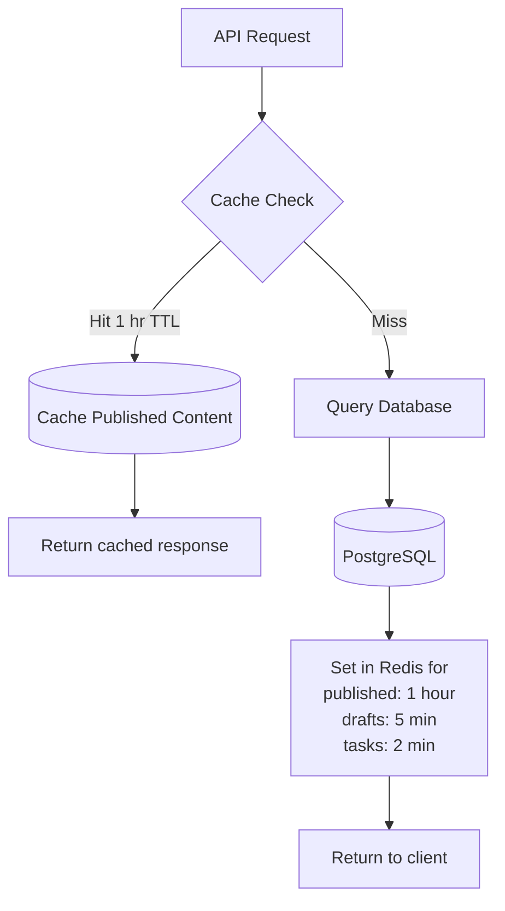

**TTL Rules:**
- Published content: 1 hour (rarely changes)
- Draft content: 5 minutes (frequently edited)
- Task state: 2 minutes (high-frequency updates)

## Error Handling Strategy

### Exception Flow Through the Stack

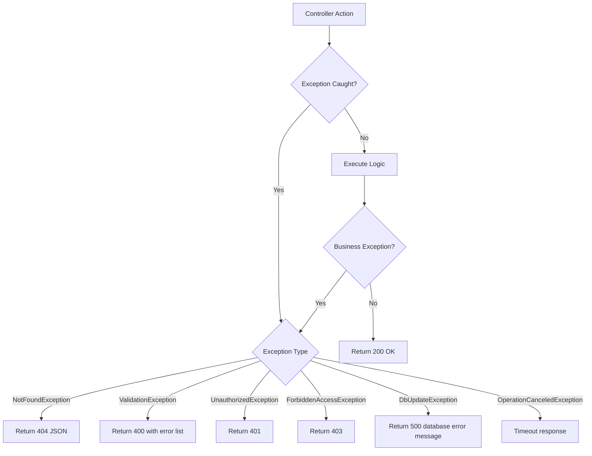

### Controller Layer Responsibility

Controllers are **thin** — they only:

1. Receive DTOs from clients
2. Validate with `[Required]` attributes or FluentValidation
3. Call service layer methods
4. Return response DTOs

They **never**:
- Directly access the database (`DbContext`)
- Perform business logic (that's in Services)
- Handle side effects like email sending (in Services/Middleware)

This separation means controllers can be replaced with gRPC, GraphQL, or a different HTTP framework without touching business logic.