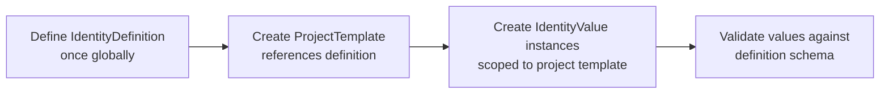

# Identity System Specification (For Another Agent)

---

## 📋 Overview

This document defines the **Identity system** used to model reusable identity types (`IdentityDefinition`) and their project-scoped instances (`IdentityValue`). It is designed around a **definition/value separation pattern**.

---

## 🔑 Core Concepts

| Concept | `IdentityDefinition` | `IdentityValue` |
| :--- | :--- | :--- |
| **Analogy** | The *blueprint* or *schema* of an identity type | A specific *instance* of that blueprint |
| **Scope** | Global / Shared across all projects | Scoped to a single `ProjectTemplate` |
| **Lifespan** | Created once, reused indefinitely | Created per project template instance |
| **Purpose** | Defines the STRUCTURE (attributes, rules) of an identity type | Holds the ACTUAL DATA values for that type in a specific context |

---

## 🔄 Relationship Model

```
┌─────────────────────────────────────────────────────────────┐
│  IdentityDefinition                                         │
│  ───────────────────────────────────────────                │
│  • Name: "Character"                                        │
│  • Description: "A playable character entity"               │
│  • Attributes:                                              │
│      - Health (int, required)                               │
│      - MaxHealth (int, required)                            │
│      - Class (string, optional)                             │
└───────────────────┬─────────────────────────────────────────┘
                    │ references → defines structure for
                    ▼
┌─────────────────────────────────────────────────────────────┐
│  IdentityValue                                              │
│  ───────────────────────────────────────────                │
│  • ProjectTemplateId: {guid} ← FK to ProjectTemplate        │
│  • Name: "Link"                                             │
│  • Health: 100 (conforms to IdentityDefinition schema)      │
│  • MaxHealth: 200                                           │
│  • Class: "Hero"                                            │
└───────────────────┬─────────────────────────────────────────┘
                    ▲ referenced by / scoped within
                    │
             ProjectTemplate (per-project instance)
```

---

## 📐 Key Design Decisions

1. **Single Source of Truth**: An `IdentityDefinition` is defined once and can be referenced by any number of projects via `ProjectTemplate`. This enables cross-project reuse without duplication.

2. **Scoped Instances**: Each `IdentityValue` belongs to exactly one `ProjectTemplate`, ensuring data isolation between different game instances (e.g., "Dragon Quest 5" vs "Final Fantasy VII").

3. **Validation Boundary**: When an `IdentityValue` is created or updated, it must conform to the schema defined in its parent `IdentityDefinition`. This validation happens at the API layer.

4. **No Circular Dependency**: The relationship flows strictly from Definition → Value (many-to-many: one definition can produce many values across projects; one value belongs to exactly one project template).

---

## 🧱 Data Model Summary

```
Entity | Purpose | Scope | Cardinality
-------|---------|-------|-------------
IdentityDefinition  | Schema blueprint for identity types | Global | Reused N times
ProjectTemplate     | Links a definition to a specific game project | Per-project | 1:1 with Definition reference
IdentityValue       | Concrete data instance of an identity type | Scoped to ProjectTemplate | Many per Definition, one per Template
```

---

## 🚀 Typical Workflow



---

## ⚠️ Constraints & Rules

- ✅ An `IdentityValue` **must** have a valid `ProjectTemplateId`.
- ❌ An `IdentityValue` cannot exist without a linked `IdentityDefinition` (enforced via ProjectTemplate).
- ✅ Changing an `IdentityDefinition` does NOT automatically migrate existing `IdentityValues`.
- ✅ Multiple projects can share the same `IdentityDefinition`.

---

## 📝 Notes for Implementation Agent

- Use **Guid** for all IDs.
- Implement validation at the API controller layer (do not rely solely on DB constraints).
- Consider adding a soft-delete flag rather than hard-deleting definitions (to avoid orphaned values).
- The `IdentityDefinition` should support versioning if future schema changes are needed without breaking existing projects.

---

End of specification.