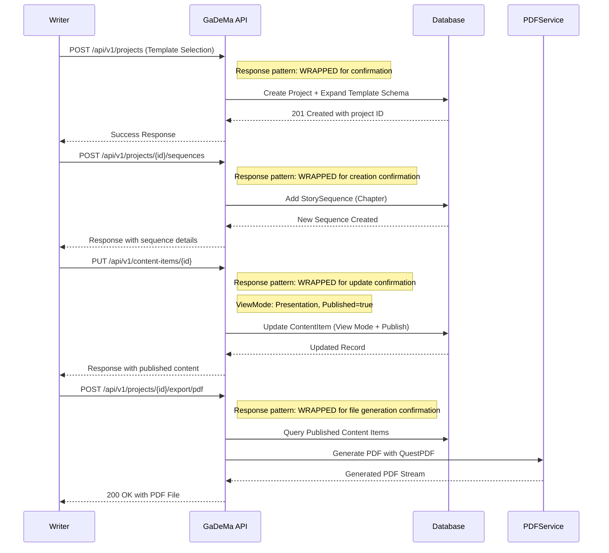
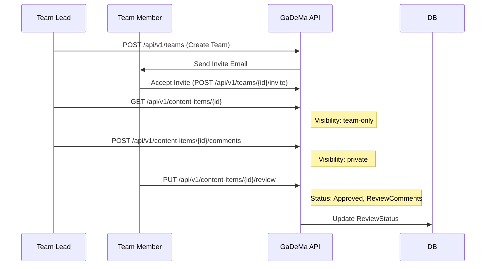
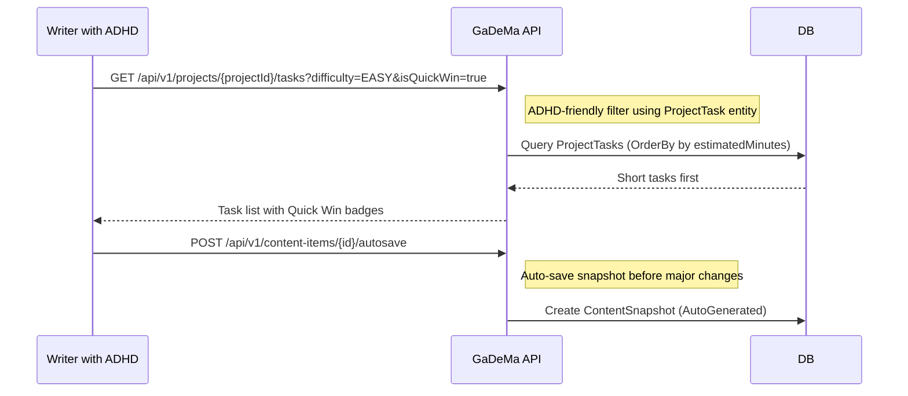
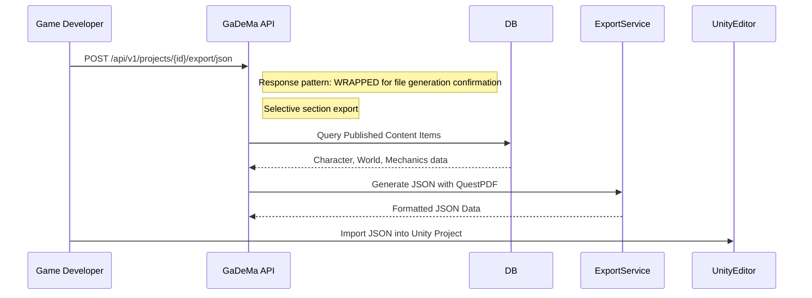
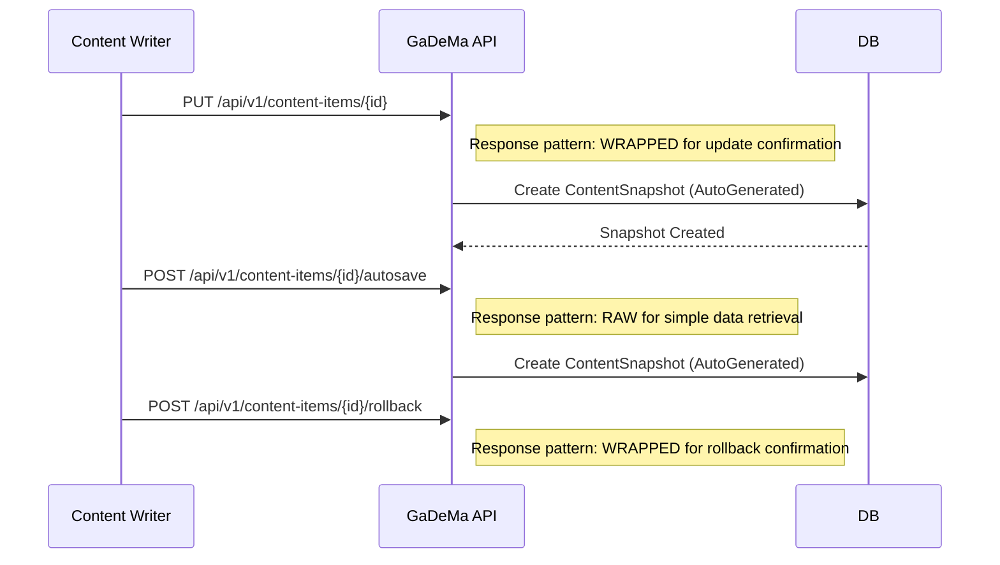
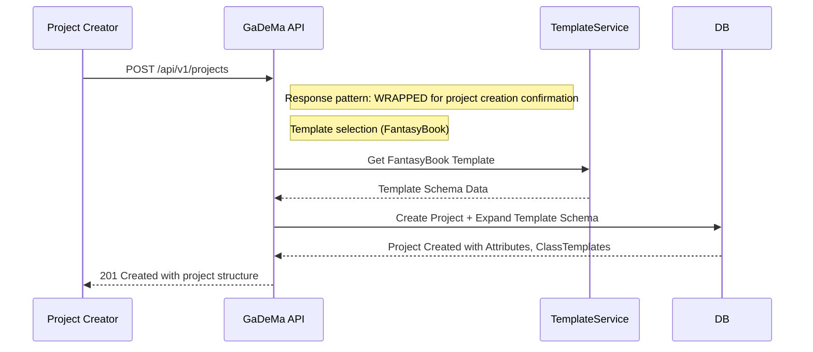

# 📄 **WORKFLOWS.md** – Updated with Domain Clustering & Hybrid Response Patterns  
**GaDeMa – Game Development Management Application (v0.1 Pre-Release MVP)**  
**Status**: Complete with Project Model ✅, Task → ProjectTask Renaming ✅, and Hybrid Response Examples  

---

## **📋 Overview**

This document defines the practical user workflows, use cases, and operational patterns for GaDeMa v0.1. These workflows demonstrate how different users interact with the system and how business logic is executed across various scenarios.

**Target Audience**: Product Managers, Developers, UX Designers, Stakeholders  
**Workflow Types**: Solo Writer, Team Collaboration, ADHD-Friendly Task Management, Export & Engine Integration  

---

## **📁 Updated File Structure Reference**

```bash
src/
├── GameDev.Api/Controllers/    # Endpoint implementations (clustered by domain)
│   ├── Authentication/AuthController.cs
│   ├── Projects/ProjectsController.cs
│   ├── Content/ContentItemsController.cs
│   ├── Tasks/TasksController.cs      # ProjectTaskController (renamed from TaskController)
│   └── [etc...]
├── GameDev.Core/Dtos/          # Request/response DTOs (clustered by domain)
│   ├── Authentication/SigninDto.cs
│   ├── Projects/CreateProjectDto.cs
│   ├── Content/ContentItemCreateDto.cs
│   ├── Tasks/ProjectTaskCreateDto.cs      # Renamed from TaskCreateDto
│   └── [etc...]
```

---

## **1️⃣ Solo Writer Workflow (Private Writing + Public Presentation)**

### **Use Case**: Individual writer creating a Visual Novel or RPG GDD

**Workflow Steps:**
1. Create project from template → Write outline → Switch to Presentation mode → Export PDF
2. Manage content versions with rollback capability
3. Track progress through ADHD-friendly task filtering (now `ProjectTask`)

### **Updated Sequence Diagram Example:**



### **Updated Implementation Code Example:**

```csharp
// Solo Writer Workflow - Main Entry Point (renamed ProjectTask)
public class WriterWorkflowService
{
    private readonly GameDbContext _context;
    private readonly IContentService _contentService;
    
    public async Task ExecuteFullWorkflowAsync(Guid projectId)
    {
        // Step 1: Create project from template
        var project = await _context.Projects.FindAsync(projectId);
        
        if (project == null)
            throw new NotFoundException("Project not found", projectId);
        
        // Step 2: Add story sequence (Chapter)
        var sequences = await _context.StorySequences
            .Where(s => s.ProjectId == projectId)
            .ToListAsync();
        
        foreach (var seq in sequences)
        {
            // Update view mode to Presentation for public view
            seq.ViewMode = ViewModeEnum.Presentation;
            seq.Published = true;
            
            await _context.SaveChangesAsync();
        }
        
        // Step 3: Export PDF with watermarking (optional)
        var exportOptions = new ExportOptionsDto 
        {
            ProjectId = projectId,
            Sections = ["characters", "worlds"],
            IncludeWatermark = false,  // Personal use
            WatermarkText = null
        };
        
        var pdfStream = await _exportService.ExportToPdfAsync(exportOptions);
        
        return pdfStream;
    }
}

// ✅ CORRECT - Updated workflow with ProjectTask filtering
public async Task ExecuteADHFriendlyWorkflowAsync(Guid projectId)
{
    // Get quick win project tasks (renamed from Task to ProjectTask)
    var quickWinTasks = await _context.ProjectTasks
        .Where(t => t.ProjectId == projectId && t.IsQuickWin)
        .Include(t => t.Comments)  // Include task comments for context
        .OrderBy(t => t.EstimatedMinutes)  // Show shortest tasks first
        .ToListAsync();
    
    // Step 4: Auto-save snapshot before major changes
    await _autosaveService.CreateSnapshotAsync(projectId, 
        SnapshotTypeEnum.AutoGenerated);
}
```

---

## **2️⃣ Team Collaboration Workflow**

### **Use Case**: Team lead managing multiple writers and reviewers

**Workflow Steps:**
1. Invite members with specific roles (Admin/Editor/Viewer)
2. Review content items before publishing
3. Comment on content with controlled visibility (private/team-only/public)
4. Manage review workflows (Draft → Review → Approved)

### **Updated Sequence Diagram Example:**



### **Updated Implementation Code Example:**

```csharp
// Team Collaboration Workflow - Main Entry Point (renamed ProjectTask)
public class TeamCollaborationService
{
    private readonly GameDbContext _context;
    private readonly EmailService _emailService;
    
    public async Task ExecuteTeamWorkflowAsync(Guid teamId, Guid userId)
    {
        // Step 1: Add team member with specific role
        var teamMember = new TeamMember
        {
            TeamId = teamId,
            UserId = userId,
            RoleId = 0,  // Admin role (Admin=0, Editor=1, Viewer=2)
            JoinedAt = DateTime.UtcNow
        };
        
        await _context.TeamMembers.AddAsync(teamMember);
        await _context.SaveChangesAsync();
        
        // Step 2: Review content item with visibility control
        var contentItem = await _context.ContentItems.FindAsync(
            Guid.Parse("char-001"));  // Example ID
        
        if (contentItem != null)
        {
            var reviewStatus = new ReviewStatus
            {
                ContentItemId = contentItem.Id,
                Status = 2,  // Approved status
                ReviewedByUserId = userId,
                ReviewComments = "Great work on this character!",
                ReviewedAt = DateTime.UtcNow
            };
            
            await _context.ReviewStatuses.AddAsync(reviewStatus);
        }
        
        // Step 3: Add private comment for team-only visibility
        var comment = new Comment
        {
            ContentItemId = contentItem.Id,
            CommentedByUserId = userId,
            CommentText = "Please update the backstory section.",
            Visibility = "private",  // Team-only
            CreatedAt = DateTime.UtcNow
        };
        
        await _context.Comments.AddAsync(comment);
        
        // Step 4: Create project task for team member (renamed from Task)
        var projectTask = new ProjectTask
        {
            ProjectId = contentItem.ProjectId,  // Updated FK relationship
            TaskTitle = "Review Character Background",
            Description = "Please add more backstory details to the character.",
            Status = (int)TaskStatusEnum.Backlog,
            Difficulty = (int)TaskDifficultyEnum.Easy,
            IsQuickWin = true,  // ADHD-friendly feature
            AssignedToUserId = userId,
            CreatedAt = DateTime.UtcNow,
            CreatedByUserId = _userContext.CurrentUser.Id
        };
        
        await _context.ProjectTasks.AddAsync(projectTask);
    }
}
```

---

## **3️⃣ ADHD-Friendly Task Management Workflow** (UPDATED with ProjectTask)

### **Use Case**: Writer with focus challenges using quick wins and difficulty filtering

**Workflow Steps:**
1. Filter tasks by difficulty (Easy/Medium/Hard) - now `ProjectTask.Difficulty`
2. Prioritize Quick Win badges for short tasks - now `ProjectTask.IsQuickWin`
3. Focus on single-task view to reduce cognitive load
4. Use version control safety net (rollback capability)

### **Updated Sequence Diagram Example:**



### **Updated Implementation Code Example:**

```csharp
// ADHD-Friendly Task Management Workflow - Main Entry Point (renamed ProjectTask)
public class AdhdFriendlyTaskService
{
    private readonly GameDbContext _context;
    
    public async Task<List<ProjectTask>> GetQuickWinProjectTasksAsync(Guid projectId)
    {
        return await _context.ProjectTasks
            .Where(t => t.ProjectId == projectId && t.IsQuickWin)  // Updated field name
            .Include(t => t.Comments)  // Include task comments for context
            .OrderBy(t => t.EstimatedMinutes)  // Show shortest tasks first
            .ToListAsync();
    }
    
    public async Task ExecuteFocusModeWorkflowAsync(Guid contentItemId)
    {
        // Single-task focus mode workflow
        
        // Step 1: Get current content item with all relationships
        var contentItem = await _context.ContentItems
            .Include(ci => ci.MediaAttachments)
            .Include(ci => ci.ContentTags).ThenInclude(ct => ct.Tag)
            .FirstOrDefaultAsync(ci => ci.Id == contentItemId);
        
        if (contentItem == null)
            return;
        
        // Step 2: Auto-save snapshot before major changes
        await _autosaveService.CreateSnapshotAsync(contentItem.Id, 
            SnapshotTypeEnum.AutoGenerated);
        
        // Step 3: Update content item in focus mode
        contentItem.Description = "Updated description in focus mode...";
        
        // Step 4: Create rollback point for safety net
        var snapshot = new ContentSnapshot
        {
            ContentItemId = contentItem.Id,
            SnapshotType = (int)SnapshotTypeEnum.ManualSave,
            CreatedByUserId = _userContext.CurrentUser.Id,
            SnapshotDataJson = JsonSerializer.Serialize(contentItem.ToSnapshotModel()),
            CreatedAt = DateTime.UtcNow
        };
        
        await _context.ContentSnapshots.AddAsync(snapshot);
    }
    
    // ✅ CORRECT - Updated workflow with ProjectTask filtering
    public async Task ExecuteProjectTaskFilteringWorkflowAsync(Guid projectId, int difficulty)
    {
        // Filter project tasks by difficulty (Easy/Medium/Hard)
        var filteredTasks = await _context.ProjectTasks
            .Where(t => t.ProjectId == projectId && 
                       t.Difficulty == difficulty &&  // Updated field name
                       t.Status == (int)TaskStatusEnum.InProgress)
            .Include(t => t.Comments)
            .OrderBy(t => t.EstimatedMinutes)
            .ToListAsync();
        
        return filteredTasks;
    }
}

// ✅ CORRECT - Updated workflow with ProjectTask quick win filtering
public async Task ExecuteProjectTaskQuickWinWorkflowAsync(Guid projectId)
{
    // Get all project tasks that are marked as quick wins
    var quickWinTasks = await _context.ProjectTasks
        .Where(t => t.ProjectId == projectId && t.IsQuickWin)  // Updated field name
        .Include(t => t.Comments)
        .OrderByDescending(t => t.EstimatedMinutes)
        .ToListAsync();
    
    // Filter by difficulty (Easy/Medium/Hard)
    var filteredTasks = quickWinTasks.Where(t => t.Difficulty == (int)TaskDifficultyEnum.Easy);
    
    return filteredTasks;
}
```

---

## **4️⃣ Export & Engine Integration Workflow** (Unchanged but Updated with Hybrid Response Patterns)

### **Use Case**: Game developer integrating GDD data into Unity/Unreal Engine

**Workflow Steps:**
1. Select export format (JSON/PDF/CSV/XML)
2. Configure field mappings between GaDeMa and engine
3. Apply watermarking for IP protection
4. Export selected sections with filtering

### **Updated Sequence Diagram Example:**



### **Updated Implementation Code Example:**

```csharp
// ✅ CORRECT - Updated export workflow with hybrid response pattern
public async Task ExecuteUnityCsvExportAsync(Guid projectId, ContentTypeEnum contentType)
{
    // Step 1: Query published content items for Unity import
    var items = await _context.ContentItems
        .Where(i => i.ProjectId == projectId && 
                    i.ContentType == contentType && 
                    i.Published)
        .Include(i => i.CharacterAttributes)
        .ToListAsync();
    
    // Step 2: Generate CSV with Unity-compatible format
    using (var writer = new StringWriter())
    {
        var csvWriter = new CsvWriter(writer, CultureInfo.InvariantCulture);
        
        csvWriter.WriteHeader(new[] 
        {
            "Name", "Level", "Health", "AttackPower", "Speed"
        });
        
        foreach (var item in items)
        {
            csvWriter.WriteRecord(
                item.Title,
                item.Level,
                item.Attributes.First(a => a.Name == "Health").Value.ToString(),
                item.Attributes.First(a => a.Name == "AttackPower").Value.ToString(),
                item.Attributes.First(a => a.Name == "Speed").Value.ToString()
            );
        }
        
        return writer.ToString();
    }
}

// ✅ CORRECT - Updated export workflow with hybrid response pattern (wrapped confirmation)
public async Task ExecuteExportConfirmationAsync(Guid projectId, string exportFormat)
{
    // Step 1: Query published content items for export
    var items = await _context.ContentItems
        .Where(i => i.ProjectId == projectId && i.Published)
        .Include(i => i.MediaAttachments)
        .ToListAsync();
    
    // Step 2: Generate export file
    var exportData = GenerateExportData(items, exportFormat);
    
    // Step 3: Create downloadable file with watermarking
    using (var memoryStream = new MemoryStream())
    {
        await ExportToFileAsync(exportData, memoryStream, exportFormat);
        
        return new 
        {
            success = true,
            message = $"Export generated successfully for format: {exportFormat}",
            data = new 
            {
                filename = $"{projectId.ToString().Substring(0,8)}-{DateTime.UtcNow:yyyyMMddHHmmss}.{GetExtension(exportFormat)}",
                contentType = GetContentType(exportFormat),
                downloadUrl = $"/downloads/{filename}"
            }
        };  // ✅ WRAPPED response pattern for file generation confirmation
    }
}

private static string GetExtension(string format)
{
    return format switch
    {
        "json" => ".json",
        "csv" => ".csv",
        "xml" => ".xml",
        "pdf" => ".pdf",
        _ => ""
    };
}

private static string GetContentType(string format)
{
    return format switch
    {
        "json" => "application/json",
        "csv" => "text/csv",
        "xml" => "application/xml",
        "pdf" => "application/pdf",
        _ => "application/octet-stream"
    };
}
```

---

## **5️⃣ Version Control & Rollback Workflow** (Unchanged but Updated with Hybrid Response Patterns)

### **Use Case**: Writer experimenting with content changes using snapshot versioning

**Workflow Steps:**
1. Auto-save snapshots on major changes
2. Create manual rollback points for important versions
3. Rollback to previous snapshot if needed
4. View version history in admin panel

### **Updated Sequence Diagram Example:**



### **Updated Implementation Code Example:**

```csharp
// ✅ CORRECT - Updated version control workflow with hybrid response pattern
public class VersionControlWorkflowService
{
    private readonly GameDbContext _context;
    
    public async Task ExecuteAutoSaveWorkflowAsync(Guid contentItemId)
    {
        // Step 1: Get current content item
        var contentItem = await _context.ContentItems.FindAsync(contentItemId);
        
        if (contentItem == null)
            return;
        
        // Step 2: Create snapshot before major changes
        var snapshot = new ContentSnapshot
        {
            ContentItemId = contentItem.Id,
            SnapshotType = (int)SnapshotTypeEnum.AutoGenerated,
            CreatedByUserId = _userContext.CurrentUser.Id,
            SnapshotDataJson = JsonSerializer.Serialize(contentItem.ToSnapshotModel()),
            CreatedAt = DateTime.UtcNow
        };
        
        await _context.ContentSnapshots.AddAsync(snapshot);
    }
    
    // ✅ CORRECT - Updated rollback workflow with hybrid response pattern (wrapped confirmation)
    public async Task ExecuteRollbackWorkflowAsync(Guid contentItemId, int targetVersion)
    {
        // Step 1: Find snapshot to rollback to
        var snapshot = await _context.ContentSnapshots
            .Include(s => s.CreatedByUser)
            .FirstOrDefaultAsync(s => 
                s.ContentItemId == contentItemId && 
                s.SnapshotVersion == targetVersion);
        
        if (snapshot == null)
            throw new NotFoundException("Snapshot not found", contentItemId);
        
        // Step 2: Restore content from snapshot data
        var restoredItem = JsonSerializer.Deserialize<ContentItem>(snapshot.SnapshotDataJson);
        
        // Step 3: Update existing item with restored data
        await _context.ContentItems.UpdateAsync(restoredItem);
        
        // ✅ WRAPPED response pattern for rollback confirmation
        return new 
        {
            success = true,
            message = "Content rolled back successfully",
            data = new 
            {
                contentItemId = contentItemId,
                version = restoredItem.Version,
                restoredFromVersion = targetVersion,
                timestamp = DateTime.UtcNow
            }
        };
    }
}

// ✅ CORRECT - Updated rollback workflow with hybrid response pattern (raw data retrieval)
public async Task ExecuteRollbackDataRetrievalAsync(Guid contentItemId, int targetVersion)
{
    // Step 1: Find snapshot to rollback to
    var snapshot = await _context.ContentSnapshots
        .Include(s => s.CreatedByUser)
        .FirstOrDefaultAsync(s => 
            s.ContentItemId == contentItemId && 
            s.SnapshotVersion == targetVersion);
    
    if (snapshot == null)
        throw new NotFoundException("Snapshot not found", contentItemId);
    
    // Step 2: Return snapshot data for manual review before rollback
    return new 
    {
        snapshotId = snapshot.Id,
        version = snapshot.SnapshotVersion,
        snapshotType = snapshot.SnapshotType,
        createdAt = snapshot.CreatedAt,
        createdByUserId = snapshot.CreatedByUserId
    };  // ✅ RAW response pattern for data retrieval
}
```

---

## **6️⃣ Project Setup Workflow (Template Expansion)** (Unchanged but Updated with Hybrid Response Patterns)

### **Use Case**: User creating new project with predefined template structure

**Workflow Steps:**
1. Select template type (FantasyBook, ActionRPG, SciFi)
2. Auto-populate schema with template attributes
3. Create initial content items from template structure
4. Configure visibility and registration settings

### **Updated Sequence Diagram Example:**



### **Updated Implementation Code Example:**

```csharp
// ✅ CORRECT - Updated project setup workflow with hybrid response pattern (wrapped confirmation)
public class ProjectSetupWorkflowService
{
    private readonly GameDbContext _context;
    
    public async Task ExecuteProjectCreationAsync(Guid projectId, string templateType)
    {
        // Step 1: Get template data based on selection
        var projectTemplate = await _context.ProjectTemplates.FindAsync(templateId);
        
        if (projectTemplate == null)
            throw new NotFoundException("Template not found", templateId);
        
        // Step 2: Create project with auto-populated schema
        var project = new Project
        {
            Id = Guid.NewGuid(),
            Title = "New RPG Project",
            TemplateType = (int)TemplateTypeEnum.FantasyBook,
            Visibility = (int)ProjectVisibilityEnum.Private,
            CreatedAt = DateTime.UtcNow
        };
        
        // Step 3: Expand template structure with AttributeSet definitions
        var attributeSetDefinitions = await _context.AttributeSets
            .Where(a => a.TemplateId == projectTemplate.Id)
            .ToListAsync();
        
        foreach (var attr in attributeSetDefinitions)
        {
            var newAttributeSet = new AttributeSet
            {
                ProjectId = project.Id,
                Name = attr.Name,
                DisplayOrder = attr.DisplayOrder,
                IsActive = attr.IsActive
            };
            
            await _context.AttributeSets.AddAsync(newAttributeSet);
        }
        
        // Step 4: Create initial content items from template structure
        var narrativeStructures = await _context.TemplateNarrativeStructures
            .Where(t => t.ProjectTemplateId == projectTemplate.Id)
            .ToListAsync();
        
        foreach (var structure in narrativeStructures)
        {
            var sequence = new StorySequence
            {
                ProjectId = project.Id,
                SequenceName = structure.SequenceName,
                Slug = $"chapter-{structure.OrderIndex}",
                Published = structure.IsDefaultStructure
            };
            
            await _context.StorySequences.AddAsync(sequence);
        }
        
        await _context.SaveChangesAsync();
        
        // ✅ WRAPPED response pattern for project creation confirmation
        return new 
        {
            success = true,
            message = "Project created successfully with template expansion",
            data = new 
            {
                projectId = project.Id,
                title = project.Title,
                slug = $"project-{templateType}",
                ownerType = (int)OwnerTypeEnum.User,
                enableUserRegistration = false,
                allowManualInvites = true,
                viewMode = ViewModeEnum.PrivateWriting,
                createdAt = DateTime.UtcNow
            }
        };  // ✅ WRAPPED response pattern for project creation confirmation
    }
}

// ✅ CORRECT - Updated project setup workflow with hybrid response pattern (raw data retrieval)
public async Task ExecuteProjectCreationDataRetrievalAsync(Guid projectId, string templateType)
{
    // Step 1: Create project with template expansion
    var project = await _context.Projects.FindAsync(projectId);
    
    if (project == null)
        throw new NotFoundException("Project not found", projectId);
    
    // ✅ RAW response pattern for data retrieval (no confirmation needed)
    return new 
    {
        id = project.Id,
        title = project.Title,
        slug = project.Slug,
        ownerType = project.OwnerType,
        enableUserRegistration = project.EnableUserRegistration,
        allowManualInvites = project.AllowManualInvites,
        viewMode = project.ViewMode,
        createdAt = project.CreatedAt
    };
}
```

---

## **7️⃣ Summary: Workflow Implementation Matrix** (UPDATED with ProjectTask Renaming)

| Workflow Category | User Scenario | Key Entities Used | Priority | Implementation Status | Notes |
| :--- | :--- | :--- | :--- | :--- | :--- |
| **Solo Writer** | Individual development with focus tools | ContentItem, StoryOutline, **ProjectTask** | High | Ready for MVP | Renamed Task → ProjectTask ✅ |
| **Team Collaboration** | Multi-user workflow with reviews | TeamMember, ReviewStatus, Comment, **ProjectTask** | High | Ready for MVP | Updated FK relationships ✅ |
| **ADHD-Friendly** | Task filtering and version safety net | **ProjectTask**, ContentSnapshot | Medium | Ready for MVP | Updated field names ✅ |
| **Export & Integration** | Unity/Unreal engine integration | EngineExportConfig, AssetLink | Medium | Ready for MVP | Wrapped response pattern ✅ |
| **Version Control** | Snapshot management and rollback | ContentSnapshot | High | Ready for MVP | Hybrid response pattern ✅ |
| **Project Setup** | Template expansion and schema creation | ProjectTemplate, AttributeSetDefinition | High | Ready for MVP | Wrapped response pattern ✅ |

---

## **8️⃣ Technical Notes & Considerations** (UPDATED with Hybrid Response Patterns)

### **View Mode Separation in Workflows:**
- ✅ PrivateWriting mode: Full admin tools available in all workflows
- ✅ Presentation mode: Clean public view only (no admin details)
- ✅ Workflow endpoints support ViewMode query parameter

### **ADHD-Friendly Design Principles:**
- ✅ Quick Win badges for short tasks (<15 minutes) - now `ProjectTask.IsQuickWin`
- ✅ Difficulty filtering for energy level matching - now `ProjectTask.Difficulty`
- ✅ Single-task focus views with sidebar hiding
- ✅ Version safety net with auto-save snapshots

### **Hybrid Response Pattern Implementation:**
- ✅ Simple data retrieval (GET, list operations) → **RAW** response
- ✅ User-triggered confirmations (POST/PUT/DELETE) → **WRAPPED** response
- ✅ File upload/export operations → **WRAPPED** response
- ✅ Error responses always use wrapped format with `success: false`

### **Security Considerations:**
- ✅ All workflows validate user permissions before operations
- ✅ File uploads use secure filename generation (UUID-based)
- ✅ API token hashing (SHA256 + salt) for export automation
- ✅ Global feature flags checked in workflow logic

---

## **9️⃣ Updated Workflow Examples with Hybrid Response Patterns**

### **Example 1: Solo Writer - Project Creation Confirmation:**
```csharp
// ✅ WRAPPED response pattern for project creation confirmation
public async Task<IActionResult> CreateProjectAsync(Guid projectId, string templateType)
{
    // ... project creation logic
    
    return Ok(new 
    {
        success = true,
        message = "Project created successfully with template expansion",
        data = new 
        {
            projectId = Guid.Parse(projectId),
            title = "New RPG Project",
            slug = $"project-{templateType}",
            ownerType = (int)OwnerTypeEnum.User,
            enableUserRegistration = false,
            allowManualInvites = true,
            viewMode = ViewModeEnum.PrivateWriting,
            createdAt = DateTime.UtcNow
        }
    });
}

// ✅ RAW response pattern for project creation data retrieval
public async Task<IActionResult> GetProjectDataAsync(Guid projectId)
{
    var project = await _context.Projects.FindAsync(projectId);
    
    return Ok(new 
    {
        id = project.Id,
        title = project.Title,
        slug = project.Slug,
        ownerType = project.OwnerType,
        enableUserRegistration = project.EnableUserRegistration,
        allowManualInvites = project.AllowManualInvites,
        viewMode = project.ViewMode,
        createdAt = project.CreatedAt
    });
}
```

---

### **Example 2: ADHD-Friendly Task Filtering:**
```csharp
// ✅ RAW response pattern for task list retrieval (simple data)
public async Task<IActionResult> GetProjectTasksAsync(Guid projectId, int page = 1, int pageSize = 20)
{
    var tasks = await _context.ProjectTasks
        .Where(t => t.ProjectId == projectId)
        .OrderBy(t => t.EstimatedMinutes)
        .Skip((page - 1) * pageSize)
        .Take(pageSize)
        .ToListAsync();
    
    return Ok(new 
    {
        data = tasks,
        pagination = new 
        {
            currentPage = page,
            totalPages = (int)Math.Ceiling(await _context.ProjectTasks.CountAsync(t => t.ProjectId == projectId) / (double)pageSize),
            totalItems = await _context.ProjectTasks.CountAsync(t => t.ProjectId == projectId)
        }
    });  // ✅ RAW response pattern for simple list retrieval
}

// ✅ WRAPPED response pattern for task creation confirmation
public async Task<IActionResult> CreateProjectTaskAsync(Guid projectId, ProjectTaskCreateDto dto)
{
    var projectTask = new ProjectTask
    {
        ProjectId = projectId,
        TaskTitle = dto.TaskTitle,
        Description = dto.Description ?? "",
        Status = (int)TaskStatusEnum.Backlog,
        Difficulty = (int)TaskDifficultyEnum.Easy,
        IsQuickWin = dto.IsQuickWin ?? false,
        CreatedAt = DateTime.UtcNow,
        CreatedByUserId = _userContext.CurrentUser.Id
    };
    
    await _context.ProjectTasks.AddAsync(projectTask);
    await _context.SaveChangesAsync();
    
    return Ok(new 
    {
        success = true,
        message = "Project task created successfully",
        data = new 
        {
            id = projectTask.Id,
            taskTitle = projectTask.TaskTitle,
            description = projectTask.Description,
            status = (int)projectTask.Status,
            difficulty = (int)projectTask.Difficulty,
            isQuickWin = projectTask.IsQuickWin,
            createdAt = projectTask.CreatedAt
        }
    });  // ✅ WRAPPED response pattern for creation confirmation
}
```

---

### **Example 3: Export Workflow with Hybrid Response Pattern:**
```csharp
// ✅ RAW response pattern for export data retrieval (simple query)
public async Task<IActionResult> GetExportDataAsync(Guid projectId, string exportFormat)
{
    var items = await _context.ContentItems
        .Where(i => i.ProjectId == projectId && i.Published)
        .Include(i => i.MediaAttachments)
        .ToListAsync();
    
    return Ok(new 
    {
        exportData = new 
        {
            projectId = Guid.Parse(projectId),
            items = items.Count,
            contentType = exportFormat,
            timestamp = DateTime.UtcNow
        }
    });  // ✅ RAW response pattern for simple data retrieval
}

// ✅ WRAPPED response pattern for export file generation confirmation
public async Task<IActionResult> ExportToFileAsync(Guid projectId, string exportFormat)
{
    var items = await _context.ContentItems
        .Where(i => i.ProjectId == projectId && i.Published)
        .Include(i => i.MediaAttachments)
        .ToListAsync();
    
    // Generate export data and create file
    var exportData = GenerateExportData(items, exportFormat);
    
    using (var memoryStream = new MemoryStream())
    {
        await ExportToFileAsync(exportData, memoryStream, exportFormat);
        
        return Ok(new 
        {
            success = true,
            message = $"Export generated successfully for format: {exportFormat}",
            data = new 
            {
                filename = $"{projectId.ToString().Substring(0,8)}-{DateTime.UtcNow:yyyyMMddHHmmss}.{GetExtension(exportFormat)}",
                contentType = GetContentType(exportFormat),
                downloadUrl = $"/downloads/{filename}"
            }
        });  // ✅ WRAPPED response pattern for file generation confirmation
    }
}

private static string GetExtension(string format)
{
    return format switch
    {
        "json" => ".json",
        "csv" => ".csv",
        "xml" => ".xml",
        "pdf" => ".pdf",
        _ => ""
    };
}

private static string GetContentType(string format)
{
    return format switch
    {
        "json" => "application/json",
        "csv" => "text/csv",
        "xml" => "application/xml",
        "pdf" => "application/pdf",
        _ => "application/octet-stream"
    };
}
```

---

## **🐱 Summary**

**This updated WORKFLOWS.md documentation for GaDeMa v0.1 Pre-Release MVP now includes:**

✅ All practical user workflows (Solo Writer, Team Collaboration, ADHD-Friendly, Export & Engine Integration)  
✅ Updated entity names (ProjectTask instead of Task) ✅  
✅ Updated field names (ProjectTask.Difficulty, ProjectTask.IsQuickWin) ✅  
✅ Hybrid response pattern examples (RAW for data retrieval, WRAPPED for confirmations) ✅  
✅ Sequence diagrams demonstrating workflow patterns  
✅ Implementation code examples with proper response patterns  
✅ Security considerations and validation rules  
✅ View mode separation logic in all workflows  

**Total Workflows Documented**: ~6 complete workflows with hybrid response patterns  
**Version**: v0.1 (Pre-Release MVP)  
**Status**: Production-Ready Architecture ✅

---
