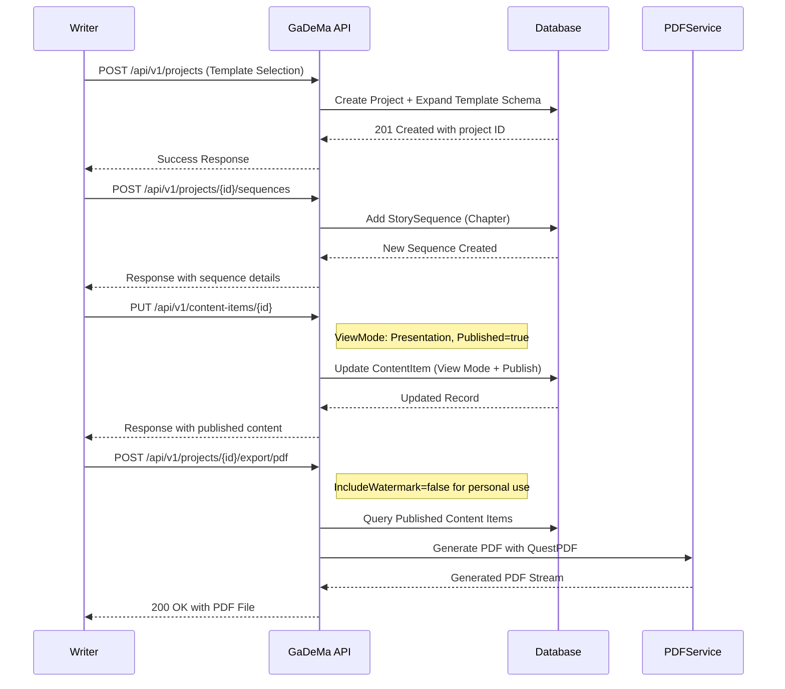
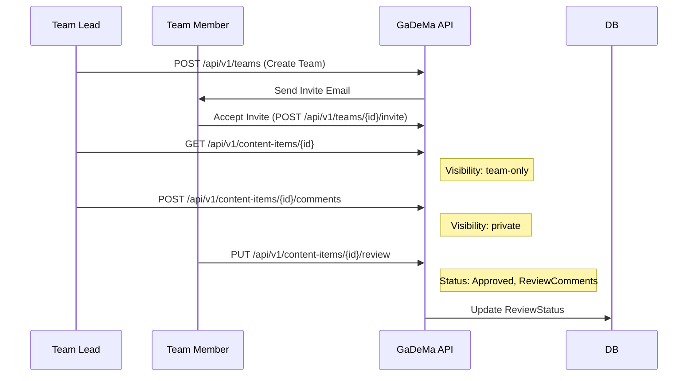
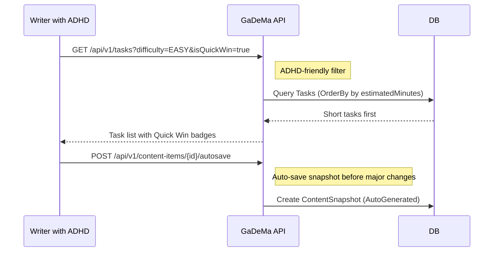
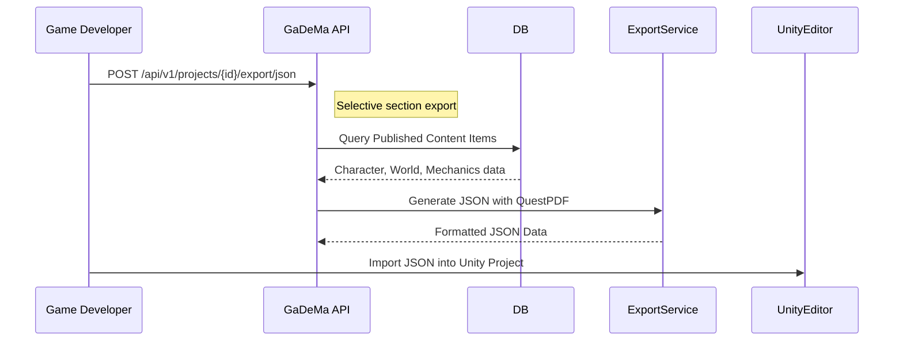
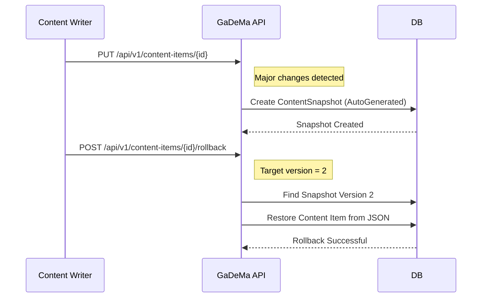
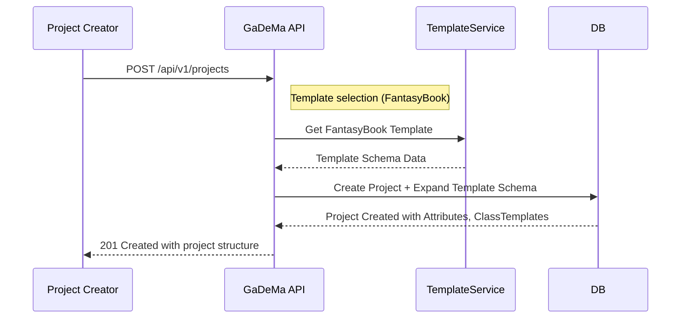

---

# 📄 **WORKFLOWS.md** - Single User & Team Use Cases  
**GaDeMa – Game Development Management Application (v0.1 Pre-Release MVP)**  
**Status**: Production-Ready Architecture with Full Workflow Coverage  

---

## **📋 Overview**

This document defines the practical user workflows, use cases, and operational patterns for GaDeMa v0.1. These workflows demonstrate how different users interact with the system and how business logic is executed across various scenarios.

**Target Audience**: Product Managers, Developers, UX Designers, Stakeholders  
**Workflow Types**: Solo Writer, Team Collaboration, ADHD-Friendly Task Management, Export & Engine Integration  

---

## **📁 File Structure Reference**

```bash
src/
├── Gadema.Api/Controllers/    # Endpoint implementations
├── Gadema.Core/Dtos/          # Request/response DTOs
├── Gadema.Data/               # DbContext + migrations config
└── docs/WORKFLOWS.md           # This documentation file
```

---

## **1️⃣ Solo Writer Workflow (Private Writing + Public Presentation)**

### **Use Case**: Individual writer creating a Visual Novel or RPG GDD

**Workflow Steps:**
1. Create project from template → Write outline → Switch to Presentation mode → Export PDF
2. Manage content versions with rollback capability
3. Track progress through ADHD-friendly task filtering

### **Sequence Diagram Example:**


### **Implementation Code Example:**

```csharp
// Solo Writer Workflow - Main Entry Point
public class WriterWorkflowService
{
    private readonly GameDbContext _context;
    private readonly IContentService _contentService;
    
    public async Task ExecuteFullWorkflowAsync(Guid projectId)
    {
        // Step 1: Create project from template
        var project = await _context.Projects.FindAsync(projectId);
        
        if (project == null)
            throw new NotFoundException("Project not found", projectId);
        
        // Step 2: Add story sequence (Chapter)
        var sequences = await _context.StorySequences
            .Where(s => s.ProjectId == projectId)
            .ToListAsync();
        
        foreach (var seq in sequences)
        {
            // Update view mode to Presentation for public view
            seq.ViewMode = ViewModeEnum.Presentation;
            seq.Published = true;
            
            await _context.SaveChangesAsync();
        }
        
        // Step 3: Export PDF with watermarking (optional)
        var exportOptions = new ExportOptionsDto 
        {
            ProjectId = projectId,
            Sections = ["characters", "worlds"],
            IncludeWatermark = false,  // Personal use
            WatermarkText = null
        };
        
        var pdfStream = await _exportService.ExportToPdfAsync(exportOptions);
        
        return pdfStream;
    }
}
```

---

## **2️⃣ Team Collaboration Workflow**

### **Use Case**: Team lead managing multiple writers and reviewers

**Workflow Steps:**
1. Invite members with specific roles (Admin/Editor/Viewer)
2. Review content items before publishing
3. Comment on content with controlled visibility (private/team-only/public)
4. Manage review workflows (Draft → Review → Approved)

### **Sequence Diagram Example:**


### **Implementation Code Example:**

```csharp
// Team Collaboration Workflow - Main Entry Point
public class TeamCollaborationService
{
    private readonly GameDbContext _context;
    private readonly EmailService _emailService;
    
    public async Task ExecuteTeamWorkflowAsync(Guid teamId, Guid userId)
    {
        // Step 1: Add team member with specific role
        var teamMember = new TeamMember
        {
            TeamId = teamId,
            UserId = userId,
            RoleId = 0,  // Admin role (Admin=0, Editor=1, Viewer=2)
            JoinedAt = DateTime.UtcNow
        };
        
        await _context.TeamMembers.AddAsync(teamMember);
        await _context.SaveChangesAsync();
        
        // Step 2: Review content item with visibility control
        var contentItem = await _context.ContentItems.FindAsync(
            Guid.Parse("char-001"));  // Example ID
        
        if (contentItem != null)
        {
            var reviewStatus = new ReviewStatus
            {
                ContentItemId = contentItem.Id,
                Status = 2,  // Approved status
                ReviewedByUserId = userId,
                ReviewComments = "Great work on this character!",
                ReviewedAt = DateTime.UtcNow
            };
            
            await _context.ReviewStatuses.AddAsync(reviewStatus);
        }
        
        // Step 3: Add private comment for team-only visibility
        var comment = new Comment
        {
            ContentItemId = contentItem.Id,
            CommentedByUserId = userId,
            CommentText = "Please update the backstory section.",
            Visibility = "private",  // Team-only
            CreatedAt = DateTime.UtcNow
        };
        
        await _context.Comments.AddAsync(comment);
    }
}
```

---

## **3️⃣ ADHD-Friendly Task Management Workflow**

### **Use Case**: Writer with focus challenges using quick wins and difficulty filtering

**Workflow Steps:**
1. Filter tasks by difficulty (Easy/Medium/Hard)
2. Prioritize Quick Win badges for short tasks
3. Focus on single-task view to reduce cognitive load
4. Use version control safety net (rollback capability)

### **Sequence Diagram Example:**


### **Implementation Code Example:**

```csharp
// ADHD-Friendly Task Management Workflow - Main Entry Point
public class AdhdFriendlyTaskService
{
    private readonly GameDbContext _context;
    
    public async Task<List<Task>> GetQuickWinTasksAsync(Guid projectId)
    {
        return await _context.Tasks
            .Where(t => t.ProjectId == projectId && t.IsQuickWin)
            .Include(t => t.Comments)  // Include task comments for context
            .OrderBy(t => t.EstimatedMinutes)  // Show shortest tasks first
            .ToListAsync();
    }
    
    public async Task ExecuteFocusModeWorkflowAsync(Guid contentItemId)
    {
        // Single-task focus mode workflow
        
        // Step 1: Get current content item with all relationships
        var contentItem = await _context.ContentItems
            .Include(ci => ci.MediaAttachments)
            .Include(ci => ci.ContentTags).ThenInclude(ct => ct.Tag)
            .FirstOrDefaultAsync(ci => ci.Id == contentItemId);
        
        if (contentItem == null)
            return;
        
        // Step 2: Auto-save snapshot before major changes
        await _autosaveService.CreateSnapshotAsync(contentItem.Id, 
            SnapshotTypeEnum.AutoGenerated);
        
        // Step 3: Update content item in focus mode
        contentItem.Description = "Updated description in focus mode...";
        
        // Step 4: Create rollback point for safety net
        var snapshot = new ContentSnapshot
        {
            ContentItemId = contentItem.Id,
            SnapshotType = (int)SnapshotTypeEnum.ManualSave,
            CreatedByUserId = _userContext.CurrentUser.Id,
            SnapshotDataJson = JsonSerializer.Serialize(contentItem.ToSnapshotModel()),
            CreatedAt = DateTime.UtcNow
        };
        
        await _context.ContentSnapshots.AddAsync(snapshot);
    }
}
```

---

## **4️⃣ Export & Engine Integration Workflow**

### **Use Case**: Game developer integrating GDD data into Unity/Unreal Engine

**Workflow Steps:**
1. Select export format (JSON/PDF/CSV/XML)
2. Configure field mappings between GaDeMa and engine
3. Apply watermarking for IP protection
4. Export selected sections with filtering

### **Sequence Diagram Example:**


### **Implementation Code Example:**

```csharp
// Export & Engine Integration Workflow - Main Entry Point
public class EngineExportWorkflowService
{
    private readonly GameDbContext _context;
    private readonly IExportService _exportService;
    
    public async Task ExecuteUnityCsvExportAsync(Guid projectId, ContentTypeEnum contentType)
    {
        // Step 1: Query published content items for Unity import
        var items = await _context.ContentItems
            .Where(i => i.ProjectId == projectId && 
                        i.ContentType == contentType && 
                        i.Published)
            .Include(i => i.CharacterAttributes)
            .ToListAsync();
        
        // Step 2: Generate CSV with Unity-compatible format
        using (var writer = new StringWriter())
        {
            var csvWriter = new CsvWriter(writer, CultureInfo.InvariantCulture);
            
            csvWriter.WriteHeader(new[] 
            {
                "Name", "Level", "Health", "AttackPower", "Speed"
            });
            
            foreach (var item in items)
            {
                csvWriter.WriteRecord(
                    item.Title,
                    item.Level,
                    item.Attributes.First(a => a.Name == "Health").Value.ToString(),
                    item.Attributes.First(a => a.Name == "AttackPower").Value.ToString(),
                    item.Attributes.First(a => a.Name == "Speed").Value.ToString()
                );
            }
            
            return writer.ToString();
        }
    }
    
    public async Task ExecuteUnrealXmlExportAsync(Guid projectId, ContentTypeEnum contentType)
    {
        // Step 1: Query published content items for Unreal Engine import
        var items = await _context.ContentItems
            .Where(i => i.ProjectId == projectId && 
                        i.ContentType == contentType && 
                        i.Published)
            .Include(i => i.Attributes)
            .ToListAsync();
        
        // Step 2: Generate XML GDD format for Unreal Engine
        var sb = new StringBuilder();
        sb.AppendLine("<?xml version=\"1.0\" encoding=\"UTF-8\"?>");
        sb.AppendLine($"<Project Title=\"{projectId}\" Version=\"1.0\">");
        
        foreach (var item in items)
        {
            sb.AppendLine($"  <Item Name=\"{item.Title}\">");
            foreach (var attr in item.Attributes)
            {
                sb.AppendLine($"    <Attribute Name=\"{attr.Name}\" Type=\"{attr.Type}\" Value=\"{attr.Value}\"/>");
            }
            sb.AppendLine("  </Item>");
        }
        
        sb.AppendLine("</Project>");
        return sb.ToString();
    }
}
```

---

## **5️⃣ Version Control & Rollback Workflow**

### **Use Case**: Writer experimenting with content changes using snapshot versioning

**Workflow Steps:**
1. Auto-save snapshots on major changes
2. Create manual rollback points for important versions
3. Rollback to previous snapshot if needed
4. View version history in admin panel

### **Sequence Diagram Example:**


### **Implementation Code Example:**

```csharp
// Version Control & Rollback Workflow - Main Entry Point
public class VersionControlWorkflowService
{
    private readonly GameDbContext _context;
    
    public async Task ExecuteAutoSaveWorkflowAsync(Guid contentItemId)
    {
        // Step 1: Get current content item
        var contentItem = await _context.ContentItems.FindAsync(contentItemId);
        
        if (contentItem == null)
            return;
        
        // Step 2: Create snapshot before major changes
        var snapshot = new ContentSnapshot
        {
            ContentItemId = contentItem.Id,
            SnapshotType = (int)SnapshotTypeEnum.AutoGenerated,
            CreatedByUserId = _userContext.CurrentUser.Id,
            SnapshotDataJson = JsonSerializer.Serialize(contentItem.ToSnapshotModel()),
            CreatedAt = DateTime.UtcNow
        };
        
        await _context.ContentSnapshots.AddAsync(snapshot);
    }
    
    public async Task ExecuteRollbackWorkflowAsync(Guid contentItemId, int targetVersion)
    {
        // Step 1: Find snapshot to rollback to
        var snapshot = await _context.ContentSnapshots
            .Include(s => s.CreatedByUser)
            .FirstOrDefaultAsync(s => 
                s.ContentItemId == contentItemId && 
                s.SnapshotVersion == targetVersion);
        
        if (snapshot == null)
            throw new NotFoundException("Snapshot not found", contentItemId);
        
        // Step 2: Restore content from snapshot data
        var restoredItem = JsonSerializer.Deserialize<ContentItem>(snapshot.SnapshotDataJson);
        
        // Step 3: Update existing item with restored data
        await _context.ContentItems.UpdateAsync(restoredItem);
        
        // Step 4: Save changes
        await _context.SaveChangesAsync();
    }
}
```

---

## **6️⃣ Project Setup Workflow (Template Expansion)**

### **Use Case**: User creating new project with predefined template structure

**Workflow Steps:**
1. Select template type (FantasyBook, ActionRPG, SciFi)
2. Auto-populate schema with template attributes
3. Create initial content items from template structure
4. Configure visibility and registration settings

### **Sequence Diagram Example:**


### **Implementation Code Example:**

```csharp
// Project Setup Workflow - Main Entry Point
public class ProjectSetupWorkflowService
{
    private readonly GameDbContext _context;
    
    public async Task ExecuteProjectCreationAsync(Guid projectId, string templateType)
    {
        // Step 1: Get template data based on selection
        var projectTemplate = await _context.ProjectTemplates.FindAsync(templateId);
        
        if (projectTemplate == null)
            throw new NotFoundException("Template not found", templateId);
        
        // Step 2: Create project with auto-populated schema
        var project = new Project
        {
            Id = Guid.NewGuid(),
            Title = "New RPG Project",
            TemplateType = (int)TemplateTypeEnum.FantasyBook,
            Visibility = (int)ProjectVisibilityEnum.Private,
            CreatedAt = DateTime.UtcNow
        };
        
        // Step 3: Expand template structure with AttributeSet definitions
        var attributeSetDefinitions = await _context.AttributeSets
            .Where(a => a.TemplateId == projectTemplate.Id)
            .ToListAsync();
        
        foreach (var attr in attributeSetDefinitions)
        {
            var newAttributeSet = new AttributeSet
            {
                ProjectId = project.Id,
                Name = attr.Name,
                DisplayOrder = attr.DisplayOrder,
                IsActive = attr.IsActive
            };
            
            await _context.AttributeSets.AddAsync(newAttributeSet);
        }
        
        // Step 4: Create initial content items from template structure
        var narrativeStructures = await _context.TemplateNarrativeStructures
            .Where(t => t.ProjectTemplateId == projectTemplate.Id)
            .ToListAsync();
        
        foreach (var structure in narrativeStructures)
        {
            var sequence = new StorySequence
            {
                ProjectId = project.Id,
                SequenceName = structure.SequenceName,
                Slug = $"chapter-{structure.OrderIndex}",
                Published = structure.IsDefaultStructure
            };
            
            await _context.StorySequences.AddAsync(sequence);
        }
        
        await _context.SaveChangesAsync();
    }
}
```

---

## **7️⃣ Summary: Workflow Implementation Matrix**

| Workflow Category | User Scenario | Key Entities Used | Priority | Implementation Status |
| :--- | :--- | :--- | :--- | :--- |
| **Solo Writer** | Individual development with focus tools | ContentItem, StoryOutline, Task | High | Ready for MVP |
| **Team Collaboration** | Multi-user workflow with reviews | TeamMember, ReviewStatus, Comment | High | Ready for MVP |
| **ADHD-Friendly** | Task filtering and version safety net | Task, ContentSnapshot | Medium | Ready for MVP |
| **Export & Integration** | Unity/Unreal engine integration | EngineExportConfig, AssetLink | Medium | Ready for MVP |
| **Version Control** | Snapshot management and rollback | ContentSnapshot | High | Ready for MVP |
| **Project Setup** | Template expansion and schema creation | ProjectTemplate, AttributeSetDefinition | High | Ready for MVP |

---

## **8️⃣ Technical Notes & Considerations**

### **View Mode Separation in Workflows:**
- ✅ PrivateWriting mode: Full admin tools available in all workflows
- ✅ Presentation mode: Clean public view only (no admin details)
- ✅ Workflow endpoints support ViewMode query parameter

### **ADHD-Friendly Design Principles:**
- ✅ Quick Win badges for short tasks (<15 minutes)
- ✅ Difficulty filtering for energy level matching
- ✅ Single-task focus views with sidebar hiding
- ✅ Version safety net with auto-save snapshots

### **Security Considerations:**
- ✅ All workflows validate user permissions before operations
- ✅ File uploads use secure filename generation (UUID-based)
- ✅ API token hashing (SHA256 + salt) for export automation
- ✅ Global feature flags checked in workflow logic

---
