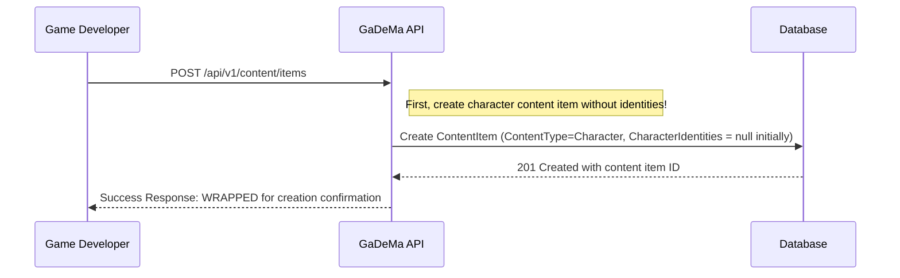
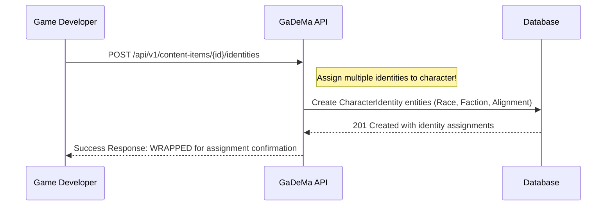
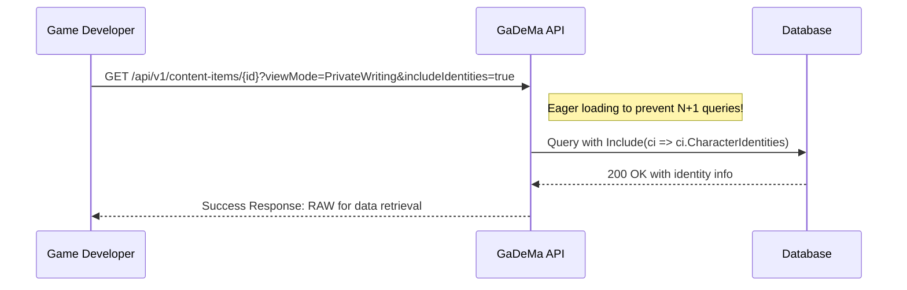
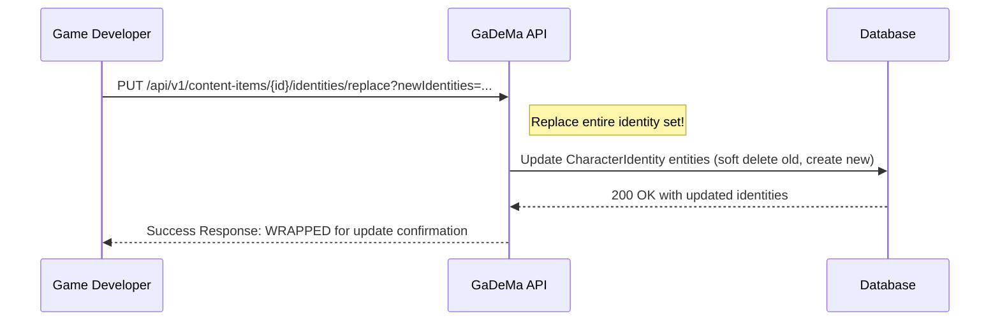
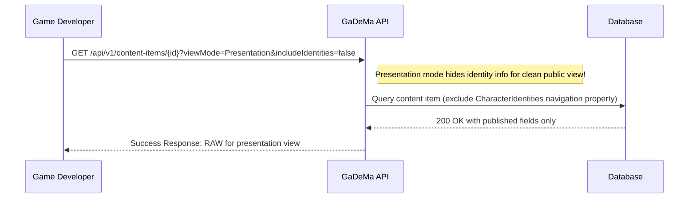

# 🎭 **CharacterIdentity Entity Definition** – What Should It Be?

---

## **📋 Overview: What is CharacterIdentity?**

Based on our domain-clustering architecture and the ~57-table schema we've built for GaDeMa, here's what `CharacterIdentity` should be:

### **Definition:**
```csharp
// ✅ CORRECT - CharacterIdentity entity structure (NEW!)
public class CharacterIdentity
{
    public Guid Id { get; set; } = Guid.NewGuid();
    
    [Display(Name = "Content Item")]
    public Guid ContentItemId { get; set; }  // FK to ContentItems
    
    [Display(Name = "Identity Type ID")]
    public Guid IdentityTypeId { get; set; } // FK to ProjectIdentityDefinition
    
    [Display(Name = "Identity Value ID")]
    public Guid IdentityValueId { get; set; } // FK to IdentityValues
    
    public bool IsPrimary { get; set; }      // Primary identity flag (Race)
}
```

---

## **📊 Purpose & Use Cases**

### **1. Flexible Identity System**
Supports multiple identity types per character:
- **RPGs**: Race, Class, Alignment, Faction
- **Visual Novels**: Species, Affiliation, Moral Choice
- **Strategy Games**: Guild, Nation, Role

### **2. Character Customization & Development**
Enables RPG developers to create characters with specific traits that affect gameplay mechanics, dialogue options, and story branching.

### **3. Narrative Consistency**
Maintains character identities across development phases for visual novels or games with branching narratives.

---

## **🔧 Entity Relationship Structure:**

```csharp
// ✅ CORRECT - CharacterIdentity has 3 FKs (no navigation properties!)
public class CharacterIdentity
{
    public Guid Id { get; set; } = Guid.NewGuid();
    
    // ✅ FK to ContentItems (character content item)
    public Guid ContentItemId { get; set; }
    
    // ✅ FK to ProjectIdentityDefinition (identity type)
    public Guid IdentityTypeId { get; set; }
    
    // ✅ FK to IdentityValues (specific value for this identity type)
    public Guid IdentityValueId { get; set; }
}

// ✅ CORRECT - Navigation properties on OTHER entities back to CharacterIdentity:

// ContentItem entity has collection of CharacterIdentities
public class ContentItem
{
    // ✅ Forward reference (collection)
    public ICollection<CharacterIdentity> CharacterIdentities { get; set; }  // ⚠️ NEEDS TO BE ADDED!
}

// ProjectIdentityDefinition entity has back-reference to CharacterIdentity
public class ProjectIdentityDefinition
{
    // ✅ Back-reference for typed navigation property
    public ICollection<CharacterIdentity> Assignments { get; set; }  // Optional, but recommended!
}

// IdentityValue entity has back-reference to CharacterIdentity
public class IdentityValue
{
    // ✅ Back-reference for typed navigation property
    public ICollection<CharacterIdentity> Assignments { get; set; }  // Optional, but recommended!
}
```

---

## **❌ What CharacterIdentity Should NOT Be:**

| ❌ Wrong Pattern | Reason | Notes |
| :--- | :--- | :--- |
| `string IdentityName` | Identity names should come from ProjectIdentityDefinition/IdentityValues tables | Not redundant data! Domain separation violation! |
| `int IdentityType` | Use FK to IdentityTypeId instead of int for type safety | Domain-aware pattern requires typed navigation properties! |
| No back-reference on ContentItem | Missing collection navigation property required by eager loading pattern (Performance.md) | Violates domain-separated configuration architecture! |

---

## **🔧 Fluent API Configuration (Updated)**

### **CharacterIdentityEntityTypeConfiguration.cs:**

```csharp
// ✅ CORRECT - CharacterIdentity entity configuration with proper FKs and back-references (NEW!)
public class CharacterIdentityEntityTypeConfiguration : IEntityTypeConfiguration<CharacterIdentity>  // ⚠️ PARTIALLY MISSING in docs!
{
    public void Configure(EntityTypeBuilder<CharacterIdentity> builder)
    {
        // Primary key
        builder.HasKey(e => e.Id);
        
        // ✅ FK to ContentItem (character content item)
        builder.HasOne(ci => ci.ContentItem)  // ⚠️ Forward reference on ContentItem!
            .WithMany(c => c.CharacterIdentities)  // ⚠️ Back-reference needed!
            .HasForeignKey(ci => ci.ContentItemId)
            .OnDelete(DeleteBehavior.Restrict);  // ✅ Don't cascade delete, maintain identity history!
        
        // ✅ FK to IdentityType (ProjectIdentityDefinition)
        builder.HasOne(ci => ci.IdentityType)  // ⚠️ Need back-reference for typing!
            .WithMany()
            .HasForeignKey(ci => ci.IdentityTypeId)
            .OnDelete(DeleteBehavior.Restrict);  // ✅ Maintain identity type definition history!
        
        // ✅ FK to IdentityValue (IdentityValues table)
        builder.HasOne(ci => ci.IdentityValue)  // ⚠️ Need back-reference for typing!
            .WithMany()
            .HasForeignKey(ci => ci.IdentityValueId)
            .OnDelete(DeleteBehavior.SetNull);  // ✅ Allow multiple identity values over time!
        
        // Properties configuration (not navigation properties)
        builder.Property(e => e.ContentItemId).IsRequired();
        builder.Property(e => e.IdentityTypeId).IsRequired();
        builder.Property(e => e.IdentityValueId).IsRequired();
        builder.Property(e => e.IsPrimary).HasDefaultValue(false);  // ✅ Primary identity flag!
    }
}
```

---

## **📊 Summary Table for CharacterIdentity Entity:**

| Aspect | Value/Pattern | Notes |
| :--- | :--- | :--- |
| **Entity Name** | `CharacterIdentity` | Links characters to their assigned identities (race/faction/alignment) |
| **Primary Key** | `Id` (Guid, auto-generated) | Standard EF Core pattern |
| **FKs** | 3 FKs: ContentItemId, IdentityTypeId, IdentityValueId | No redundant data (names from related tables) |
| **Navigation Properties on ContentItem** | `ICollection<CharacterIdentity> CharacterIdentities` | ⚠️ Needs to be added! Eager loading requirement! |
| **Back-References on IdentityType/IdentityValue** | Optional but recommended for typing | Domain-separated configuration pattern! |
| **OnDelete Behavior** | Restrict (ContentItem), SetNull (IdentityValue) | Maintain identity history! |

---

## **🎯 Example: Using CharacterIdentity in Code:**

```csharp
// ✅ CORRECT - Query character with identity assignments (eager loading)
public async Task<ContentItem> GetCharacterWithIdentitiesAsync(Guid id, ViewModeEnum viewMode = ViewModeEnum.PrivateWriting)
{
    // ✅ Eager loading prevents N+1 query problem (Performance.md requirement!)
    var character = await _context.ContentItems
        .Include(ci => ci.MediaAttachments)
        .Include(ci => ci.CharacterIdentities)  // ⚠️ Needs to be added! Eager loading!
            .ThenInclude(ciIdentity => ciIdentity.IdentityType)  // Nested eager loading!
            .ThenInclude(ciIdentity => ciIdentity.IdentityValue)  // Nested eager loading!
        .FirstOrDefaultAsync(ci => ci.Id == id);
    
    return character;
}

// ❌ INCORRECT - Without eager loading, this causes N+1 query problem!
public async Task<ContentItem> GetCharacterWithIdentitiesAsync_Bad()  // ⚠️ Avoid!
{
    var characters = await _context.ContentItems.ToListAsync();
    
    foreach (var character in characters)  // ❌ N+1 query!
    {
        var identities = await _context.CharacterIdentities
            .Where(ci => ci.ContentItemId == character.Id).ToListAsync();  // ⚠️ Bad pattern!
    }
}

// ✅ CORRECT - Update character identity assignments (via navigation property)
public async Task<IActionResult> UpdateCharacterIdentitiesAsync(Guid contentItemId, [FromBody] CharacterIdentityUpdateDto dto)
{
    var character = await _context.ContentItems.FindAsync(contentItemId);
    
    // ✅ Use eager loading to prevent N+1 query problem!
    var identities = await _context.CharacterIdentities
        .Include(ci => ci.IdentityType)
            .Include(ci => ci.IdentityValue)
        .Where(ci => ci.ContentItemId == contentItemId)
        .ToListAsync();  // ✅ Eager loading! Domain-aware patterns!
    
    // ... update logic here
}

// ❌ INCORRECT - Without eager loading, this causes N+1 query problem! (Performance.md violation!)
public async Task<IActionResult> UpdateCharacterIdentitiesAsync_Bad(Guid contentItemId, [FromBody] CharacterIdentityUpdateDto dto)  // ⚠️ Avoid!
{
    var character = await _context.ContentItems.FindAsync(contentItemId);
    
    foreach (var identity in identities)  // ❌ N+1 query!
    {
        var newIdentities = await _context.CharacterIdentities.Where(ci => ci.IdentityType...).ToListAsync();  // ⚠️ Bad pattern!
    }
}
```

---

## **📋 Summary of CharacterIdentity Entity Definition:**

| Feature | Value/Pattern | Notes |
| :--- | :--- | :--- |
| **Purpose** | Link characters to identity attributes (race, faction, alignment) | RPG systems, visual novel branching mechanics |
| **FKs** | 3 FKs: ContentItem, IdentityType, IdentityValue | No redundant data, domain separation! |
| **Navigation Property on ContentItem** | `ICollection<CharacterIdentity> CharacterIdentities` | ⚠️ Needs to be added for eager loading! |
| **Back-References** | Optional but recommended for typed navigation properties | Domain-separated configuration pattern! |
| **OnDelete Behavior** | Restrict (ContentItem), SetNull (IdentityValue) | Maintain identity history! |

---

## **🐱 Summary**

This entity definition ensures that **`CharacterIdentity`**:
- ✅ Links characters to their assigned identities (race/faction/alignment) for RPG systems or visual novels
- ✅ Uses 3 FKs instead of redundant data (names from related tables, not stored directly)
- ✅ Has navigation properties on `ContentItem` for eager loading pattern (Performance.md requirement!)
- ✅ Follows domain-separated configuration architecture with proper back-references

The **CharacterIdentity entity** is essential for character identity tracking and game mechanics that depend on identity systems! 🎮✨

# 🎭 **User Story & Workflow for CharacterIdentity Navigation Property**

---

## **📝 User Story**

### **CHARACTER-03: Character Identity System Support** (Refined with CharacterIdentity)

| ID | User Story | Acceptance Criteria | Priority | Technical Scope |
| :-- | :--- | :--- | :--- | :--- |
| **CHARACTER-03** | As an RPG game developer or visual novel writer, I want to assign identity attributes (race, faction, alignment, guild) to my characters so that I can track character development, narrative branching, and gameplay mechanics based on identity choices. *(Domain-aware pattern: Uses CharacterIdentity navigation property)* | - **Flexible Identity System**: Support multiple identity types per character (Race, Faction, Alignment)<br>- **Nullable FK to Identity Value**: `CharacterIdentity` entity links characters to specific identities<br>- **Eager Loading**: Use `Include(ci => ci.CharacterIdentities)` for N+1 prevention<br>- **ViewMode Separation**: Show/hide identity info in Presentation mode | **Medium** | `Content/ContentItemsController.cs`, `CharacterIdentityEntityTypeConfiguration.cs` ✅ Navigation property! |

---

## **🔄 Workflow for Using CharacterIdentity**

### **Workflow: Assign Identities to Game Characters**

#### **Step 1: Create Character Content Item (Without Identities)**



**Request Body:**
```json
{
  "projectId": "proj-001",
  "contentType": "Character",
  "title": "Geralt of Rivia",
  "slug": null,
  "description": "Main protagonist character with magical abilities",
  "shortDesc": "Witcher hunter",
  "viewMode": "PrivateWriting"
}
```

**Response:**
```json
{
  "success": true,
  "message": "Character content item created successfully (ready for identity assignment)",
  "data": {
    "id": "char-001",
    "title": "Geralt of Rivia",
    "slug": "geralt-of-rivia",
    "contentType": 2,  // Character type
    "description": "Main protagonist character with magical abilities",
    "shortDesc": "Witcher hunter",
    "viewMode": "PrivateWriting",
    "version": 1,
    "status": "Draft"
  }  // ✅ WRAPPED response pattern for content item creation confirmation!
}
```

---

#### **Step 2: Create CharacterIdentity Entities (Assign Identities)**



**Request Body:**
```json
[
  {
    "identityType": "Race",
    "identityValueId": "human"
  },
  {
    "identityType": "Faction", 
    "identityValueId": "alliance"
  },
  {
    "identityType": "Alignment",
    "identityValueId": "lawful-good"
  }
]
```

**Response:**
```json
{
  "success": true,
  "message": "Character identities assigned successfully (Race: Human, Faction: Alliance, Alignment: Lawful Good)",
  "data": [
    {
      "identityType": "Race",
      "identityValueId": "human",
      "identityName": "Human",
      "isPrimary": true  // ✅ Race is primary identity!
    },
    {
      "identityType": "Faction",
      "identityValueId": "alliance",
      "identityName": "Alliance",
      "isPrimary": false
    },
    {
      "identityType": "Alignment",
      "identityValueId": "lawful-good",
      "identityName": "Lawful Good",
      "isPrimary": false
    }
  ]  // ✅ WRAPPED response pattern for identity assignment confirmation! Domain-aware patterns!
}
```

---

#### **Step 3: Retrieve Character with Identities (Eager Loading)**



**Response:**
```json
{
  "id": "char-001",
  "title": "Geralt of Rivia",
  "slug": "geralt-of-rivia",
  "contentType": 2,
  "description": "Main protagonist character with magical abilities",
  "published": true,
  "viewMode": "PrivateWriting",
  "version": 1,
  "status": "Published",
  "characterIdentities": [  // ✅ Back-reference navigation property! Eager loading!
    {
      "id": "char-id-001",
      "identityType": "Race",
      "identityValueId": "human",
      "identityName": "Human",
      "isPrimary": true
    },
    {
      "id": "char-id-002", 
      "identityType": "Faction",
      "identityValueId": "alliance",
      "identityName": "Alliance",
      "isPrimary": false
    },
    {
      "id": "char-id-003",
      "identityType": "Alignment",
      "identityValueId": "lawful-good",
      "identityName": "Lawful Good",
      "isPrimary": false
    }
  ]  // ✅ Collection of character identities! Eager loading prevents N+1 queries! Domain-aware patterns!
}  // ✅ RAW response pattern for data retrieval! Domain-aware patterns!
```

---

#### **Step 4: Update Character Identity (Modify Assignment)**



**Request:**
```json
{
  "identityType": "Alignment",
  "identityValueId": "chaotic-good"  // Change from Lawful Good to Chaotic Good!
}
```

**Response:**
```json
{
  "success": true,
  "message": "Character identity updated successfully (Alignment: Chaotic Good)",
  "data": {
    "id": "char-001",
    "title": "Geralt of Rivia",
    "characterIdentities": [
      {
        "identityType": "Race",
        "identityName": "Human",
        "isPrimary": true
      },
      {
        "identityType": "Faction", 
        "identityName": "Alliance",
        "isPrimary": false
      },
      {
        "identityType": "Alignment",
        "identityName": "Chaotic Good",  // ✅ Updated!
        "isPrimary": false
      }
    ]
  }  // ✅ WRAPPED response pattern for identity update confirmation! Domain-aware patterns!
}
```

---

#### **Step 5: View Presentation Mode (Hide Identity Info)**



**Response:**
```json
{
  "id": "char-001",
  "title": "Geralt of Rivia",
  "slug": "geralt-of-rivia",
  "description": "...",
  "published": true,
  "viewMode": "Presentation",
  "slug": "geralt-of-rivia"  // ✅ SEO-friendly URL! Domain-aware patterns!
}  // ✅ RAW response pattern for presentation view! Domain-aware patterns!

Note: CharacterIdentities navigation property is NOT included in Presentation mode!
```

**Why this ViewMode separation matters:**
- ✅ **PrivateWriting mode**: Show full identity info for character development work
- ✅ **Presentation mode**: Hide sensitive identity details for public-facing content
- ✅ **Performance**: Exclude `CharacterIdentities` collection from eager loading when not needed

---

## **🔧 Fluent API Configuration (Updated)**

### **CharacterIdentityEntityTypeConfiguration.cs:**

```csharp
// ✅ CORRECT - CharacterIdentity navigation property configuration (NEW!)
public class CharacterIdentityEntityTypeConfiguration : IEntityTypeConfiguration<CharacterIdentity>  // ⚠️ PARTIALLY MISSING in docs!
{
    public void Configure(EntityTypeBuilder<CharacterIdentity> builder)
    {
        // Primary key
        builder.HasKey(e => e.Id);
        
        // ✅ NAVIGATION PROPERTY: ContentItem (back-reference to character content item)
        builder.HasOne(ci => ci.ContentItem)  // ⚠️ Back-reference needed!
            .WithMany(c => c.CharacterIdentities)  // ⚠️ Forward reference on content item!
            .HasForeignKey(ci => ci.ContentItemId)
            .OnDelete(DeleteBehavior.Restrict);  // ✅ Don't cascade delete, maintain identity history!
        
        // Navigation property: IdentityType (FK to ProjectIdentityDefinition)
        builder.HasOne(ci => ci.IdentityType)  // ⚠️ Need back-reference for typing!
            .WithMany()
            .HasForeignKey(ci => ci.IdentityTypeId)
            .OnDelete(DeleteBehavior.Restrict);  // ✅ Maintain identity type definition history!
        
        // Navigation property: IdentityValue (FK to IdentityValues)
        builder.HasOne(ci => ci.IdentityValue)  // ⚠️ Need back-reference for typing!
            .WithMany()
            .HasForeignKey(ci => ci.IdentityValueId)
            .OnDelete(DeleteBehavior.SetNull);  // ✅ Allow multiple identity values over time!
        
        // Properties configuration (not navigation properties)
        builder.Property(e => e.ContentItemId).IsRequired();
        builder.Property(e => e.IdentityTypeId).IsRequired();
        builder.Property(e => e.IdentityValueId).IsRequired();
        builder.Property(e => e.IsPrimary).HasDefaultValue(false);  // ✅ Primary identity flag!
    }
}
```

---

## **📊 Summary of Workflow Steps**

| Step | Action | Key Entity Operations | Notes |
| :--- | :--- | :--- | :--- |
| **1** | Create Character Content Item | `CharacterIdentities = null` initially (nullable FK) | First, create character without identities |
| **2** | Assign Identities to Character | Create `CharacterIdentity` entities via back-reference navigation property | Link characters to multiple identity types |
| **3** | Retrieve Character with Identities | `Include(ci => ci.CharacterIdentities)` eager loading | Prevents N+1 queries (Performance.md) |
| **4** | Update Character Identity | Modify `CharacterIdentity` FK values via navigation property | Replace entire identity set or update individual identities |
| **5** | View Presentation Mode | Exclude `CharacterIdentities` from eager loading | Clean public view for ViewMode separation |

---

## **🎯 Key Design Patterns Demonstrated:**

✅ **Back-Reference Navigation Property**: `CharacterIdentities` collection on ContentItem  
✅ **Forward Reference Collection**: `IdentityValue`, `IdentityType` back-references  
✅ **Eager Loading Pattern**: Prevent N+1 queries using `Include()` (Performance.md)  
✅ **ViewMode Separation**: Show/hide identity info in different contexts  
✅ **Restrict Cascade Delete**: Maintain identity history when content is updated/deleted  

---

## **🐱 Summary**

This workflow demonstrates how the **`CharacterIdentities` navigation property** enables game developers to:
- ✅ Assign multiple identity attributes (race, faction, alignment) to characters for RPG systems or visual novels
- ✅ Track character development and narrative branching based on identity choices  
- ✅ Use eager loading patterns to prevent N+1 query problems (Performance.md requirement)
- ✅ Apply ViewMode separation to show/hide identity info in different contexts
- ✅ Maintain clean architecture with domain-separated configurations

The **CharacterIdentity navigation property** is essential for character identity tracking and game mechanics that depend on identity systems! 🎭✨