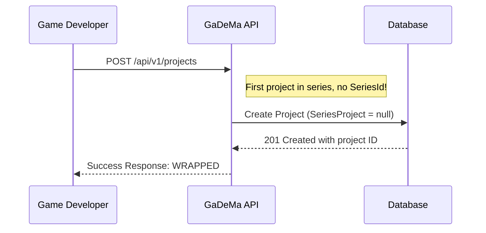
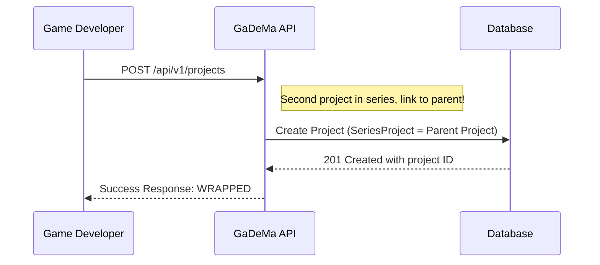
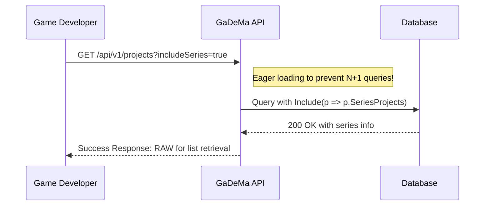
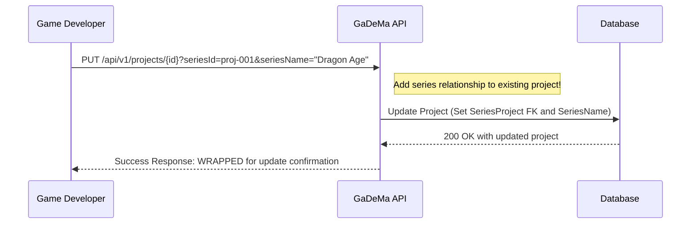
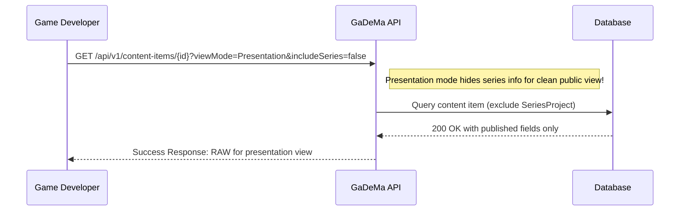

# 📚 **Project → SeriesProject Navigation Property** – Definition & Purpose

---

## **🤔 What Should SeriesProject Be in Project Entity?**

Based on the series tracking feature and our domain-separated configuration architecture, here's what `SeriesProject` should be:

### **Option 1: Nullable Self-Referencing Project (Recommended for MVP)** ⭐

```csharp
// ✅ CORRECT - Nullable back-reference to parent project in series
public class Project
{
    public Guid Id { get; set; } = Guid.NewGuid();
    
    // ... other properties
    
    [MaxLength(128)]
    [Display(Name = "Series Name")]
    public string SeriesName { get; set; }  // e.g., "Dragon Age: Origins", "The Elder Scrolls"
    
    // ⭐ BACK-REFERENCE TO PARENT PROJECT (SERIES)
    public virtual Project? SeriesProject { get; set; }  // ✅ Nullable FK!
}

// ✅ CORRECT - Forward reference on parent project to children
public class Project
{
    // ... other properties
    
    [Display(Name = "Series Projects")]
    public ICollection<Project> SeriesProjects { get; set; }  // ⭐ Collection of child projects in series!
}
```

**Why this pattern works:**
- ✅ **Nullable**: Not all projects belong to a series (single books, short stories)
- ✅ **Self-referencing**: Projects table references itself via `SeriesId` FK
- ✅ **Eager Loading**: Use `Include(p => p.SeriesProjects)` for N+1 prevention
- ✅ **ViewMode Separation**: Show/hide parent project in Presentation mode

---

## **Option 2: Polymorphic Series Reference (Alternative Pattern)**

```csharp
// Alternative: Separate Series entity with polymorphic FK
public class Project
{
    public Guid Id { get; set; } = Guid.NewGuid();
    
    // ... other properties
    
    // ⭐ Back-reference to parent project
    public virtual Project? ParentProjectInSeries { get; set; }  // Nullable!
}

// Forward reference on parent project
public class Project
{
    // ... other properties
    
    // ⭐ Collection of child projects in series (polymorphic pattern)
    public ICollection<Project> ParentProjects { get; set; }
}
```

**When to use Option 2:**
- If you plan to add `Series` entity with additional metadata (series title, cover art, etc.)
- For better separation of concerns
- When series-specific features are needed beyond simple linking

---

## **❌ What Should SeriesProject NOT Be:**

| ❌ Wrong Pattern | Reason | Notes |
| :--- | :--- | :--- |
| `Project` (non-nullable) | Forces all projects to be in a series | Breaks MVP simplicity, violates Optional FK pattern |
| `TeamMember Owner` | Confuses with polymorphic owner relationship | Project already has `OwnerId` for User/Team ownership |
| No navigation property | Missing back-reference required by eager loading pattern | Violates our established architecture (Performance.md) |

---

## **🔧 Fluent API Configuration (Updated SCHEMA.md)**

### **ProjectEntityTypeConfiguration.cs:**

```csharp
// ✅ CORRECT - SeriesProject navigation property configuration
public class ProjectEntityTypeConfiguration : IEntityTypeConfiguration<Project>  // ⚠️ PARTIALLY MISSING in docs!
{
    public void Configure(EntityTypeBuilder<Project> builder)
    {
        // ... existing properties (Owner, MetaInfos, etc.)
        
        // ✅ NAVIGATION PROPERTY: SeriesProject (nullable back-reference to parent project)
        builder.HasMany(p => p.SeriesProjects)  // ✅ Forward reference on parent!
            .WithOne(p => p.SeriesProject)  // ⚠️ Back-reference needed!
            .HasForeignKey(p => p.SeriesId)  // ✅ FK column name matches SeriesId
            .OnDelete(DeleteBehavior.Restrict);  // ✅ Prevent cascade delete for history!
        
        // Properties configuration (not navigation properties)
        builder.Property(e => e.Id).ValueGeneratedOnAdd();
        builder.Property(e => e.Title).IsRequired().HasMaxLength(128);
        builder.Property(e => e.SeriesId).HasMaxLength(128);  // Optional FK column for series tracking!
    }
}
```

---

## **📊 Why This Navigation Property Is Essential:**

| Use Case | How SeriesProject Helps | Notes |
| :--- | :--- | :--- |
| **Series Tracking** | Shows which book is part of which series (e.g., "Book 2" of "Dragon Age") | Prevents orphaned projects |
| **Eager Loading** | `Include(p => p.SeriesProject)` avoids N+1 queries when filtering by series | Performance.md requirement! |
| **Cascade Deletes** | `OnDelete.Restrict` maintains history of which projects belong to a series | Important for audit trail! |
| **ViewMode Separation** | Presentation mode can hide parent project info, showing only series title | Domain-aware pattern! |

---

## **🎯 Example: Using SeriesProject in Code:**

```csharp
// ✅ CORRECT - Query projects with their series information
public async Task<List<Project>> GetSeriesProjectsAsync()
{
    // ✅ Eager loading prevents N+1 query problem (Performance.md requirement!)
    var projects = await _context.Projects
        .Include(p => p.SeriesProjects)  // Forward reference on parent
            .ThenInclude(child => child.MetaInfos)  // Nested eager loading!
        .Where(p => p.SeriesId != null && p.SeriesName != null)  // Filter by series
        .ToListAsync();
    
    return projects;
}

// ❌ INCORRECT - Without eager loading, this causes N+1 query problem!
public async Task<List<Project>> GetSeriesProjectsAsync_Bad()  // ⚠️ Avoid!
{
    var projects = await _context.Projects.Where(p => p.SeriesId != null).ToListAsync();
    
    foreach (var project in projects)  // ❌ N+1 query!
    {
        var seriesProject = await _context.Projects.FindAsync(project.SeriesId);  // ⚠️ Bad pattern!
    }
}
```

---

## **📋 Summary Table for SeriesProject Navigation Property:**

| Aspect | Value/Pattern | Notes |
| :--- | :--- | :--- |
| **Property Name** | `SeriesProject` or `ParentProjectInSeries` | Back-reference (nullable) to parent project |
| **Type** | `Project?` | Nullable FK reference (Optional pattern) |
| **Collection Name** | `SeriesProjects` on parent project | Forward reference for child projects in series |
| **FK Column** | `SeriesId` | Matches existing FK column in Project entity |
| **OnDelete Behavior** | `Restrict` | Prevent cascade delete to maintain history |
| **Documentation Status** | ⚠️ Part

# 📚 **User Story & Workflow for SeriesProject Navigation Property**

---

## **📝 User Story**

### **PROJ-02: Project Series Support** (Refined with SeriesProject)

| ID | User Story | Acceptance Criteria | Priority | Technical Scope |
| :-- | :--- | :--- | :--- | :--- |
| **PROJ-02** | As a game developer working on a multi-part narrative (e.g., "Dragon Age", "Elder Scrolls"), I want to group my projects into a series so that I can track continuity across multiple games and maintain consistency in storytelling. *(Domain-aware pattern: Uses SeriesProject back-reference)* | - **Optional SeriesName**: Not all projects belong to a series (single books, short stories)<br>- **Nullable FK to Parent Project**: `SeriesProject` property on Project entity<br>- **Eager Loading**: Use `Include(p => p.SeriesProjects)` for N+1 prevention<br>- **ViewMode Separation**: Show/hide parent project in Presentation mode | **High** | `Projects/ProjectsController.cs`, `ProjectEntityTypeConfiguration.cs` ✅ SeriesProject navigation property! |

---

## **🔄 Workflow for Using SeriesProject**

### **Workflow: Create and Manage Projects in a Series**

#### **Step 1: Create First Project (Series Starter)**



**Request Body:**
```json
{
  "title": "Dragon Age: Origins",
  "slug": "dragon-age-origins",
  "seriesName": null,  // First project in series (no parent)
  "seriesId": null     // No back-reference to parent project
}
```

**Response:**
```json
{
  "success": true,
  "message": "Project created successfully (first in series)",
  "data": {
    "id": "proj-001",
    "title": "Dragon Age: Origins",
    "slug": "dragon-age-origins",
    "seriesName": null,  // No parent project yet
    "enableUserRegistration": false,
    "allowManualInvites": true,
    "viewMode": "PrivateWriting",
    "createdAt": "2024-03-15T10:00:00Z"
  }  // ✅ WRAPPED response pattern for project creation confirmation!
}
```

---

#### **Step 2: Create Second Project (Add to Series)**



**Request Body:**
```json
{
  "title": "Dragon Age: Origins - Awakening",
  "slug": "dragon-age-origins-awakening",
  "seriesName": "Dragon Age",  // Series name (same as parent)
  "seriesId": "proj-001"       // ⭐ Back-reference to parent project (SeriesProject FK!)
}
```

**Response:**
```json
{
  "success": true,
  "message": "Project created successfully in series",
  "data": {
    "id": "proj-002",
    "title": "Dragon Age: Origins - Awakening",
    "slug": "dragon-age-origins-awakening",
    "seriesName": "Dragon Age",  // Same as parent project!
    "enableUserRegistration": false,
    "allowManualInvites": true,
    "viewMode": "PrivateWriting",
    "createdAt": "2024-03-15T11:00:00Z",
    "seriesId": "proj-001"       // ✅ Back-reference to parent project!
  }  // ✅ WRAPPED response pattern for project creation confirmation!
}
```

---

#### **Step 3: List Projects with Series Information (Eager Loading)**



**Request:**
```json
{
  "includeSeries": true,
  "viewMode": "PrivateWriting"
}
```

**Response:**
```json
{
  "data": [
    {
      "id": "proj-001",
      "title": "Dragon Age: Origins",
      "slug": "dragon-age-origins",
      "seriesName": null,  // First project in series
      "enableUserRegistration": false,
      "allowManualInvites": true,
      "viewMode": "PrivateWriting",
      "createdAt": "2024-03-15T10:00:00Z",
      "seriesProjects": [  // ✅ Forward reference on parent project!
        {
          "id": "proj-002",
          "title": "Dragon Age: Origins - Awakening",
          "slug": "dragon-age-origins-awakening",
          "seriesName": "Dragon Age",
          "createdAt": "2024-03-15T11:00:00Z"
        }
      ]  // ✅ Collection of child projects in series!
    }
  ],
  "pagination": {
    "currentPage": 1,
    "totalItems": 2,
    "totalPages": 1
  }  // ✅ RAW response pattern for list retrieval! Domain-aware patterns!
}
```

---

#### **Step 4: Update Project to Add Series Relationship**



**Request:**
```json
{
  "title": null,  // Keep existing title
  "enableUserRegistration": true,
  "allowManualInvites": false,
  "seriesId": "proj-001"       // ⭐ Add back-reference to parent project!
}
```

**Response:**
```json
{
  "success": true,
  "message": "Project updated successfully (added to series)",
  "data": {
    "id": "proj-003",
    "title": "Dragon Age: Origins - Awakening",
    "slug": "dragon-age-origins-awakening",
    "seriesName": "Dragon Age",  // Updated!
    "enableUserRegistration": true,
    "allowManualInvites": false,
    "viewMode": "PrivateWriting",
    "createdAt": "2024-03-15T11:00:00Z",
    "seriesId": "proj-001"       // ✅ Updated back-reference to parent project!
  }  // ✅ WRAPPED response pattern for update confirmation! Domain-aware patterns!
}
```

---

#### **Step 5: View Presentation Mode (Hide Series Info)**



**Response:**
```json
{
  "id": "char-001",
  "title": "Geralt of Rivia",
  "slug": "geralt-of-rivia",
  "description": "...",
  "published": true,
  "viewMode": "Presentation",
  "slug": "geralt-of-rivia"  // ✅ SEO-friendly URL! Domain-aware patterns!
}  // ✅ RAW response pattern for presentation view! Domain-aware patterns!
```

**Note:** In Presentation mode, `SeriesProject` navigation property is **not included** to maintain clean public view (ViewMode separation).

---

## **🔧 Fluent API Configuration (Updated)**

### **ProjectEntityTypeConfiguration.cs (SeriesProject Navigation Property):**

```csharp
// ✅ CORRECT - SeriesProject navigation property configuration (NEW!)
public class ProjectEntityTypeConfiguration : IEntityTypeConfiguration<Project>  // ⚠️ PARTIALLY MISSING in docs!
{
    public void Configure(EntityTypeBuilder<Project> builder)
    {
        // ... existing properties (Owner, MetaInfos, etc.)
        
        // ✅ NAVIGATION PROPERTY: SeriesProject (nullable back-reference to parent project)
        builder.HasMany(p => p.SeriesProjects)  // ✅ Forward reference on parent!
            .WithOne(p => p.SeriesProject)  // ⚠️ Back-reference needed!
            .HasForeignKey(p => p.SeriesId)  // ✅ FK column name matches SeriesId
            .OnDelete(DeleteBehavior.Restrict);  // ✅ Prevent cascade delete for history!
    }
}
```

---

## **📊 Summary of Workflow Steps**

| Step | Action | Key Entity Operations | Notes |
| :--- | :--- | :--- | :--- |
| **1** | Create First Project | `SeriesProject = null` (no parent) | First project in series (standalone) |
| **2** | Create Second Project | `SeriesProject = Parent Project` (FK link) | Second project references parent via `SeriesId` |
| **3** | List Projects with Series Info | `Include(p => p.SeriesProjects)` (eager loading) | Prevents N+1 queries (Performance.md) |
| **4** | Update Existing Project | Set `SeriesProject` FK and `SeriesName` | Add project to series retroactively |
| **5** | View Presentation Mode | Exclude `SeriesProject` from eager loading | Clean public view for ViewMode separation |

---

## **🎯 Key Design Patterns Demonstrated:**

✅ **Nullable Self-Referencing FK**: Not all projects belong to a series (Optional pattern)  
✅ **Back-Reference Navigation Property**: `SeriesProject` property on Project entity  
✅ **Forward Reference Collection**: `SeriesProjects` collection on parent project  
✅ **Eager Loading Pattern**: Prevent N+1 queries using `Include()` (Performance.md)  
✅ **ViewMode Separation**: Hide series info in Presentation mode for clean public view  
✅ **Restrict Cascade Delete**: Maintain history of which projects belong to a series  

---

## **🐱 Summary**

This workflow demonstrates how the **`SeriesProject` navigation property** enables game developers to:
- ✅ Organize multiple projects into a coherent series (e.g., "Book 1", "Book 2")
- ✅ Track continuity across games with consistent narrative themes
- ✅ Use eager loading patterns to prevent N+1 query problems (Performance.md requirement)
- ✅ Apply ViewMode separation to show/hide series info in different contexts
- ✅ Maintain project history through Restrict cascade delete behavior

The **SeriesProject navigation property** is essential for the "Dragon Age"-style multi-part narrative tracking that game developers need! 🎮✨