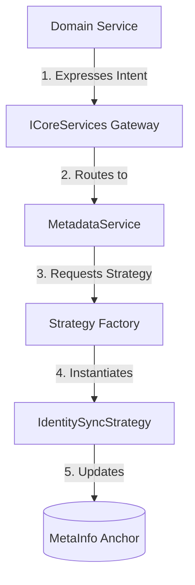

# 🧬 The Identity System: Soul & Body Architecture

The GaDeMa architecture is built upon a fundamental distinction between an entity's **Identity** and its **Domain Data**. This concept, known as the **Soul & Body Pattern**, allows for a highly flexible, scale-invariant system where content can exist within different hierarchical contexts without losing its core identity.

---

## ⚖️ The Core Philosophy: Soul vs. Body

In many systems, an entity is a single monolithic block of data. In GaDeMa, we split this into two distinct parts to achieve maximum decoupling and structural flexibility.

| Component | Concept | Responsibility | Persistence Layer |
| :--- | :--- | :--- | :--- |
| **The Soul** | `MetaInfo` (Identity Anchor) | Maintaining the "Universal Identity" (Title, Slug, Type, Global Tags, Version). | The `MetaInfos` table. |
| **The Body** | Domain Entity (e.g., `Scene`, `ProjectTask`) | Holding the specific domain-driven data (Content, Difficulty, Status). | The specific Domain table (e.g., `Scenes`). |

### Why this matters:
By separating the **Soul** from the **Body**, we ensure that an entity's identity remains stable even if its "body" is moved, restructured, or transformed. This enables the "Graph-not-Tree" model where entities can be re-parented or contextually shifted without breaking their fundamental existence.

---

## ⚓ The Anchor Pattern

Every piece of content in GaDeMa is "anchored" to a `MetaInfo` record. This anchor acts as the universal pointer that allows the system to:
1.  **Identify** the item across different domains (Access, Tasks, Writing).
2.  **Synchronize** identity properties (like title or slug) automatically.
3.  **Track** versioning and global metadata consistently.

---

## 🔄 Identity Synchronization (The Sync Mechanism)

Maintaining the link between a "Body" and its "Soul" requires careful coordination. To prevent domain services from being overwhelmed by infrastructure logic, we use an **Identity Synchronization mechanism** mediated by the `ICoreServices` gateway.

### The Workflow: The Strategy Pattern in Action

When a domain entity is updated, its identity properties (the "Soul") must often be updated alongside it. We achieve this using a specialized **Strategy Factory**.

#### 1. The Trigger (Domain Service)
The developer simply calls `SyncIdentityAsync<T>` within their service. They do not need to know *how* the sync happens; they only express the *intent*.

```csharp
// Inside a Domain Service (e.g., CharacterService)
public async Task UpdateAsync(Guid id, CharacterUpdateDto dto)
{
    // 1. Update the Body (The actual character data)
    var character = await _db.Characters.FindAsync(id);
    character.Name = dto.Name;

    // 2. Synchronize the Soul (The MetaInfo anchor)
    // This single call handles the complexity of routing and strategy execution.
    await SyncIdentityAsync<CharacterIdentityStrategy>(id, dto.ContentMetaInfo);

    await _db.SaveChangesAsync();
}
```

#### 2. The Gateway (`ICoreServices`)
The request is routed through the `CoreServices` gateway. This gateway acts as a centralized dispatcher, ensuring that all infrastructure concerns (Audit, Metadata, Permissions) are handled in a unified way.

#### 3. The Execution (`MetadataService` & Strategy)
The `MetadataService` receives the request and uses a **Strategy Factory** to instantiate the correct `IIdentitySyncStrategy` based on the generic type `<T>`.

*   **The Strategy**: A specialized class (e.g., `CharacterIdentityStrategy`) that knows exactly which fields in the "Body" map to which fields in the "Soul".
*   **The Execution**: The strategy performs the delta calculation and executes the necessary updates to the `MetaInfo` anchor, ensuring the "Soul" accurately reflects the new state of the "Body."

---

## 🛠️ Implementation Hierarchy

To maintain order, all identity operations must follow this strict downward dependency flow:



### Summary of Responsibilities

| Layer | Responsibility | Known As... |
| :--- | :--- | :--- |
| **Domain Service** | Expressing business intent and updating the "Body". | The Body Manager |
| **Core Gateway** | Coordinating cross-cutting infrastructure concerns. | The Orchestrator |
| **Metadata Service** | Managing the lifecycle of the Identity Anchors. | The Soul Keeper |
| **Sync Strategy** | Mapping specific Body fields to Soul properties. | The Bridge |

---

## ⚠️ The Golden Rule for Developers

> **"Never attempt to update MetaInfo properties manually within a Domain Service."**

Always use the `SyncIdentityAsync<T>` pattern. This ensures that your changes are properly audited, versioned, and synchronized across the entire system.
