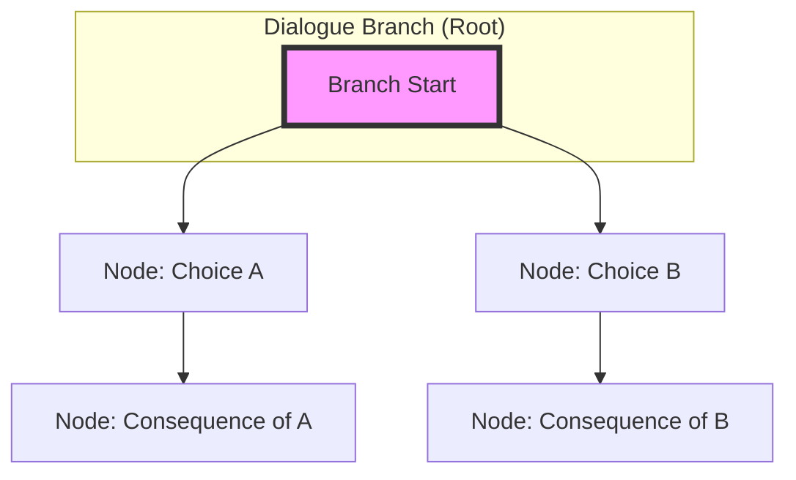

# Dialogue & Branching Narrative

The dialogue system manages interactive, non-linear narrative paths. Unlike linear prose, this system allows for decision-based branching where a character's or player's choices lead to different narrative outcomes.

## 🏗️ The Branching Hierarchy

The system utilizes a tree-based structure to manage choice-driven storytelling:

### 1. Dialogue Branch (The Root)
A `DialogueBranch` represents the entry point of a specific narrative thread or decision path. It acts as the root node for a tree of subsequent choices and outcomes.

**Key Properties:**
- **Root Identity**: Defines the start of a new branch of possibility.
- **Self-Reference**: Uses a `ParentNodeId` to link back to itself or a parent, allowing for complex, multi-layered decision trees.

### 2. Dialogue Node (The Choice/Line)
A `DialogueNode` is an individual unit within a branch. It represents a single line of dialogue, a specific action, or a junction point where a choice must be made.

**Key Properties:**
- **Branch Linkage**: Every node is anchored to its parent `DialogueBranch`.
- **Decision Points**: Nodes serve as the points where the narrative path can diverge based on player/character input.

---

## 🗺️ Visualizing the Tree

## ⚠️ Architectural Notes

### Non-Linearity via Self-Reference
The system avoids rigid, linear structures by using a self-referencing `ParentNodeId` pattern. This allows for:
- **Cyclical Paths**: Characters returning to previous states/choices.
- **Complex Branching**: Deeply nested decision trees that can diverge and then converge back into a single narrative thread.

### Integration with Scenes
While scenes provide the "Canvas" (the text and setting), the Dialogue system provides the "Logic." A scene may contain multiple dialogue branches, allowing the player to navigate through different paths of interaction within a single physical location or moment in time.
