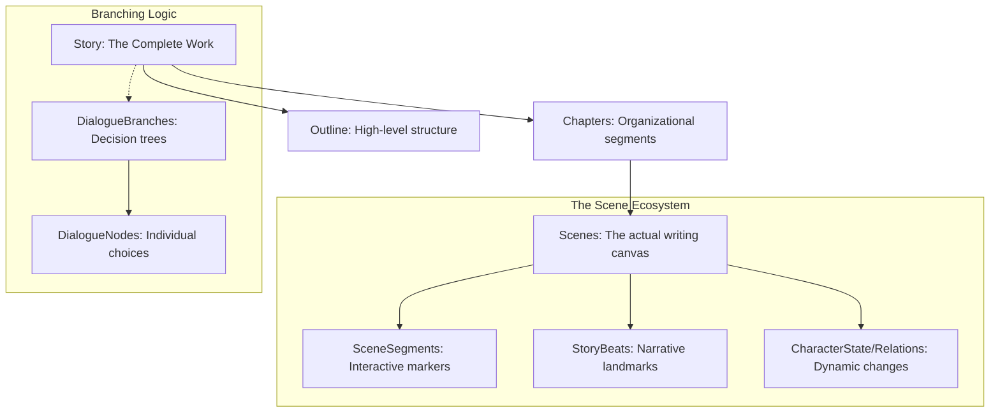

# Narrative Structure (Macro View)

The GaDeMa narrative system is organized into a hierarchical progression that moves from high-level story arcs down to the granular, interactive units of writing. This structure allows for both long-term planning and detailed, moment-to-moment execution.

## 🏗️ The Hierarchy

### 1. Story (The Overarching Work)
The top-level container representing a complete work (e.g., a novel, screenplay, or campaign). A `Story` serves as the anchor for all narrative elements.

**Key Components:**
- **Structural Outline**: Defines the high-level progression of the story.
- **Chapters**: Major organizational segments that group scenes together.
- **Beats**: The fundamental landmarks in a story's arc.

### 2. Chapter (The Organizational Unit)
A chapter acts as a middle layer, organizing multiple `Scene` entities into logical, manageable chunks of the narrative. Chapters allow writers to segment the story for pacing and structure.

### 3. Scene (The Fundamental Unit of Work)
The `Scene` is the "canvas" where actual writing occurs. It is the most active entity in the system, acting as the intersection between static narrative intent and dynamic character progression.

**A Scene serves three primary roles:**
- **Content Container**: Holds the `RawText` (the actual prose/script).
- **Structural Anchor**: Links to `StoryBeat` milestones and uses `SceneSegment` to index interactive elements like dialogue or actions without relying on fragile text indices.
- **Dynamic Driver**: Captentures changes in `CharacterState` and `CharacterRelation`, recording how the narrative arc transforms the characters through their experiences.

---

## 🗺️ Visualizing the Flow

## ⚠️ Architectural Notes

### The Scene as a "Nexus"
In many systems, a scene is just a container for text. In GaDeMa, the `Scene` is a **nexus of state**. It is where the static world (the story) meets the dynamic inhabitants (the characters). By linking `CharacterState` and `StoryBeat` directly to the `Scene`, we enable a "Living Narrative" where the act of writing a scene can trigger measurable changes in the character's journey.
