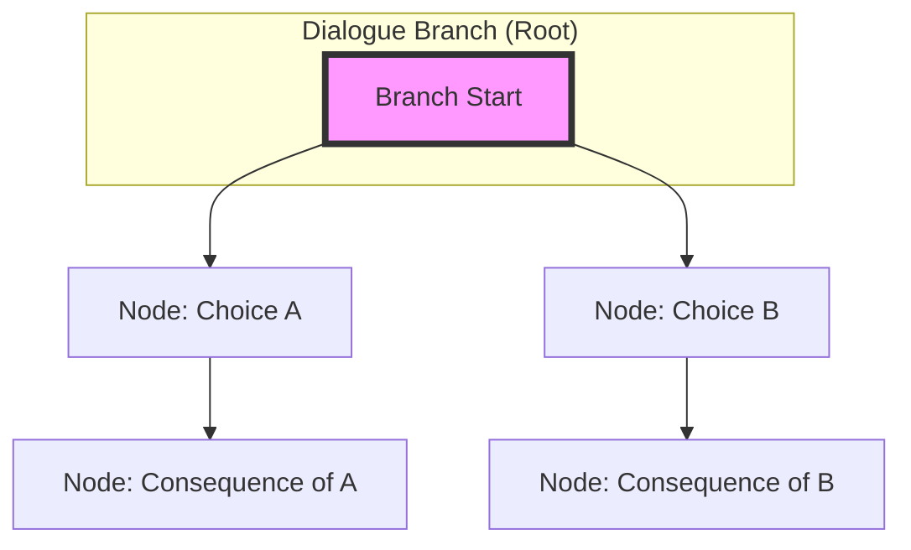
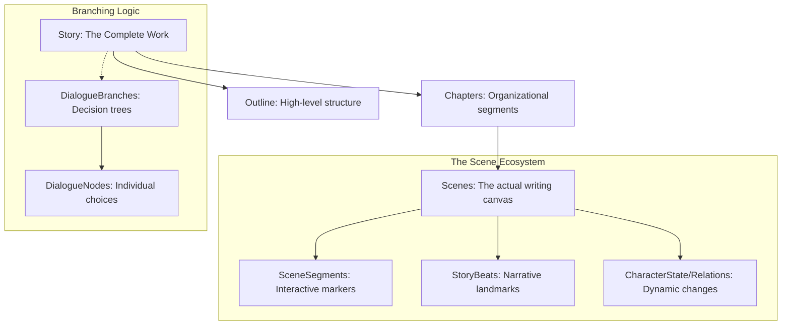

# 🛡️ Security & Identity Architecture

This guide defines the security implementation, authentication protocols, and data protection strategies for Anima Lab. It covers everything from JWT management to file upload sanitization.

## 1. Authentication & Authorization Protocols

Anima Lab uses a multi-layered approach to ensure that only authorized users can access sensitive content and perform critical actions.

### 1.1 Identity Management
* **JWT Bearer Tokens**: Uses HS256 (HMAC-SHA256) with a 1-hour expiry for stateless API authentication.
* **Refresh Token Rotation**: To mitigate the risk of stolen tokens, every use of a refresh token issues a new one and invalidates the old one.
* **Two-Factor Authentication (2FA)**: Supports TOTP (Time-based One-Time Password) via Google Authenticator or Authy to provide an extra layer of security.
* **Recovery Codes**: Provides eight single-use base64 recovery codes for users who lose access to their 2FA device.

### 1.2 Authorization Model
The system employs a **Capability-Based Authorization** model rather than simple role checks:
1.  **Identity Verification**: Confirms the user is authenticated via `IUserContext`.
2.  **Ownership Check**: If the user owns the resource, full access is granted (the "Owner" bypass).
3.  **Permission Evaluation**: For non-owners, the `IPermissionEngine` evaluates granular permissions (e.g., `CanEdit`, `CanPublish`) against the user's role and the resource's specific policy.

---

## 2. Data Protection & Security Best Practices

### 2.1 Password Security
* **Hashing Algorithm**: All passwords are hashed using **BCrypt** via PBKDF2.
* **Implementation**: We use a unique 32-byte random salt per password to prevent rainbow table attacks.
* **Complexity Requirements**: Minimum 8 characters, including uppercase, lowercase, digits, and special characters.

### 2.2 File Upload Sanitization
To prevent malicious uploads (e. Wrappers/OOM attacks), every upload follows this strict pipeline:
1.  **MIME Type Validation**: Validates against a strict whitelist (`image/png`, `image/jpeg`, `application/pdf`) **before** any processing.
2.  **Size Constraint**: Rejects files exceeding the 100MB limit immediately.
3.  **Filename Sanitization**: Strips directory traversal attempts and prefixes filenames with a unique UUID to prevent collisions and path injection.

### 2.3 Input Sanitization (XSS Prevention)
* All user-generated text (e.g., `Description`, `CommentText`) is encoded using `HtmlEncoder.Encode()` before being stored or rendered to prevent Cross-Site Scripting (XSS).

---

## 3. Infrastructure Hardening

### 3.1 API Security
* **Rate Limiting**: Enforced at the Caddy reverse proxy level to prevent brute force and DDoS attacks:
    * `General API`: 100 req/min per IP.
    * `Auth Endpoints`: 1000 req/hour per IP.
    * `Export Endpoints`: 5 req/min (due to high CPU cost).
* **CORS Policy**: Strictly configured to prevent unauthorized cross-origin requests in production environments.

### 3.2 Transport Security
* **HTTPS Enforcement**: All traffic must be served over TLS.
* **Security Headers**: The Caddy proxy injects critical headers:
    * `Strict-Transport-Security` (HSTS)
    * `X-Content-Type-Options: nosniff`
    * `X-Frame-Options: SAMEORIGIN`

---

## 4. Developer Checklist for Secure Implementation

- [ ] **JWT Key**: Is the signing key $\ge$ 64 random bytes?
- [ ] **Clock Skew**: Is `ClockSkew` set to `TimeSpan.Zero` in your JWT configuration?
- [ ] **Validation**: Are you checking `ModelState.IsValid` at the start of every controller action?
- [ ] **Streaming**: Are you using `FileStream` for uploads instead of loading bytes into memory?
- [ ] **Logging**: Ensure sensitive data (passwords, tokens) is NEVER written to logs.
# 🏷️ Enums & Type Definitions

This guide provides a comprehensive reference for the enumerations used throughout Anima Lab, mapping them to their respective domains and explaining their design rationale.

## 1. Overview

Anima Lab uses strongly-typed enumerations to ensure data integrity, facilitate efficient database storage, and enable bitwise operations for multi-dimensional classification. All enums are defined in `src/Gadema.Core/Enums/`.

### Core Design Principles:
* **Dense Integers**: Enums use consecutive integers starting from `0` for efficient SQL storage and bitwise logic.
* **[Flags] Attribute**: Used for multi-dimensional classification (e.s., character identity) where an entity can belong to multiple categories simultaneously.
* **Actionable States**: Every enum value represents a valid, actionable state; there are no "Unknown" or "None" sentinel values.

---

## 2. Enum Registry by Domain

### 🧩 Content Model Classification
Used to classify the nature of content items and their lifecycle states.

| Enum Name | Usage Context | Examples |
| :--- | :--- | :--- |
| `ContentTypeEnum` | Determines the kind of content (e.g., Character, World). | `Character`, `World`, `Mechanic` |
| `ContentStatusEnum` | Tracks the lifecycle stage of an item. | `Draft`, `Published`, `Archived` |
| `ViewModeEnum` | Controls UI rendering mode. | `PrivateWriting` (Editor), `Presentation` (Reader) |

### 🛠️ Task & Workflow Management
Designed with ADHD-friendly principles to support energy-matching and momentum building.

| Enum Name | Usage Context | Examples |
| :--- | :--- | :--- |
| `TaskStatusEnum` | Tracks the workflow pipeline. | `Backlog`, `InProgress`, `Done` |
| `TaskDifficultyEnum` | Matches task complexity to user energy levels. | `Easy` (Quick Win), `Medium`, `Hard` |
| `TaskPriorityEnum` | Drives scheduling and urgency. | `High`, `Medium`, `Low` |

### 🎭 Character Identity System
Uses the `[Flags]` attribute to support multi-dimensional character typing.

| Enum Name | Usage Context | Examples (Bitwise combinations) |
| :--- | :--- | :--- |
| `IdentityTypeEnum` | Multi-dimensional identity (Race, Faction, Alignment). | `Human (Race) \| Alliance (Faction)` |
| `IdentityDefinitionType` | Categorizes the type of identity being defined. | `Race`, `Faction`, `Alignment` |

### 🏗️ Project & Team Structure
Defines how projects are owned and managed within a collaborative environment.

| Enum Name | Usage Context | Examples |
| :--- | :--- | :--- |
| `OwnerTypeEnum` | Determines if the owner is a User or a Team. | `User`, `Team` |
| `ProjectStatusEnum` | Tracks project lifecycle stages. | `Draft`, `InProgress`, `Published` |
| `ProjectVisibilityEnum` | Controls access levels for project content. | `Private`, `Public`, `Anonymous` |
| `TeamMemberRoleEnum` | Defines permission hierarchy within a team. | `Admin`, `Editor`, `Viewer` |

### 📜 Narrative & World Building
Tracks the development and classification of story elements.

| Enum Name | Usage Context | Examples |
| :--- | :--- | :--- |
| `OutlineStatusEnum` | Tracks narrative planning stages. | `Draft`, `Outlined`, `Structured` |
| `LoreTypeEnum` | Categorizes world-building entries. | `History`, `Mythology`, `Geography` |

### 📦 Export & Versioning
Controls how data is transformed for external use and how snapshots are stored.

| Enum Name | Usage Context | Examples |
| :--- | :--- | :--- |
| `ExportFormatEnum` | Defines target file formats. | `Pdf`, `Json`, `Markdown` |
| `SnapshotTypeEnum` | Classifies versioning snapshots. | `Full`, `Delta`, `Comparison` |

---

## 3. Implementation Reference: Bitwise Identity

The `IdentityTypeEnum` uses the `[Flags]` attribute to allow a single integer to represent multiple simultaneous identities.

```csharp
// src/Gadema.Core/Enums/IdentityTypeEnum.cs
[Flags]
public enum IdentityTypeEnum : int
{
    Race      = 1,   // 0001
    Faction   = 2,   // 0010
    Alignment = 4,   // 0100
    Guild     = 8    // 1000
}

// Example: A character that is both Human (Race) and part of the Alliance (Faction).
// IdentityValue = 3 (0011 in binary)
```

---

## 4. Developer Guide: Adding New Enums

To maintain system integrity, follow these rules when adding new enumerations:

1.  **Location**: Place the new enum in `src/Gadema.Core/Enums/`.
2.  **Integer Values**: Always start at `0` and use consecutive integers.
3.  **Documentation**: Add a brief comment describing the purpose of each value.
4.  **Validation**: If used in a model, ensure the property is decorated with `[EnumDataType(typeof(YourEnum))]`.
5.  **Migrations**: When adding new values to an existing enum, ensure you create a database migration to update the type if using PostgreSQL enums.

***
*Last Updated: [Date]*
# 🛡️ Authorization Architecture

The Anima Lab uses a **Decoupled, Multi-Dimensional Authorization Engine**. Instead of hardcoded role checks inside services, we use a "Brain" (`IPermissionEngine`) that evaluates granular permissions against specific resource scopes via pluggable strategies.

This architecture separates **Identity** (who you are) from **Authorization** (what you can do), and allows for complex, context-aware decisions (e.g., *"Does this user have the 'Editor' role within this specific project?"*).

## 1. The Architectural Hierarchy

The system is organized into four distinct layers to ensure strict separation of concerns:

| Layer | Responsibility | Key Components |
| :--- | :--- | :--- |
| **The Law** | `GademaBaseContext` | Enforces global invariants (e.g., `ISoftDelete`) via Expression Trees. |
| **The Brain** | `IPermissionEngine` | Orchestrates decision-making by iterating through injected strategies. |
| **The Muscle** | `IPermissionStrategy` | Executes the actual data/role lookups (e.g., `ProjectRoleStrategy`). |
| **The Domain** | `DomainServices` | Performs business logic and calls the engine for access checks. |

## 2. The Request Lifecycle (The Four-Gate Flow)

Every request follows this sequence of gates to ensure security and data integrity:

1.  **Gate 1: Visibility Gate (Is it visible?)**
    *   Checks the `IsPublic` flag on the resource.
    *   If `true`, access is granted for **viewing only**.
2.  **Gate 2: Identity Gate (Who are you?)**
    *   Uses `IUserContext` to verify authentication.
    *   If anonymous and the resource is private $\rightarrow$ **Denied**.
3.  **Gate 3: Authorization Gate (Can you do this?)**
    *   Calls `IPermissionEngine.CheckPermissionAsync(...)`.
    *   The engine iterates through all registered `IPermissionStrategy` implementations until one returns `true`.
4.  **Gate 4: Execution Gate (The Work)**
    *   If authorized, the Service proceeds to call the `IIdentitySyncStrategy` to perform the atomic "Soul & Body" update.

## 3. Developer Guide: Extending the System

### A. Adding a New Permission
To add a new action (e.g., `CanPublish`), simply add it to the `Permission` enum in the core models.

```csharp
// src/Gadema.Core/Models/Base/Permissions/Permission.cs
public enum Permission {
    CanView, CanCreate, CanEdit, CanDelete, 
    CanPublish // New permission added here
}
```

### B. Implementing a New Strategy (The "How")
If you have new logic (e.g., checking if a user is part of a Guild), create a class implementing `IPermissionStrategy`.

1.  **Create the class**:
    ```csharp
    public class GuildPermissionStrategy : IPermissionStrategy {
        public async Task<bool> EvaluateAsync(Guid userId, Guid scopeId, Permission permission) {
            // Implement your custom logic here (e.g., query the database)
            return await _db.GuildMembers.AnyAsync(m => m.UserId == userId && m.GuildId == scopeId);
        }
    }
    ```
2.  **Register it in DI**: 
    In `DbInjection.cs`, add: `services.AddScoped<IPermissionStrategy, GuildPermissionStrategy>();`

### C. Using Permissions in a Service (The "Call")
To prevent "magic" and ensure visibility, always call the engine explicitly in your domain services.

```csharp
public async Task UpdateStoryAsync(Guid storyId, StoryUpdateDto dto) {
    // 1. Explicit Authorization Check
    bool isAuthorized = await _permissionEngine.CheckPermissionAsync(
        _userContext.CurrentUser.Id, 
        storyId, 
        Permission.CanEdit
    );

    if (!isAuthorized) throw new UnauthorizedAccessException();

    // 2. Proceed with Business Logic
    await _identitySyncStrategy.SyncAsync(storyId, dto);
}
```

## 4. Core Principles to Remember

* **The "Dumb" Engine**: The `PermissionEngine` should not know about databases or specific entities; it only orchestrates the strategies.
* **No Magic Extensions**: Avoid adding extension methods like `.HasPermission()` directly onto primitives (`Guid`). This keeps authorization explicit and easy to audit in the service layer.
* **The Law is Absolute**: Any entity implementing `ISoftDelete` must be filtered by the `GademaBaseContext` automatically via its expression tree implementation.
# 🏗️ Schema & Entity Configuration

This guide defines the database schema and the architectural pattern used for entity configuration in Anima Lab. We use a **Configuration-per-Domain** pattern to ensure a clean, scalable, and maintainable data access layer.

## 1. Architectural Pattern: Configuration-per-Domain

Instead of a monolithic `GameDbContext` containing all Fluent API configurations, we separate the configuration logic into individual files organized by domain. This keeps the `DbContext` slim and ensures that entity-specific logic lives alongside its model.

### Directory Structure
```bash
src/Gadema.Core/Configurations/  # Fluent API configurations per domain
├── Authentication/              # User, TeamMember
├── Projects/                    # Project (Polymorphic Ownership)
├── Content/                     # MetaInfo, StoryOutline, DialogueBranch, etc.
├── Narrative/                   # StorySequence, StoryBeat, LoreEntry
├── Characters/                  # CharacterDetails, CharacterBackground
├── Attributes/                  # AttributeSet, ClassTemplate, etc.
├── Abilities/                   # AbilitySet, AbilityDefinition, StatusEffect
├── Tasks/                       # ProjectTask, TaskComments, ReviewStatus
├── Activities/                  # ActivityLog, TokenUsageLog
├── Tokens/                      # ProjectToken
├── Versioning/                  # ContentSnapshot
├── Inventory/                   # InventoryItem, EndingDefinition
├── Templates/                   # ProjectTemplate + sub-definitions
├── Identity/                    # ProjectIdentityDefinition, CharacterIdentity
└── EngineIntegration/          # ExportConfig, FieldMapping, AssetLink
```

### Implementation in `GameDbContext`
The `DbContext` uses assembly-wide discovery to load all configurations automatically:

```csharp
protected override void OnModelCreating(ModelBuilder modelBuilder)
{
    base.OnModelCreating(modelBuilder);
    
    // Automatically discover and apply all IEntityTypeConfiguration implementations 
    // in the current assembly.
    modelBuilder.ApplyConfigurationsFromAssembly(typeof(GameDbContext).Assembly);
}
```

---

## 2. Core Schema Patterns

### 2.1 Polymorphic Ownership (The Project Pattern)
The `Project` entity uses a polymorphic ownership model to support both individual users and collaborative teams without duplicating tables.

* **`OwnerType`**: An integer discriminator (`0 = User`, `1 = Team`).
* **`OwnerId`**: A single foreign key that points to either the `Users` table or the `Teams` table, determined by the `OwnerType`.

### 2.2 FK-as-PK Junction Tables
To reduce database blobedness and eliminate unnecessary surrogate keys, we use the Foreign Key as the Primary Key for many-to-many junction tables (e.g., `TeamMemberships`, `ContentTags`).

```csharp
// Example: TeamMember Configuration
public class TeamMemberEntityTypeConfiguration : IEntityTypeConfiguration<TeamMember>
{
    public void Configure(EntityTypeBuilder<TeamMember> builder)
    {
        builder.HasKey(e => e.Id); // In some patterns, this would be (UserId, TeamId)
        // ...
    }
}
```

### 2.3 Soft Delete Pattern
All entities implement an `IsActive` flag. Deletions are handled as updates rather than hard removals to preserve audit trails and prevent orphaned references.

---

## 3. Entity Inventory Summary

| Domain | Key Entities | Configuration Strategy |
| :--- | :--- | :--- |
| **Authentication** | `User`, `Team`, `TeamMember` | Individual config files per domain folder |
| **Content** | `MetaInfo`, `MediaAttachment`, `Tag` | Cascading deletes for attachments; SetNull for tags |
| **Narrative** | `StorySequence`, `StoryBeat` | Self-referencing hierarchy (optional parents) |
| **Characters** | `CharacterDetails`, `Background` | FK-as-PK pattern for child entities |
| **Tasks** | `ProjectTask`, `ReviewStatus` | Indexed difficulty and quick-win flags |
| **Identity** | `ProjectIdentityDefinition`, `CharacterIdentity` | Multi-dimensional typing via bitwise/integer enums |

---

## 4. Developer Guide: Creating a New Entity

When adding a new entity to the system, follow these steps:

1.  **Define the Model**: Create the class in `src/Gadema.Core/Models/{Domain}/`.
2.  **Create Configuration**: Create an `EntityTypeConfiguration<T>` file in `src/Gadema.Core/Configurations/{Domain}/`.
3.  **Implement Fluent API**: 
    * Define the Primary Key.
    * Set up required properties and constraints (`HasMaxLength`, `IsRequired`).
    * Define Indexes for frequently filtered columns (e.g., `Slug`, `Status`).
    * Configure Navigation Properties and Delete Behaviors (`Cascade`, `Restrict`, or `SetNull`).
4.  **Register in DbContext**: Add the `DbSet<T>` property to `GameDbContext.cs`. The configuration will be auto-discovered.

***
*Last Updated: [Date]*
<|channel>thought
<channel|># 🧬 The Law of Identity: Soul & Body (The Anchor Pattern)

To maintain stability in a complex, modular world, every entity must follow the **Law of Identity**. This is achieved by decoupling an entity's permanent essence from its evolving data.
---

## ⚖️ The Core Concept: Soul vs. Body

In Anima, we do not treat entities as monolithic blocks. Instead, we split them into two distinct parts to ensure scale-invariant stability.

* **The Anchor (the Soul)**: This is the permanent identity of an entity (e.g., a Character's Name or a Setting's Title). It acts as the stable foundation that remains constant even as the world evolves.
* **The Body (the Modules)**: These are the specialized, evolving parts of your creation (e.g., a `Story Profile` for narrative, or a `Game Profile` for mechanics).

By separating the **Soul** from the **Body**, we ensure that any change to the "Body" can be correctly reflected in the "Soul," maintaining structural integrity across the entire system.
---

## 🔄 The Protocol: Harmonization (The Sync Mechanism)

When a part of the **Body** is updated, the **Anchor (the Soul)** must be aligned to match. We do not perform manual updates; we use the **Harmonization Protocol**.

### Implementation Detail
To maintain this equilibrium, developers must use the `SyncIdentityAsync<T>` method provided by the `ICoreServices` gateway.

**The Workflow:**
1. **Update the Body**: The domain service performs its primary business logic (e.g., updating a character's stats).
2. **Invoke Harmonization**: The service calls `SyncIdentityAsync<T>(id, updateData)`.
3. **Execute Strategy**: The system routes this call to a specialized `IIdentitySyncStrategy<T>`, which calculates the delta and updates the `MetaInfo` anchor accordingly.

> [!IMPORTANT]
> **The Law of Identity**: Never attempt to manually update `MetaInfo` properties within a domain service. Always use the **Harmonization** protocol to ensure identity stability.
---

## 🛠️ Technical Implementation Reference

| Component | Interface / Class | Responsibility |
| :--- | :--- | :--- |
| **Identity Anchor** | `MetaInfo` | The central, stable identity record. |
| **The Gateway** | `ICoreServices` | The entry point for all identity operations. |
| **The Strategy** | `IIdentitySyncStrategy<T>` | The logic that maps Body changes to Soul updates. |

### Example Usage (C#)

# User

The `User` entity represents a unique account within the GaDeMa system. It serves as the primary identity used by the **Identity Gate** to establish who is interacting with the application.

## 🧬 Identity & Role

A user's presence in the system is defined by their authentication credentials and their ability to hold roles across different organizational scopes (Teams and Projects).

| Property | Type | Description |
| :--- | :--- | :--- |
| `Id` | `Guid` | The unique identifier used for all authorization checks. |
| `UserName` | `string` | Unique identifier for login and identification. |
| `Email` | `string` | Verified contact address. |
| `DisplayName` | `string?` | The human-readable name shown in the UI. |
| `Provider` | `UserAuthProviderEnum` | Defines the primary authentication method (e.g., Password, Google). |

## 🛡️ Security & Access

The user identity is the foundation for the **Four-Gate Flow**:

1.  **Identity Gate**: The system uses the `User.Id` via `IUserContext` to confirm a session exists.
2.  **Authorization Gate**: Once identified, the user's permissions are evaluated against specific resources (e.g., `Project`, `Scene`) based on their memberships in **Teams** or **Projects**.

## ⚙️ Technical Details

- **Authentication Providers**: Supports standard password-based login and external providers like Google OAuth via `ProviderLinks`.
- **Account Status**: Managed through the `IsActive` flag, which can be used to suspend access without deleting the identity.
- **Lifecycle**: Tracks account creation (`CreatedAt`) and recent activity (`LastLogin`).

---
*Part of the [Auth & Team Domain](./access/overview.md)*

# Project Token

A `ProjectToken` represents an automated access key for a specific project. It allows external systems (such as CI/CD pipelines or automation scripts) to interact with the GaDeMa API without requiring a user's interactive session.

## 🔐 Security & Authentication

To ensure security, tokens are never stored in plain text. Instead, they follow a strict hashing and verification pattern:

- **Storage**: Only the `TokenHash` (a secure SHA256 + salt) is persisted in the database.
- **Verification**: During an API request, the incoming token is hashed and compared against the stored hash to validate authenticity.

## 📊 Token Capabilities & Quotas

Tokens can be configured with specific constraints to prevent abuse and manage resource usage:

| Property | Type | Description |
| :--- | :--- | :--- |
| `TokenName` | `string` | A descriptive label (e.g., "CI/CD Pipeline"). |
| `MaxRequests` | `int` | The total request quota allowed (0 = unlimited). |
| `CurrentUsage` | `int` | The number of requests already consumed by this token. |
| `ExpiresAt` | `DateTime?` | An optional expiration timestamp for temporary access. |
| `PermissionsJson` | `string` | A JSON-encoded array defining granular permissions granted to the token. |

## ⚙️ Technical Implementation

- **Scope**: Every token is anchored to a specific `ProjectId`.
- **Usage Tracking**: The system monitors usage via the `CurrentUsage` property, allowing for real-time quota enforcement.
- **Automation Ready**: Designed specifically for non-interactive environments where standard OAuth flows are not feasible.

---
*Part of the [Access & Identity Domain](./access/overview.md)*
# Project Member

The `ProjectMember` entity defines the relationship between a `User` and a `Project`. It acts as the authorization bridge, determining what actions a user can perform within a specific project's scope.

## 🛡️ Access & Roles

Access is managed through a scoped role system. Instead of global permissions, a user's capabilities are determined by their membership in a particular project.

| Role | Description |
| :--- | :--- |
| `Owner` | Full administrative control and primary ownership of the project. |
| `Admin` | High-level management privileges within the project scope. |
| `Editor` | Capable of creating, editing, and managing content/tasks. |
| `Reviewer` | Focused on reviewing progress and providing feedback. |
| `Viewer` | Read-only access to all project contents. |

## 🧬 Membership Details

A membership record links a user's identity to a project's workspace via the following data:

| Property | Type | Description |
| :--- | :--- | :--- |
| `Id` | `Guid` | Unique identifier for this membership instance. |
| `ProjectId` | `Guid` | The ID of the project being joined. |
| `UserId` | `Guid` | The ID of the user joining the project. |
| `Role` | `ProjectMemberRoleEnum` | The assigned permission level within this scope. |
| `JoinedAt` | `DateTime` | Timestamp of when the membership was established. |

## ⚙️ Technical implementation

- **Scope Binding**: This entity is the "Muscle" in the Four-Gate Flow, providing the context used by the `PermissionEngine` to resolve whether a user has the required role for a specific action.
- **Relational Integrity**: Maintains strict links to both the `Project` and the `User` via Required navigation properties.

---
*Part of the [Access & Identity Domain](./access/overview.md)*
# Access & Identity Domain

The **Access & Identity** domain defines how users are identified, how they belong to projects, and how automation interacts with the system. It is the foundation for the entire security model of GaDeMa.

## 🧬 Core Components

This domain manages three primary entities that work together to establish a secure, scoped environment:

| Entity | Role |
| :--- | :--- |
| [User](./user.md) | The central identity anchor representing an authenticated account. |
| [Project Member](./project-member.md) | The bridge defining a user's specific role and access within a project. |
| [Project Token](./project-token.md) | A secure, hashed key for automated or non-interactive access. |

## 🛡️ Authorization Model

GaDeMa utilizes a **Decoupled, Multi-Dimensional Authorization Engine**. Access is not just about *who* you are, but *where* you are acting.

### The Four-Gate Flow
Every request passes through four distinct security gates:

1.  **Visibility Gate**: Checks if the resource is marked as `IsPublic`.
2.  **Identity Gate**: Verifies the user's authentication via `IUserContext`.
3.  **Authorization Gate**: Uses the `IPermissionEngine` to check roles (e.g., Editor, Admin) within a specific project scope.
4.  **Execution Gate**: Once authorized, the service performs the requested operation.

---
*Part of the [Core Domain Hierarchy](./../hierarchy.md)*
# 📜 The Laws of Animation: Coding Standards & Patterns

This guide is the **Single Source of Truth** for implementation within the GaDeMa project. It is designed as a high-density "Cheat Sheet" to ensure consistency, prevent ambiguity, and maintain our architectural integrity.

---

## 📂 1. The Law of Domain Clustering & Naming

To avoid name collisions (e.g., with `System.Threading.Task`) and maintain order, we follow the law of **Domain Clustering**.

### 📏 Naming Conventions
| Type | Pattern | ✅ Correct Example | ❌ Avoid! |
| :--- | :--- | :--- | :--- |
| **Models** | `EntityName` (PascalCase) | `ProjectTask.cs` | `Task.cs` |
| **DTOs (Create)** | `CreateXDto` | `ProjectTaskCreateDto` | `TaskCreateDto` |
| **DTOs (Update)** | `UpdateXDto` | `ProjectTaskUpdateDto` | `TaskUpdateDto` |
| **DTOs (Response)**| `ResponseXDto` | `ProjectTaskResponseDto`| `TaskResponseDto` |
| **Controllers** | `ResourceNameController` | `TasksController` | `TaskController` |
| **Services** | `XxxService` | `ProjectTaskService` | `TaskService` |

### 📁 Folder Structure (Domain-Aware)
All files must be clustered by their domain:
```text
src/Gadema.Core/Models/Tasks/          <-- Models
src/Gadema.Core/Dtos/Tasks/            <-- DTOs
src/Gadema.Api/Controllers/Tasks/      <-- Controllers
src/Gadema.Api/Services/Tasks/         <-- Services
```

---

## 🎮 2. The Law of the Thin Controller

Controllers are merely routing and dispatching layers. They must never hold business logic or touch the database directly.

### ✅ Correct Implementation (One-Liner)
For simple retrieval or actions, use the `Ok(await ...)` pattern:
```csharp
public async Task<IActionResult> Search([FromQuery] string query, [FromQuery] Guid? projectId) 
    => Ok(await _projectService.GetMatchesAsync(query, projectId));
```

---

## 🛡️ 3. The Law of Service Responsibility

The Service layer is the "Muscle." It handles all business rules, permission checks, and data integrity.

### ✅ Correct Implementation (Access & Auth)
Always check for identity and permissions at the start of your service method using the `ApiResponseDto` pattern.

```csharp
public async Task<ApiResponseDto<ProjectResponseDto>> GetProjectAsync(Guid projectId)
{
    // 1. Check Authentication
    var loggedIn = await CheckIsLoggedIn();
    if (!loggedIn)
        return ApiResponseDto<ProjectResponseDto>.Unauthorized("you need to be logged in");

    // 2. Check Authorization (Scope-based)
    var authorizationError = await CheckAccessAsync<ProjectResponseDto>(projectId, Permission.CanView);
    if (authorizationError != null) 
        return authorizationError; // Return the error object directly

    // 3. Proceed with Business Logic
    var project = await _context.Projects.FindAsync(projectId);
    return ApiResponseDto<ProjectResponseDto>.Success(project);
}
```

---

## 🔄 4. The Law of Hybrid Responses

To provide a consistent API experience, we distinguish between **Data Retrieval** and **Action Confirmation**.

### 🧪 RAW Pattern (For Data Retrieval)
Used for `GET` requests where the goal is simply to return data.
```csharp
// Returns the raw object/collection directly in an Ok() wrapper
return Ok(await _service.GetAsync(id)); 
```

### 📦 WRAPPED Pattern (For Actions & Errors)
Used for `POST`, `PUT`, and `DELETE`. Every action must return a success/failure status.

**Success Example:**
```csharp
// Returns a wrapped confirmation of the action
return Ok(new {
    success = true,
    message = "Task created successfully",
    data = new { id = newTask.Id } 
});
```

**Error Example:**
```c// Returns a wrapped error object
return Ok(ApiResponseDto<CreateResponseDto>.Failure("Description is required"));
```

---

## ⚙️ 5. The Law of Data Integrity & Performance

### ✅ Validation: DTO vs. Model
- **DTOs**: Must contain all validation attributes (`[Required]`, `[MaxLength]`, etc.).
- **Models**: Should only contain structural constraints via the Fluent API in the configuration files. **Never put validation logic on Models.**

### ✅ Eager Loading (Preventing N+1)
Always use `.Include()` when fetching entities that have related data to avoid multiple database roundtrips.
```csharp
// ✅ CORRECT: Single query with eager loading
var tasks = await _context.ProjectTasks
    .Include(t => t.Comments)
    .ToListAsync();

// ❌ INCORRECT: N+1 problem (querying comments in a loop)
foreach(var task in tasks) {
    task.Comments = await _context.Comments.Where(c => c.TaskId == task.Id).ToListAsync();
}
```

### ✅ Pagination Rules
All list endpoints must be paginated to prevent performance degradation.
- **Default Page Size**: 20
- **Maximum Page Size**: 100
- **Pattern**: Always provide `TotalCount` and `TotalPages`.

---
*Compiled from the GaDeMa Coding Guidelines Repository.*This document serves as the definitive architectural blueprint for the GaDeMa API. It defines how we handle **Identity**, **Domain Data**, and **Discovery** to ensure that as the system grows, it remains consistent, type-safe, and easy to search.

# GaDeMa Architecture: Identity Sync & Search Orchestration

## 1. The Core Hierarchy: Root vs. Content
We distinguish between two types of "Anchors" in our world. This distinction dictates where data is stored and how it is searched.

| Feature | **Root Anchors (The Universe)** | **Content Anchors (The Data)** |
| :--- | :--- | :--- |
| **Examples** | `Project` | `Character`, `Scene`, `LoreEntry` |
| **Identity Layer** | `ProjectMetaInfo` | `MetaInfo` |
| **Search Scope** | Global/Universe Discovery | Scoped to a Project |
| **Lifecycle** | Defines the workspace | Lives within a workspace |

---

## 2. The Identity Sync Pattern (The "Write" Side)
To prevent "Identity Bloat" and ensure data integrity, we separate an entity's **Identity** (Title, Slug, Status) from its **Domain Data** (Genre, Age, Role).

### The Mechanism: `ApplyIdentitySyncAsync`
Instead of manual updates, all services use a standardized strategy-based approach. This ensures that when a user updates an identity, both the properties and the associated tags are synchronized atomically.

#### The Interface: `IIdentitySyncStrategy`
Every anchor type must have a strategy that defines how its specific identity is updated in the database.
```csharp
public interface IIdentitySyncStrategy
{
    // Handles Title, Slug, Status, Visibility, ViewMode, and Tag synchronization
    Task SyncAsync(Guid identityId, MetaInfoUpdateData updateData);
}
```

#### The Workflow (The "Sync" Logic)
1.  **Client Sends**: A `UpdateDto` containing both Domain data and a `MetaInfoUpdateDto` (which includes the full list of current `TagIds`).
2.  **Service Orchestrates**: The domain service updates its own properties, then calls `ApplyIdentitySyncAsync`.
3.  **Strategy Executes**: The strategy performs a **Delta Calculation** (calculates which tags to add and which to remove) and executes the changes within a transaction.

---

## 3. The Search Orchestrator Pattern (The "Read" Side)
To prevent "Search Bloat" and fragmented endpoints, we use an orchestration layer that aggregates results from multiple domain providers into a single, unified stream.

### A. The Contract: `ISearchableProvider`
Every domain service (Project, Character, etc.) must implement this interface to be "discoverable."
```csharp
public interface ISearchableProvider
{
    // Returns the raw matches for a query within this provider's scope
    Task<IEnumerable<SearchHitDto>> GetMatchesAsync(string query, Guid? projectId);
}
```

### B. The Universal Response: `SearchHitDto`
All search results must be mapped to this shape. This allows the client to handle any result type (Project or Character) using a single UI component.
```csharp
public class SearchHitDto 
{
    public Guid ResourceId { get; set; }      // The actual entity ID
    public string DisplayName { get; set; }   // Title/Name for display
    public string Slug { get; set; }          // URL identifier
    public string ResourceType { get { ... } } // "Project", "Character", etc.
    public Guid? ScopeId { get; set; }        // Null for Root, ProjectId for Content
    public string ResourceLink { get { ... } } // API endpoint to fetch details
}
```

### C. The Engine: `SearchOrchestrator`
The Orchestrator is the single entry point for all search queries. It follows this pipeline:
1.  **Gather**: Calls all registered `ISearchableProvider` implementations in parallel.
2.  **Merge**: Combably aggregates all hits into one master list.
3.  **Paginate**: Performs the final `Skip` and `Take` math on the merged collection.

---

## 4. Summary of Responsabilities

| Component | Responsibility | Knowledge |
| :--- | :--- | :--- |
| **Domain Service** | Manages Domain Data + Orchestrates Identity Sync. | Knows its own properties & DB. |
| **Identity Strategy** | Handles the "Delta" logic for Title, Slug, and Tags. | Knows how to write to identity tables. |
| **Search Provider** | Provides raw matches from a specific domain. | Knows how to query its specific table. |
| **Search Orchestrator**| Merges results and applies global pagination. | Knows nothing of domains; only knows `ISearchableProvider`. |

---

## 5. Developer Checklist for New Entities
When adding a new entity (e.g., `WorldLocation`):
1.  [ ] Create the **Model** (Domain Data).
2.  [ ] Create/Update the **MetaInfo** (Identity Data).
3.  [ ] Implement `ISearchableProvider` in your service.
4.  [ ] Implement `IIdentitySyncStrategy` for its identity sync.
5.  [ ] Add it to the `SearchOrchestrator`'s provider list.# GaDeMa System Architecture & Patterns

This document defines the core architectural patterns for the GaDeMa API. These patterns are designed to ensure scalability, maintainable search/discovery, and a clear distinction between different levels of data hierarchy.

---

## 1. The Hierarchy Distinction: Root vs. Content

A fundamental principle of this system is the semantic distinction between "The Environment" and "The Data within it."

### A. Root Anchors (The Universe)
*   **Examples**: `Project`, `Community` (future).
*   **Role**: These are the top-level containers/workspaces. They define the scope for all other data.
*   **Identity**: They have their own unique identity properties (Title, Slug, Status, etc.) that are **not** part of a shared content pool.
*   **Discovery**: Searched at the "Universe" level. A user discovers a Project to begin working within it.

### B. Content Anchors & Components (The Data)
*   **Examples**: `Character`, `Scene`, `LoreEntry` (Anchors); `DialogueNode`, `Comment`, `ReviewStatus` (Components).
*   **Role**: These are the entities that live *inside* a Root Anchor. 
*   **Identity**: They use the **MetaInfo Pattern**. They are "anonymous" until attached to a Project via a `ProjectId`.
*   **Discovery**: Searched within the scope of a specific project.

---

## 2. The Search Engine Architecture

To prevent API bloat and ensure a unified experience for consumers, we use an **Orchestrator-based Search Pattern**.

### A. The Contract: `SearchHitDto`
All search operations—regardless of whether they are searching for Projects or Characters—must return this standardized shape to the consumer.

```csharp
public class SearchHitDto 
{
    public Guid ResourceId { get; set; }      // The actual ID of the resource
    public string DisplayName { get; set; }   // For display in lists (Title/Name)
    public string Slug { get; set; }          // URL-friendly identifier
    public string ResourceType { get; set; }  // "Project", "Character", etc.
    public Guid? ScopeId { get; set; }        // Null for Projects, ProjectId for Content
    public string ResourceLink { get; set; }  // The API endpoint to fetch details
}
```

### B. The Implementation: Orchestrator Pattern
We avoid "Service Bloat" by separating **Data Retrieval** from **Search Logic**.

1.  **Data Providers (The Services)**: 
    *   Services like `CharacterService` or `ProjectService` are responsible *only* for finding matches in the database.
    *   They do **not** handle pagination or complex search merging.
    *   They return a raw collection of results (or a simple count).

2.  **The Orchestrator (The Search Engine)**: 
    *   A single `SearchOrchestrator` service manages the complexity of merging multiple streams.
    *   It calls the various Data Providers, gathers their results, and handles the "Global" logic.

---

## 3. The Pagination Pattern: Centralized Paging

To prevent redundant paging logic across every controller/service, we use **Orchestrator-Level Pagination**.

### The Workflow:
1.  **Providers**: `GetMatchesAsync(query)` returns all matching items from the database (no `Skip` or `Take`).
2.  **Orchestrator**: 
    *   Calls multiple providers to gather a master list of results.
    *   Performs the pagination math (`Skip` and `Take`) in **one single place**.
    *   Wraps the final slice into a `ListResponseDto<T>`.
3.  **Consumer**: Receives a perfectly sliced, paginated list that represents a true cross-section of the entire system.

### Benefits:
*   **Single Source of Truth**: The math for `page` and `pageSize` exists in only one place.
*   **True Cross-Type Pagination**: Allows users to search "everything" and get an accurate, paginated list that includes both Projects and Content.
*   **Testability**: Testing a service becomes a simple check of: *"Does this query return the right items?"* rather than complex offset/limit math.

---

## 4. Summary Table

| Pattern | Logic Location | Responsibility |
| :--- | :--- | :--- |
| **Identity** | Domain Model / MetaInfo | Defines *what* a thing is. |
| **Discovery** | `SearchHitDto` | Defines *how* a consumer sees it. |
| **Retrieval** | Data Providers (Services) | Finds raw data in the DB. |
| **Orchestration**| `SearchOrchestrator` | Merges streams and applies pagination. |
Since we are building a system that allows for **Scale-Invariant Storytelling**, a standard text summary isn't enough. You need to see the "shape" of the logic.

Here is a conceptual and visual overview of the GaDeMa architecture.

---

# 🌌 The GaDeMa Architecture: A Fractal Universe

The core philosophy is that **the world is fractal**. Whether you are looking at a single character or an entire galaxy, the rules for how they are identified, how they are searched, and how they are updated remain exactly the same.

## 1. The Structural Hierarchy (The "Bones")
This view shows how data is nested. A `ProjectSeries` is the ultimate container, but it doesn't "own" everything—it provides a **shared scope** for things to live in.

```text
[ PROJECT SERIES ] (The Universe / Shared Lore)
       │
       ├── [ Project: The Novel ] (Local Workspace)
       │      ├── Character A (Local - only exists here)
       │      └── Character B (Shared - part of the Series lore) ◄───┐
       │                                                             │
       ├── [ Project: The RPG ] (Local Workspace)                   │ (Shared via Scope)
       │      ├── Character C (Local - unique to this game)         │
       │      └── Character B (Shared - seen in the RPG too) ───────┘
       │
       └── [ Project: Action Game ] (Local Workspace)
              └── Character B (Shared - part of the universe's history)
```

---

## 2. The Entity Pattern (The "DNA")
Every single object in this system—whether it's a Series, a Project, or a Character—is constructed using the same **Anchor & Component** pattern. We never create "monolith" objects; we assemble them.

### The Formula: `Entity = Anchor (Identity) + Components (Domain Data)`

| Part | Role | Example (A Character) | Example (A Project) |
| :--- | :--- | :--- | :--- |
| **The Anchor** | **The Soul**: Defines *what* it is. Provides the identity used for searching and syncing. | `MetaInfo` (Name, Slug, Status) | `ProjectMetaInfo` (Title, Slug, Status) |
| **The Components**| **The Body**: Defines *how* it behaves in its specific medium. | `CombatStats`, `Backstory`, `Inventory` | `Genre`, `Tone`, `Audience` |

**Crucial Rule:** The Anchor is the "Source of Truth." If you change the Name in the Anchor, the name changes everywhere.

---

## 3. The Operational Patterns (The "Flow")
This is how data moves through the system via our two main engines.

### A. The Identity Sync Engine (Writing)
Instead of many small updates, we use **Strategy-based Synchronization**. This ensures that when an identity changes, the entire "identity footprint" stays consistent.

```text
[ User Input ] ──▶ [ Update DTO ] ──▶ [ Identity Sync Strategy ] ──▶ [ Atomic DB Transaction ]
                                              │
                                     (Calculates Deltas for:
                                      Title, Slug, Status, Tags)
```

### B. The Search Orchestration Engine (Reading)
We don't have a "Search Service" that knows everything. We have an **Orchestrator** that asks many specialized **Providers** for help.

```text
[ User Query: "Aragorn" ]
          │
          ▼
[ Search Orchestrator ] ◀─── (Asks in parallel) ───┐
          │                                        │
          ├─▶ [ Project Provider ] ───────────────┤
          ├─▶ [ Character Provider ] ─────────────┤ ──▶ [ Merged & Paginated Results ]
          └─▶ [ Location Provider ] ──────────────┘      (Standardized SearchHitDto)
```

---

## 4. The Authorization Logic (The "Shield")
Because we have a hierarchy, access is determined by **Scope**. This prevents users from accidentally editing the "Core Lore" of a series when they only have permission to edit their own local project.

| If the user owns... | They can Edit... | They can Read... |
| :--- | :--- | :--- |
| **The Project** | Local Assets (`ProjectId` matches) | Local + Shared Assets in the Series |
| **The Series** | All Shared Assets (`SeriesId` matches) | The entire Universe |
| **Nothing** | Nothing | Only their own local assets (if any) |

---

### Summary of the Vision
*   **Identity is decoupled from Domain:** You can change a character's name without touching their combat stats.
*   **Scope is explicit:** An object knows if it belongs to a Project or a Series.
*   **Discovery is unified:** Searching "The Universe" feels the same as searching "A Book."
*   **Scaling is seamless:** You can add new media types (e.g., a "Movie Project") just by adding new `Components`, without ever changing the core architecture.# 🌌 Anima Lab Documentation Index

This document provides a functional overview of the documentation. Each entry describes the core information contained within the guide and its current implementation status.

## 🧭 The Status Pattern
Every guide is accompanied by a `[filename]_status.md` file used for technical validation.
* ✅ **Match**: Concept fully implemented.
* ⚠️ **Partial / In Progress**: Implementation is incomplete or evolving.
* ℹ️ **Conceptual / UI-Driven**: Design goals/UX patterns.

---

## 🧬 Access & Identity
The foundation of the security model, managing user identities and project-scoped access.
* [Overview](access/overview.md): The fundamental identity anchor and scoped access model. *[Status: ✅ Match]*
* [Project Member](access/project-member.md): Roles and membership within a specific project. *[Status: ✅ Match]*
* [Project Token](access/project-token.md): Secure, hashed keys for automated system access. *[Status: ✅ Match]*
* [User](access/user.md): The central identity anchor for all system interactions. *[Status: ✅ Match]*

## 🏗️ Architecture & Infrastructure
The technical blueprints for core patterns, permissions, and performance.
* [Enums](architecture/enums.md): Core type definitions and integer-based state management. *[Status: ⚠️ Partial]*
* [Identity System](architecture/identity-system.md): The mechanism for identity anchoring and synchronization. *[Status: ✅ Match]*
* [Permissions](architecture/permissions.md): The authorization engine (Brain, Muscle, Law) and access gates. *[Status: ⚠️ Partial]*
* [Schema](architecture/schema.md): Entity configuration patterns and polymorphic ownership logic. *[Status: ✅ Match]*
* [Security](architecture/security.md): Data protection protocols including JWT and sanitization. *[Status: ⚠️ Verification Required]*
* [Performance](infrastructure/performance.md): Query optimization, pagination, and infrastructure requirements. *[Status: ✅ Match]*

## ✍️ Writing & Narrative Engine
The creative engine for non-linear, graph-based storytelling.
* [Content Items](writing/content-items.md): The polymorphic content model and narrative hierarchy. *[Status: ✅ Match]*
* [Dialogue](writing/dialogue.md): Branching dialogue trees and node-based decision logic. *[Status: ⚠️ In Progress]*
* [Overview](writing/overview.md): Writing philosophy, focusing on Graph vs Tree structures. *[Status: ✅ Match]*
* [Scene Canvas](writing/scene-canvas.md): The scene as a unit of content with structural markers (Beats/Segments). *[Status: ⚠️ In Progress]*
* [Structure](writing/structure.md): Macro-level hierarchy from Story to Scene. *[Status: ✅ Match]*

## 📋 Task & Productivity Layer
A task management system optimized for ADHD-friendly workflows.
* [Project Task](tasks/project-task.md): Lifecycle and features of individual project tasks. *[Status: ⚠️ In Progress]*
* [Task Comment](tasks/project-task-comment.md): The model for task-linked communication. *[Status: ✅ Match]*
* [Task MetaInfo](tasks/project-task-meta-info.md): Metadata (Priority, Status) and ADHD energy-matching fields. *[Status: ⚠️ In Progress]*
* [User Stories](tasks/user-stories.md): Functional requirements and acceptance criteria for system features. *[Status: ✅ Mixed]*

## 🌌 The Universe
The high-level architectural scale-invariance principles.
* [Fractal Universe Concept](universe/fractal_universe_concept.md): The Anchor & Component pattern and scale-invariant design. *[Status: ✅ Match]*
* [System Architecture](universe/SYSTEM_ARCHITECTURE.md): Core patterns, orchestration, and the Root vs Content distinction. *[Status: ⚠️ In Progress]*
* [Identity Sync & Search](universe/IDENTITY_SYNC_SEARCH.md): Protocols for identity synchronization and search discovery. *[Status: ⚠️ In Progress]*

## 🎨 User Experience
UX design principles and sensory state metaphors.
* [ADHD Workflow](user-experience/adhd-workflow.md): Interaction patterns like Quick Wins and the two-tier save system. *[Status: ⚠️ Partial]*
* [Philosophy](user-experience/philosophy.md): Conceptual framework for energy management (Stamina/Mana). *[Status: ⚠️ Implementation Gap]*

---
*Last Updated: 2025-05-14*# 🚀 Performance & Infrastructure

This guide defines all performance optimization strategies, caching patterns, query guidelines, and infrastructure requirements for Anima Lab. It ensures the application maintains high performance under load while minimizing database queries and memory footprint.

**Target Audience**: Developers, DevOps Engineers, System Administrators  
**Coverage**: Query Optimization, Caching Strategy, Memory Management, API Response Time, Monitoring & Health Checks, Deployment

---

## 1️⃣ Database Query Optimization

### 1.1 Eager Loading with `Include()`

#### Architecture:
- Always use `.Include()` for relationship queries to prevent the N+1 problem.
- Use `.ThenInclude()` for nested relationships (e.g., `MetaInfo` $\rightarrow$ `MediaAttachments`).
- Never query navigation properties separately inside loops.

#### Implementation Pattern:
```csharp
// ✅ CORRECT - Eager loading to avoid N+1 queries with ProjectTask entity
public async Task<MetaInfo> GetMetaInfoWithFullDataAsync(Guid id, ViewModeEnum viewMode = ViewModeEnum.PrivateWriting)
{
    return await _context.MetaInfos
        .Include(ci => ci.MediaAttachments)
        .Include(ci => ci.ContentTags)
            .ThenInclude(ct => ct.Tag)
        .Include(ci => ci.ProjectTasks)
            .ThenInclude(pt => pt.Comments)
        .FirstOrDefaultAsync(ci => ci.Id == id);
}

// ❌ INCORRECT - N+1 problem (Looping and querying separately)
foreach (var item in items)
{
    var tasks = await _context.ProjectTasks.Where(t => t.MetaInfoId == item.Id).ToListAsync();
}
```

### 1.2 Pagination Best Practices

#### Architecture:
- **Default page size**: 20 items (configurable up to 100).
- Always validate `pageSize` in controller actions.
- Use `Skip()` and `Take()` for efficient database-level pagination.

---

## 2️⃣ Caching Strategy

### 2.1 Redis Cache Configuration

#### Architecture:
- Use **Redis** for distributed caching in production environments.
- Implement **Domain-Aware Key Patterns** to avoid collisions (e.g., `tasks.{projectId}.{taskId}`).
- Set expiration based on content freshness:
    - **Draft Content**: 5 minutes TTL (high frequency of updates).
    - **Published Content**: 1 hour TTL (low frequency of updates).
    - **Static/System Data**: 24 hours TTL.

#### Implementation Pattern:
```csharp
// ✅ CORRECT - Redis caching with domain-aware key pattern and expiration
var cacheKey = $"tasks.{projectId}.{taskId}";
return await _redisCache.GetOrCreateAsync(cacheKey, async entry =>
{
    entry.AbsoluteExpirationRelativeToNow = TimeSpan.FromHours(1); // Published content TTL
    return await _context.ProjectTasks.FindAsync(projectId, taskId);
});
```

---

## 3️⃣ File Upload & Memory Management

### 3.1 Stream-Based Processing

#### Architecture:
- **Stream large files** directly to storage using `FileStream` instead of loading them into memory buffers.
- Validate file size **before** starting the upload process to prevent Out-Of-Memory (OOM) attacks.
- Use UUID-based filenames for security and collision avoidance.

#### Implementation Pattern:
```csharp
// ✅ CORRECT - Stream large file uploads
await using var fileStream = new FileStream(filePath, FileMode.Create);
await file.CopyToAsync(fileStream); // Memory-efficient streaming
```

### 3.2 Monitoring & Health Checks

#### Architecture:
- Monitor memory usage per instance (Target: `< 512MB`).
- Implement a `/health` endpoint to monitor:
    - Database connectivity.
    - Cache availability.
    - Current memory/request metrics.

---

## 4️⃣ Deployment & Infrastructure

### 4.1 Caddy Reverse Proxy Configuration

#### Architecture:
- Use **Caddy** for SSL auto-renewal and reverse proxying.
- Implement **Rate Limiting** at the proxy level to protect against DDoS and API abuse.

| Endpoint Type | Rate Limit | Rationale |
| :--- | :--- | :--- |
| General API (`/api/*`) | 100 req/min | Standard usage |
| Auth Endpoints (`/auth/*`) | 1000 req/hour | Protect against brute force |
| Export Endpoints (`/export/*`) | 5 req/min | High CPU/Resource intensity |

### 4.2 Production Deployment Checklist
- [ ] Set `ASPNETCORE_ENVIRONMENT` to `Production`.
- [ ] Configure PostgreSQL connection string with TLS.
- [ ] Enable Redis distributed caching.
- [ ] Verify SSL certificates via Caddy.
- [ ] Ensure rate limits are active on the proxy.

---

## 5️⃣ Performance KPIs

| Metric | Target | Measurement Method |
| :--- | :--- | :--- |
| **GET Response Time** | < 500ms | API Latency Monitoring |
| **POST/PUT Latency** | < 2s | API Latency Monitoring |
| **Database Query** | < 100ms | EF Core / SQL Profiler |
| **Memory Usage** | < 512MB | GC Counter / System Monitor |

***
*Last Updated: [Date]*
# 🎭 Narrative Design Philosophy

> "Structure should serve the writer, not constrain them. The tool must support non-linear thinking without forcing a single path."

This document outlines the core philosophy behind Anima Lab's approach to story authoring and game design. It explains why we chose a graph-based model over traditional hierarchies and how our architecture supports both the "systems thinker" and the "discovery writer."

---

## 1. The Core Principle: Graph, Not Tree

Traditional content management systems typically use a **Tree Structure**: a rigid, hierarchical parent-child relationship where every child must belong to exactly one parent (e.g., Chapter $\rightarrow$ Scene $\rightarrow$ Beat). This works for linear stories but creates massive friction for non-linear thinkers.

Anima Lab uses a **Graph-Based Model**. In our system, relationships are links, not rigid constraints.

### Why this matters:
* **No "Wrong" Entry Point**: A writer can start with a single beat, a scene, or a high-level sequence. You don't have to build the foundation before you can add the roof.
* **Non-Linear Flexibility**: A scene can be moved between sequences without breaking its internal structure or losing its associated beats.
* **Multi-Dimensionality**: A single element (like a "Red Thread" motif) can be linked across multiple scenes, creating a web of connections rather than a simple list.

| Feature | Rigid Tree Model | Anima Lab Graph Model |
| :--- | :--- | :--- |
| **Structure** | Forced hierarchy (Parent $\rightarrow$ Child) | Flexible links (Many-to-Many) |
| **Editing** | Moving items risks breaking the tree | Moving items is a simple re-link |
| **Entry Point** | Must follow top-down path | Enter anywhere, build outward |

---

## 2. Terminology & Scale Invariance

To support both game designers and creative writers, we use scale-invariant terminology. This allows the same logic to apply whether you are organizing a game campaign or a novel.

### The Hierarchy of Intent
Regardless of the scale, content is organized into "buckets" of increasing complexity:

| Term | Concept | Scaling Example (Game) | Scaling Example (Novel) |
| :--- | :--- | :--- | :--- |
| **Story** | The top-level container. | *The Chronicles of Aethelgard* | *The Glass Garden* |
| **Sequence** | An organizational bucket. | Act I: The Awakening | Chapter 1: The Discovery |
| **Scene** | The primary unit of work. | Level 1: The Ruined Village | Scene 1: The Basement |
| **Beat** | A discrete moment or idea. | Combat encounter, a plot twist | A specific character realization |

> **Key Insight**: A "Sequence" is just an organizational tool. It is not a mandatory container. You can have beats and scenes that exist independently of any sequence, allowing for pure discovery writing.

---

## 3. The Two Primary Workflows

The graph-based model enables two distinct modes of creation, catering to different cognitive styles.

### 3A. The Systems Approach (Top-Down)
Typical for game designers who think in terms of pacing, acts, and levels.
* **Workflow**: Define a Sequence $\rightarrow$ Populate with Scenes $\rightarrow$ Detail the Beats.
* **Goal**: Building an intentional structure that governs player experience.

### 3B. The Discovery Approach (Bottom-Up)
Typical for creative writers who think in terms of character moments and imagery.
* **Workflow**: Capture a Beat/Scene $\rightarrow$ Observe emerging patterns $\rightarrow$ Create a Sequence to group them.
* **Goal**: Capturing inspiration without the pressure of immediate organization.

---

## 4. Technical Foundations (The "How")

To make this philosophy possible, our architecture adheres to several critical technical constraints:

### 🔗 Relationship Logic
Unlike traditional systems where a child belongs to one parent, Anima Lab uses **explicit, bi-directional links**. 
* **[Implementation Note]**: We utilize junction tables (e.g., `scene_beat_links`) and many-to-many relationships to allow a single beat to be referenced by multiple scenes or sequences.

### 📝 The Outline as an Annotation
In Anima Lab, an outline is not the structure itself—it is an **attachment**.
* **[Implementation Note]**: Outlines are stored as optional metadata linked to a content item. This means you can write a scene first and add its "plan" later, or delete the plan without destroying the scene.

### 🔄 Seamless Re-organization
Because we use a graph, moving content does not cause "cascading failures."
* **[Implementation Note]**: Moving a scene from one sequence to another is a simple update of a foreign key or link. The internal beats and metadata move with it, untouched.

---

## 5. Summary: The Design Goal

The goal of Anima Lab is not to impose order on chaos, but to provide **scaffolding that appears only when invited.** By decoupling the *content* from its *structure*, we allow the tool to match the user's mental state—whether they are in a state of rapid-fire idea capture or deep, structured planning.

***
*Last Updated: [Date]*
# ⚖️ Anima: The Engine of Equilibrium
### *Capture the Spark. Manifest the World.*

---

## 🌑 The Creative Paradox: Chaos vs. Stagnation
Every creator lives between two extremes. Neither is ideal, but both are part of the process.

*   **Creative Chaos**: The explosive rush of ideas. It is your fuel, but without a container, it becomes overwhelming and fragmented.
*   **Stagnation**: The heavy weight of too much structure. When rules become too rigid, they act as a cage that kills creativity.

**Anima exists to find the Equilibrium: providing enough structure to hold your ideas, but enough freedom to let them grow.**

---

## 🧪 The Transmutation Process: From Spark to Reality
Creation is not a single event; it is a cycle of refining chaos into stable matter.

### 1. Capturing the Spark (The Idea)
Every creation begins with a spark of **Creative Chaos**. Whether it's a line of dialogue or a world-building detail, Anima captures these raw ingredients without forcing an immediate structure.

### 2. Fueling the Ritual (Managing Energy)
To turn a spark into reality, you must manage your mental energy through two core mechanics:
*   **Mana Potions (Quickwins)**: Small, high-momentum tasks designed to break through decision paralysis and rebuild your creative energy.
*   **Stamina (Complexity/Capacity)**: Every task is tagged by its difficulty. This allows you to match the work to your current capacity—choosing low-stamina tasks when tired, or high-stamina deep dives when focused.

### 3. Synthesizing the Body (Modular Growth)
As you work, you build the **Body** of your creation. You can grow these parts independently: a **Story Profile** for narrative, or a **Game Profile** for mechanics. This modularity prevents any single part from becoming too heavy and unmanageable.

### 4. The Law of Identity (The Final Harmonization)
To prevent "The Monster" (un-syncable data), Anima performs **Harmonization**. As you update your modular Body, the system automatically aligns your central **Anchor (the Soul)** to match. This ensures your world's identity remains stable as it grows.

---

## 🏛️ The Laboratory: Your Creative Workspace
The Anima interface is not a collection of menus; it is your **Laboratory**—a space designed for the meticulous work of creation. **In Anima, even your workspace transforms.** 

The laboratory operates in two distinct states, changing its sensory signature to match your creative intent.

### 🌬️ State I: The Flow (Air & Water)
*A calm, fluid environment optimized for non-linear exploration and narrative discovery.*

### 🔥 State II: The Foundation (Fire & Earth)
*A vibrant, grounded environment optimized for structural execution and momentum.*

---

### 🛠️ The Stations of Creation

#### **The Scaffolding (Structure & Organization)**
*   **The Concept**: Providing a framework to hold your ideas without constraining them.
*   **The UX**: Split-panel layouts and collapsible UI sections.
*   **The Purpose**: To manage complexity by allowing you to expand your view for detail or collapse it to focus on a single task.

#### **The Current (Flow & Movement)**
*   **The Concept**: Moving from raw thought to concrete substance through interaction.
*   **The UX**: Reactive UI elements and drag-and-drop behavior.
*   **The Purpose**: To mimic the natural movement of ideas, reducing friction between your intention and the resulting data.

#### **The Apothecary (Momentum & Progress)**
*   **The Concept**: Managing the energy required for the creation process.
*   **The UX**: Visual task tracking via Mana Potions and Stamina levels.
*   **The Purpose**: To provide a visible indicator of progress, helping you navigate through decision paralysis and maintain creative momentum.

#### **The Codex (Knowledge & Context)**
*   **The Concept**: Maintaining a stable reference for your world's identity.
*   **The UX**: Integrated overviews, contextual links, and informative tooltips.
*   **The Purpose**: To provide immediate context, ensuring that as you build the **Body**, you never lose sight of the **Soul**.

#### **Transmutation (Manifestation of Form)**
*   **The Concept**: Seeing your creation from multiple perspectives to find hidden patterns.
*   **The UX**: Switchable view modes (e.g., lists vs. mindmaps).
*   **The Purpose**: To allow you to transform how you perceive your structure, helping you discover new connections and relationships within your work.

---

## ⚖️ The Goal: Achieving Equilibrium
Whether you are **weaving a narrative arc** or **designing complex game mechanics**, the goal remains the same: 

**To guide your creative chaos into a stable, structured manifestation of your vision.**
# 🎨 User Experience & ADHD Workflow

---

## 🧠 Core Philosophy

> **Structure should serve the writer, not constrain them.**

The system matches how ADHD brains actually work: non-linearly, associatively, and in bursts of focus followed by decision paralysis. Every design decision reduces friction between "I have an idea" and "that idea is safely stored."

---

## 📐 Core Architecture

```
┌─────────────────────────────────────────────────────┐
│                    GaDeMa CMS                        │
├─────────────────────────────────────────────────────┤
│  ┌──────────────┬────────────────────┬──────────┐   │
│  │  Content     │  Relationships     │  Meta-    │   │
│  │  Items       │  (many-to-many)    │  Data     │   │
│  │              │                    │           │   │
│  ├──────────────┼────────────────────┤──────────┤   │
│  │ Story →      │ • Scenes link to   │• Version- │   │
│  │ Sequences    │   Beats (M2M)      │  aware    │   │
│  │              │ • Characters       │  history  │   │
│  │              │   linked via       │           │   │
│  │              │   CharacterDetails  │          │   │
│  │              │   (FK-as-PK pattern)│          │   │
│  └──────────────┴────────────────────┴──────────┘   │
│                          │                           │
│                        ┌─┴─┐                         │
│                        │📷 │ ← Only manual snapshots │
│                        │💾 │ ← Autosave = fail-safe  │
│                        └───┘                         │
└─────────────────────────────────────────────────────┘
```

**Key design decisions:**

| Entity | PK Strategy | Why |
|--------|-------------|-----|
| `ProjectTaskComments` | FK (`TaskId`) as PK column | Eliminates nullable primary keys; row = comment |
| `ContentTags` | Self-composite key (`Id`) + FKs inline | No separate junction table needed |
| `CharacterBackground` | FK (`MetaInfoId`) as PK column | Direct link to character, no intermediate ID |

---

## 🎨 UI/UX Design Decisions

### 1. Split Workspace with Ghost Preview

```
┌──────────────┬─────────────────────────┐
│              │   OVERVIEW (collapsible)│
│  FOCUS MODE  ├─────────────────────────┤
│  Write       │ ┌─────────────────────┐│
│  here        │ │ Where to go next?  ││
│              │ │ • Quick wins: [ ]   ││
│ ───────────  │ │ • Connect X → Y     ││
│  Timeline    │ │ • Review outline    ││
│  (collapsible)│ └─────────────────────┘│
│  • Scene 1.1 ▼│                         │
│  • Scene 1.2 ◄┤  [Dismiss]   [Keep showing]│
│  • Scene 1.3 ◄└─────────────────────────┘│
└──────────────┴───────────────────────────┘
```

- **Ghost preview:** Small thumbnail of related elements visible but collapsible
- **Toggle with keyboard shortcut** — no mouse hunting needed
- Overview stays visible when collapsed, never hidden permanently

---

### 2. Two-Tier Save System (The Core Ritual)

#### Minor Save (Background)
```
[Save] → "✓ Saved in 0.4s • +127 words" → auto-dismisses after 3s
```
- **Overwrites** the last autosave silently
- **No version number shown.** Never says "v5."
- **No history entry created.** Invisible to version timeline.
- Purpose: *Safety only* — failsafe if you forget or crash.

#### Snapshot Save (Intentional)
```
[📸 Save Snapshot] → "✓ Saved as Milestone #12" → comment field appears
```
- **Creates a real version** in the timeline
- **Requires one-line comment** — forces micro-reflection
- **Suggestions appear ONLY after this action**
- Purpose: *Commitment & reflection* — marking a boundary you chose

#### Autosave (The Silent Guardian)
- Runs every 30–60 seconds in background
- Creates `.autosaved` versions internally, never visible to the user
- If tab crashes or browser closes → reopens with last autosaved state immediately
- **Never contributes** to versioned snapshot history

---

### 3. Version History as a Visual Timeline (Not a List)

```
[←] v1 ────► [v2] ─────► [v3] ◄──── [v4]
     (Jan 8)       (Jan 10)   (Jan 12)    (Jan 14)
              │          │         │        │
           "Intro"   "Added door motif" "Blocked on X research"
```

- **Horizontal scroll** — not a dropdown or modal
- Clicking any version jumps back to *that exact state*
- Comment appears as hover tooltip (not a full modal)
- Relative labels (`prev`, `next`) make navigation intuitive

---

### 4. "Where To Go From Here?" Panel

Appears **only after** a Snapshot Save. Dismissible at any time.

```
┌─────────────────────────────────────────────┐
│  ✨ Suggestions for what's next             │
│                                            │
│  ⚡ Quick wins (no new research):           │
│     [ ] Add a character emotion tag         │
│     [ ] Tag this scene with "tension"       │
│                                             │
│  🔍 Related items to review:                │
│     • The door motif appears in Scene 7    │
│       → Should we resolve it?              │
│     • CharacterBackground for Protagonist  │
│       is outdated (last edited 3 weeks ago)│
└─────────────────────────────────────────────┘

[Dismiss until next save]   [Keep showing me]
```

**Key rules:**
- Suggestions are **tied to the version** — if you undo to v2, suggestions disappear
- Can be dismissed without guilt ("I'll look at this on v4")
- No forms or multi-step setup required — single click to act

---

### 5. Connection Threads (Visual, Not Forced)

```
[Scene: The Confrontation] 
         │
    ┌────┴────┐
    │         │
[Beat]   [Beat]
  ⚡        ✨
   \      /
    \    /
[Outstanding beat in another scene that references this] → "This might connect here"
```

- Threads **pulse** when an unresolved link exists (a beat referenced elsewhere but not yet written)
- Dragging a thread between two elements creates the relationship — no forms
- If you don't know where something belongs? Leave it floating. The system suggests connections over time as you write more.

---

### 6. Idea Dump Zone (Non-Linear Capture)

```
┌─────────────────────────┐
│  IDEA DUMP (auto-saved) │ ← Always visible, never blocking
├─────────────────────────┤
│ • What if the weapon    │
│   glows when someone is lying?          │
│                           │
│ • The red thread motif   │
│   appears in Scene 7... │
│                           │
│ [Drag a beat here]       │ ← Drag-and-drop into existing scene
│ [Attach to existing scene]│
└─────────────────────────┘
```

- Ideas are saved instantly (no "write them down" friction)
- Can drag any idea into an existing scene later — no commitment required
- System gently suggests: *"You wrote about X in Scene 3. Do you want to connect this?"*

---

### 7. Time-Based Scaffolding Modes

| Mode | What It Hides | When To Use |
|------|---------------|-------------|
| **25-min sprint** | Everything except current scene + timer | When writer's block hits — reduce noise |
| **Freeform hour** | All structure; no tags, no beats required | First draft, discovery writing |
| **Retroactive planning** | Writer writes first → AI asks: *"What beats did you accidentally create?"* | After the fact structuring |

---

## 🧩 The Complete Flow (End-to-End)

```
┌─────────────────────────────────────────────────────┐
│  PHASE 1: FLOW STATE                                │
│  ───────────────────                                │
│  • Clean canvas — no suggestions visible            │
│  • Autosave happening silently in background        │
│  • Idea Dump open for capture (but non-intrusive)   │
│  • No decisions to make, no history to navigate     │
└───────────────┬─────────────────────────────────────┘
                ▼ [User stops typing / takes a break]
┌─────────────────────────────────────────────────────┐
│  PHASE 2: COMMIT RITUAL                             │
│  ───────────────────                                │
│  • Click [📸 Save Snapshot]                         │
│  • One-line comment appears (required)              │
│  • Version enters the timeline                      │
│  • Suggestions panel fades in *after* save          │
└───────────────┬─────────────────────────────────────┘
                ▼ [User chooses next action]
┌─────────────────────────────────────────────────────┐
│  PHASE 3: DECISION POINT                            │
│  ───────────────────                                │
│  • Click "Dismiss Suggestions" → back to flow       │
│  • Click a suggestion → it becomes the next task   │
│  • Or open a new draft without closing this one     │
└───────────────┬─────────────────────────────────────┘
                ▼ [User continues or dismisses]
┌─────────────────────────────────────────────────────┐
│  PHASE 4: BACK TO FLOW                              │
│  ───────────────────                                │
│  • Suggestions can be dismissed                     │
│  • Overview mode collapses suggestions               │
│  • User returns to clean writing space              │
└─────────────────────────────────────────────────────┘

This loop is the core of the ADHD-friendly workflow:
Flow → Commit → Decide → Flow → ...
```

---

## 🚫 What We Explicitly Avoid (Anti-Patterns)

| Pattern | Why It Fails for ADHD | Our Alternative |
|---------|----------------------|-----------------|
| Auto-save prompts ("You haven't saved!") | Creates anxiety, feels like nagging | Silent autosave; only snapshot creates visible history |
| Mandatory outlines before writing | Blocks momentum entirely | Outlines are optional attachments on any layer |
| Multi-step versioning dialogs | Friction kills the completion feeling | One-click snapshot → one-line comment → done |
| Linear tree navigation (Scene 1.1 → 1.2 → 1.3) | Doesn't match how ADHD brains associate ideas | Graph-based linking: drag threads between any elements |
| Pop-ups and modals for suggestions | Breaks flow, feels intrusive | Suggestions appear only after intentional save; dismissible at any time |

---

## 🧭 Summary of Core Principles

1. **Progressive disclosure** — Hide complexity until the user is ready to engage with it (save → then show suggestions)
2. **Ritual over friction** — Turn "I should have saved" into a satisfying completion ritual that feels like progress, not work
3. **Capture > structure** — Ideas are captured first; organization comes later as an optional layer on top
4. **Visual timeline over lists** — Temporal relationships are shown spatially (horizontal scroll), not hierarchically (dropdowns)
5. **Suggestions are suggestions** — Never required, never sticky, always dismissible with zero guilt

---

This is the complete design system for GaDeMa as an ADHD-friendly CMS. It's built on the insight that the tool shouldn't *fix* the writer's thinking process — it should match it and provide scaffolding only when explicitly invited to do so.# Project Task Comment

A `ProjectTaskComment` represents a piece of user-generated feedback or discussion attached to a specific task. In the GaDeMa architecture, comments are treated as **Components**—ancillary data that is tethered to an Anchor (the `ProjectTask`).

## 🧬 Identity & Linkage

Comments exist within the context of a task and provide essential social/feedback layers to the workflow.

| Property | Type | Description |
| :--- | :--- | :--- |
| `Id` | `Guid` | Unique identifier for the comment. |
| `ProjectTaskId` | `Guid` | The ID of the parent task this comment belongs to. |
| `CommentedByUserId` | `Guid` | The identity of the user who authored the comment. |

## 📝 Content & Lifecycle

Comments are designed to facilitate communication and documentation within a project's workflow.

| Property | Type | Description |
| :--- | :--- | :--- |
| `CommentText` | `string` | The actual content of the comment (supports Markdown/HTML). |
| `CreatedAt` | `DateTime` | Timestamp indicating when the comment was authored. |
| `TaskId` | `Guid` | A secondary identifier for internal linking and junction patterns. |

## ⚙️ Technical Implementation

- **Component Pattern**: Comments are not independent entities; they are "anonymous" until attached to a task via the `ProjectTaskId`.
- **Scope**: Access to comments is governed by the permissions of the parent `ProjectTask` and the user's role within that project.
- **Formatting**: Supports rich text (Markdown/HTML) for detailed feedback and context.

---
*Part of the [Tasks & Workflow Domain](./tasks/overview.md)*

# Project Task

A `ProjectTask` represents a discrete unit of work within a project's workflow. It is designed with ADHD-friendly principles in mind, focusing on low cognitive load and momentum building.

## 🧬 Identity & Anchor

Every task is anchored by its `ProjectTaskMetaInfo`, which holds the core state and priority metadata.

| Property | Type | Description |
| :--- | :--- | :--- |
| `Id` | `Guid` | The unique identifier for the task. |
| `MetaInfoId` | `Guid` | Link to the identity anchor (`ProjectTaskMetaInfo`). |
| `ProjectId` | `Guid` | The ID of the parent project this task belongs to. |

## 🧠 Workflow & ADHD-Friendly Features

The task model is optimized to help users manage focus and maintain momentum through specific metadata:

- **Quick Wins**: Tasks marked as `IsQuickWin` are intended to be small, low-effort achievements that provide immediate dopamine hits and build momentum.
- ** Difficulty Scaling**: The `Difficulty` property allows users to filter tasks by perceived cognitive load (ee.g., Easy, Medium, Hard), preventing overwhelm.
- **Time Estimation**: The `EstimatedMinutes` field helps in planning manageable work sessions.

## ⚙️ Technical Details

| Property | Type | Description |
| :--- | :--- | :--- |
| `AssignedToUserId` | `Guid?` | The user currently responsible for the task. |
| `DueDate` | `DateTime?` | The target deadline for completion. |
| `CreatedByUserId` | `Guid` | The creator of the task. |
| `Comments` | `ICollection` | A collection of feedback and discussion entries related to this task. |

---
*Part of the [Tasks & Workflow Domain](./tasks/overview.md)*

# Project Task MetaInfo

`ProjectTaskMetaInfo` serves as the de **Identity Anchor** for a `ProjectTask`. It serves as the "Soul" of the task; changes here update the task's identity footprint across the system. It holds the core state, priority, and metadata required to manage task workflows within a project.

## 🧬 Identity & State

While the `ProjectTask` represents the discrete unit of work, its identity and lifecycle are managed through this anchor.

| Property | Type | Description |
| :--- | :--- | :--- |
| `Id` | `Guid` | The unique identifier for the task's identity. |
| `ProjectId` | `Guid` | `/` |
| `Status`| `TaskStatusEnum` | The current lifecycle stage (e---g, Backlog, InProgress, Review, Done). |
| `Priority` | `TaskPriorityEnum` | The current importance level within the project workflow. |

## 🧠 ADHD-Friendly Metadata

This anchor contains specific fields designed to reduce cognitive load and facilitate momentum:

- **Difficulty**: The perceived cognitive effort required (`TaskDifficultyEnum`).
- **Quick Win**: A boolean flag indicating if this is a small, low-effort achievement intended to boost motivation.
- - **Time Estimation**: `EstimatedMinutes` provides a rough time requirement for planning.

## ⚙️ Technical Implementation

- **Identity Anchor Pattern**: Acts as the "Soul" of the task; changes here update the task's identity footprint across the system.

- **Relational Link**: Maintains a required link to its parent `Project`.

---
*Part of the [Tasks & Workflow Domain](./tasks/overview.md)*

# 📋 User Stories & Acceptance Criteria

This guide provides a detailed breakdown of the user stories, acceptance criteria, and technical scope required for Anima Lab. These stories drive the development of our ADHD-friendly, non-linear content management system.

## 1. Task Management & Workflow (ADHD-Friendly) ⭐

These stories focus on reducing cognitive load through energy-matching and momentum building.

| ID | User Story | Acceptance Criteria | Priority | Technical Scope |
| :--- | :--- | :--- | :--- | :--- |
| **PROJECT-TASK-01** | Filter tasks by difficulty (Easy/Medium/Hard) to match energy levels. | - Dropdown filter for difficulty<br>- Visual indicators per level<br>- Sort by estimated time | **High** | `ProjectTask` entity, Difficulty field |
| **PROJECT-TASK-02** | Mark tasks as "Quick Wins" to build momentum. | - Quick Win badge for <15m tasks<br>- Toggle status<br>- Sort by quick wins first | **High** | `IsQuickWin` boolean flag |
| **PROJECT-TASK-03** | Use a Focus Mode view that hides distractions. | - Hide sidebars/UI clutter<br>- Show only active task<br>- Timer integration | **Medium** | Single Task View UI pattern |
| **PROJECT-TASK-04** | Move tasks through statuses (Backlog $\rightarrow$ Done). | - Drag-and-drop transitions<br>- Status change audit logs<br>- Workflow visualization | **High** | `TaskStatusEnum` implementation |
| **PROJECT-TASK-05** | Add comments to tasks for collaboration. | - Rich text editor<br>- Visibility control (Private/Team)<br>- Threaded replies | **Medium** | `TaskComments` & `Comment` entities |
| **PROJECT-TASK-06** | Assign tasks to specific team members. | - User selection dropdown<br>- Assignment audit trail<br>- Auto-assign option | **High** | `AssignedToUserId` FK on `ProjectTask` |
| **PROJECT-TASK-07** | Track task completion rates and streaks. | - Completion percentage display<br>- Consecutive day streak counter | **Medium** | Activity log & Task history analysis |
| **PROJECT-TASK-08** | Automatically archive completed tasks to reduce clutter. | - Auto-archive after 7 days<br>- Manual archive option<br>- Archive search capability | **Medium** | `ContentVersionLog` / Cleanup service |

---

## 2. Content Creation & Management

| ID | User Story | Acceptance Criteria | Priority | Technical Scope |
| :--- | :--- | :--- | :--- | :--- |
| **CONTENT-01** | Create content items with dedicated outlines. | - Outline creation before/during content<br>- Markdown/HTML support | **High** | `MetaInfo` + `StoryOutline` |
| **CONTENT-02** | Toggle between "PrivateWriting" and "Presentation" modes. | - Private: Full editor tools<br>- Presentation: Clean, read-only view | **High** | `ViewModeEnum` logic |
| **CONTENT-03** | Upload media (images/audio) for inspiration. | - Drag-and-drop interface<br>- Up to 100MB file size<br>- MIME type validation | **High** | `MediaAttachment` system |
| **CONTENT-04** | Auto-save snapshots and rollback versions. | - Automatic snapshot on major changes<br>- Manual version creation<br>- Rollback capability | **High** | `ContentSnapshot` & Versioning logic |
| **CONTENT-05** | Tag content for quick discovery. | - Multi-select interface<br>- Pre-defined tag lists<br>- Tag suggestions | **Medium** | `Tag` + `ContentTags` junction |
| **CONTENT-06** | Link to external resources (Notion, Pinterest). | - URL validation<br>- Resource type tagging<br>- Thumbnail previews | **Medium** | `ExternalReference` entity |

---

## 3. Narrative Structure & Outlining

| ID | User Story | Acceptance Criteria | Priority | Technical Scope |
| :--- | :--- | :--- | :--- | :--- |
| **SEQUENCE-01** | Create story sequences (chapters/acts). | - Chapter title input<br>- Slug auto-generation<br>- Order index management | **High** | `StorySequence` entity |
| **SEQUENCE-02** | Add beats (plot points) within sequences. | - Beat title & description<br>- Drag-and-drop reordering<br>- Parent-child mapping | **Medium** | `StoryBeat` entity |
| **SEQUENCE-03** | Manage lore entries for world building. | - Lore category tagging<br>- Rich text editor<br>- Hierarchy support | **Medium** | `LoreEntry` entity |

---

## 4. Team Collaboration & Review

| ID | User Story | Acceptance Criteria | Priority | Technical Scope |
| :--- | :--- | :--- | :--- | :--- |
| **TEAM-01** | Assign roles (Admin/Editor/Viewer) to members. | - Role selection dropdown<br>- Permission enforcement per role | **High** | `TeamMemberRoleEnum` & RBAC |
| **TEAM-02** | Review content before publishing. | - Approval/Rejection workflow<br>- Mandatory review comments on rejection | **High** | `ReviewStatus` entity |
| **TEAM-03** | Leave collaborative comments on content. | - Threaded discussions<br>- Visibility control (Team vs Public) | **Medium** | `Comment` entity |
| **TEAM-04** | View a team activity feed. | - Real-time activity updates<br>- Filter by event type | **Medium** | `ActivityLog` entity |

---

## 5. Project Setup & Configuration

| ID | User Story | Acceptance Criteria | Priority | Technical Scope |
| :--- | :--- | :--- | :--- | :--- |
| **PROJ-01** | Create project from pre-defined templates. | - Template selection<br>- Auto-population of structure | **High** | `ProjectTemplate` system |
| **PROJ-02** | Organize projects into series. | - Parent/Child relationship<br>- Series name tracking | **Medium** | `SeriesId` FK on `Project` |
| **PROJ-03** | Control project visibility (Private/Public). | - Private/Public toggle<br>- Role-based access control | **High** | `ProjectVisibilityEnum` |
| **PROJ-04** | Enable/Disable user self-registration. | - Admin toggle for registration<br>- Feature flag implementation | **Medium** | Project feature flags |

---

## 6. Export & Engine Integration

| ID | User Story | Acceptance Criteria | Priority | Technical Scope |
| :--- | :--- | :--- | :--- | :--- |
| **EXPORT-01** | Export GDD as JSON for Unity. | - Selectable content types<br>- Downloadable JSON file | **High** | `EngineExportConfig` (JSON) |
| **EXPORT-02** | Export character data as CSV for Unity. | - Character attribute mapping<br>- Downloadable CSV file | **Medium** | `EngineFieldMapping` (CSV) |
| **EXPORT-03** | Export XML for Unreal Engine. | - Unreal-compatible XML structure<br>- Asset field mapping | **Medium** | `EngineExportConfig` (XML) |

---

## 7. Search & Discovery

| ID | User Story | Acceptance Criteria | Priority | Technical Scope |
| :--- | :--- | :--- | :--- | :--- |
| **SEARCH-01** | Full-text search across all content. | - Title/Description/Slug search<br>- Content type filtering | **High** | `MetaInfo` full-text indexing |
| **SEARCH-02** | Filtered task search. | - Keyword search in tasks<br>- Difficulty/Status filtering | **Medium** | `ProjectTask` indexing |

***
*Last Updated: [Date]*
# Dialogue & Branching Narrative

The dialogue system manages interactive, non-linear narrative paths. Unlike linear prose, this system allows for decision-based branching where a character's or player's choices lead to different narrative outcomes.

## 🏗️ The Branching Hierarchy

The system utilizes a tree-based structure to manage choice-driven storytelling:

### 1. Dialogue Branch (The Root)
A `DialogueBranch` represents the entry point of a specific narrative thread or decision path. It acts as the root node for a tree of subsequent choices and outcomes.

**Key Properties:**
- **Root Identity**: Defines the start of a new branch of possibility.
- **Self-Reference**: Uses a `ParentNodeId` to link back to itself or a parent, allowing for complex, multi-layered decision trees.

### 2. Dialogue Node (The Choice/Line)
A `DialogueNode` is an individual unit within a branch. It represents a single line of dialogue, a specific action, or a junction point where a choice must be made.

**Key Properties:**
- **Branch Linkage**: Every node is anchored to its parent `DialogueBranch`.
- **Decision Points**: Nodes serve as the points where the narrative path can diverge based on player/character input.

---

## 🗺️ Visualizing the Tree



## ⚠️ Architectural Notes

### Non-Linearity via Self-Reference
The system avoids rigid, linear structures by using a self-referencing `ParentNodeId` pattern. This allows for:
- **Cyclical Paths**: Characters returning to previous states/choices.
- **Complex Branching**: Deeply nested decision trees that can diverge and then converge back into a single narrative thread.

### Integration with Scenes
While scenes provide the "Canvas" (the text and setting), the Dialogue system provides the "Logic." A scene may contain multiple dialogue branches, allowing the player to navigate through different paths of interaction within a single physical location or moment in time.
# ✍️ Content Items & Narrative Structure

This guide explains how Anima Lab manages diverse types of information using a unified polymorphic model, and how this content is organized into narrative hierarchies.

## 1. The Polymorphic Content Model (`MetaInfo`)

Instead of creating separate tables for every type of thing you might want to document (Characters, Locations, Items, etc.), Anima Lab uses a single, central table called `MetaInfo`. This approach avoids "table explosion" and allows all content items to share common infrastructure like tagging, media attachments, and versioning.

### 1.1 The Core Entity: `MetaInfo`
Every piece of content—whether it's a character profile, a world location, or a game mechanic—is a `MetaInfo` entry.

| Field | Purpose |
| :--- | :--- |
| **`ContentType`** | The "Discriminator" that defines what the item is (e.g., Character, World, Mechanic). |
| **`Title` & `Slug`** | The primary identification and URL-friendly identifier for the item. |
| **`Status`** | Tracks the lifecycle: `Draft` $\rightarrow$ `InProgress` $\rightarrow$ `UnderReview` $\rightarrow$ `Published`. |
| **`ViewMode`** | Determines how the content is rendered: `PrivateWriting` (Editor) vs `Presentation` (Reader). |
| **`Version`** | An integer counter used to track revisions and support rollbacks. |

### 1.2 Type-Specific Data (Polymorphism in Action)
While all items share a common base, specific details are stored in "Child Tables" linked via `MetaInfoId`. This prevents the main table from becoming too wide/bloated while allowing rich, specialized data.

**Example: Character vs. World**
* **A Character item**: The `MetaInfo` entry holds the name and title. Its specific properties (like *Race*, *Class*, or *Level*) are stored in the linked `CharacterDetails` table.
* **A World item**: The `MetaInfo` entry holds the location name. Its specific properties (like *Climate* or *Geography*) are stored in associated `LoreEntry` tables.

---

## 2. Narrative Hierarchy

Anima Lab supports multiple ways to structure content, moving from broad containers down to atomic units of work.

### 2.1 The Hierarchy Chain
The system follows a natural progression for storytellers:

**Project $\rightarrow$ StorySequence $\rightarrow$ StoryBeat**

1.  **Project**: The top-level container (e.g., "The Dragon Chronicles").
2.  **StorySequence**: An organizational bucket representing acts, chapters, or major movements (e.print `Act 1`, `Chapter 3`). Sequences can optionally have a parent sequence to create a nested tree.
3.  **StoryBeat**: The atomic unit of work—a specific scene, moment, or beat within a sequence.

### 2.2 Branching Narratives (Dialogue Trees)
For interactive content like dialogue, `MetaInfo` acts as the root for a branching structure:
* A `MetaInfo` entry of type `PlotPoint` can serve as the starting node for a tree of `DialogueNodes`.
* This allows writers to create complex, choice-driven narratives that are still managed under the umbrella of a single content item.

---

## 3. Shared Infrastructure (Cross-Cutting Concerns)

Regardless of their type, all content items benefit from these universal features:

### 3.1 Media & External References
* **Media Attachations**: Every `MetaInfo` can have multiple files (images, PDFs, voice clips) attached to it.
* **External References**: Link your content to the wider web, such as Pinterest boards, Google Docs, or research papers.

### 3.2 Tagging System
All items participate in a many-to-many relationship with `Tags`. This allows you to categorize disparate content (e.g., tagging both a "Character" and a "Location" with the tag `#HighFantasy").

### 3.3 Versioning & Audit Trail
The system maintains an automatic history of changes:
* **Snapshots**: Every major change creates a `ContentSnapshot` (a JSON blob of the entity's state).
* **Rollbacks**: You can instantly revert a content item to any previous version using these snapshots.

---

## 4. Summary Table: Content Types

| Type | Typical Child Entities | Primary Use Case |
| :--- | :--- | :--- |
| `Character` | `CharacterDetails`, `CharacterAttributes` | RPG-style character profiles and stats |
| `World` | `StorySequence`, `LoreEntry` | Setting descriptions, locations, and geography |
| `Mechanic` | `ClassTemplate`, `AbilityDefinition` | Game rules, systems, and abilities |
| `PlotPoint` | `DialogueBranch/Node` | Narrative beats, quests, and branching dialogue |

***
*Last Updated: [Date]*
# Narrative Structure (Macro View)

The GaDeMa narrative system is organized into a hierarchical progression that moves from high-level story arcs down to the granular, interactive units of writing. This structure allows for both long-term planning and detailed, moment-to-moment execution.

## 🏗️ The Hierarchy

### 1. Story (The Overarching Work)
The top-level container representing a complete work (e.g., a novel, screenplay, or campaign). A `Story` serves as the anchor for all narrative elements.

**Key Components:**
- **Structural Outline**: Defines the high-level progression of the story.
- **Chapters**: Major organizational segments that group scenes together.
- **Beats**: The fundamental landmarks in a story's arc.

### 2. Chapter (The Organizational Unit)
A chapter acts as a middle layer, organizing multiple `Scene` entities into logical, manageable chunks of the narrative. Chapters allow writers to segment the story for pacing and structure.

### 3. Scene (The Fundamental Unit of Work)
The `Scene` is the "canvas" where actual writing occurs. It is the most active entity in the system, acting as the intersection between static narrative intent and dynamic character progression.

**A Scene serves three primary roles:**
- **Content Container**: Holds the `RawText` (the actual prose/script).
- **Structural Anchor**: Links to `StoryBeat` milestones and uses `SceneSegment` to index interactive elements like dialogue or actions without relying on fragile text indices.
- **Dynamic Driver**: Captentures changes in `CharacterState` and `CharacterRelation`, recording how the narrative arc transforms the characters through their experiences.

---

## 🗺️ Visualizing the Flow



## ⚠️ Architectural Notes

### The Scene as a "Nexus"
In many systems, a scene is just a container for text. In GaDeMa, the `Scene` is a **nexus of state**. It is where the static world (the story) meets the dynamic inhabitants (the characters). By linking `CharacterState` and `StoryBeat` directly to the `Scene`, we enable a "Living Narrative" where the act of writing a scene can trigger measurable changes in the character's journey.
# The Scene (The Writing Canvas)

The `Scene` is the fundamental unit of work within the GaDeMa system. It is the primary interface for the writer, acting as the "canvas" where raw narrative text meets structural markers and dynamic character state.

## 🛠️ Implementation Details

| Property | Type | Description |
| :--- | :--- | :--- |
| `Id` | `Guid` | Unique identifier for the scene. |
| `RawText` | `string` | The actual Markdown content of the scene. |
| `OrderIndex` | `int?` | The sequence of this scene within its parent chapter. |
| `StoryChapterId`| `Guid` | Foreign Key to the parent `StoryChapter`. |

## 🏗️ The Three Pillars of a Scene

A scene in GaDeMa is more than just text; it serves three critical roles that drive the narrative forward:

### 1. The Canvas (Content)
The `RawText` property holds the primary prose, dialogue, or script. This is where the writer's creative work resides.

### 2. The Structural Markers (Segments & Beats)
To prevent "fragile text indexing" (where a small change in text breaks all your links), scenes use two types of structural markers:
- **SceneSegments**: These are non-textual markers that index interactive elements (like a specific dialogue choice or an action trigger) within the scene. They allow the system to "know" where things happen without parsing raw text every time.
- **StoryBeats**: A scene can fulfill one or more `StoryBeat` milestones. This allows writers to anchor major narrative turning points (e.s., "The Hero's Call to Adventure") directly to the scenes where they occur.

### 3. The Dynamic Driver (State & Relations)
The scene is the engine of character progression. As a story unfolds, the `Scene` records:
- **CharacterState**: Changes in physical or mental status (e.g., "Injured", "Level Up").
- **CharacterRelation**: Shifts in social dynamics (e.s., "Becomes Allies", "Develops Grudge").

## ⚠️ Architectural Notes

### The Nexus Pattern
The `Scene` acts as a nexus between the **Static Narrative** (the story arc and beats) and the **Dynamic Reality** (character states and relations). This design ensures that narrative progression is not just an abstract concept, but a measurable consequence of the scenes being written.
# Writing Domain Overview

The **Writing** domain provides the tools for both structured narrative (like game design) and fluid discovery-based writing (like novel drafting). It is built on a "Graph, Not Tree" philosophy to support non-linear thinking.

## 🧬 Core Concept: Graph-Based Storytelling

Unlike traditional hierarchical systems that force a rigid parent-child structure, the GaDeMa writing engine treats all narrative elements as nodes in a flexible graph. This allows writers to move between high-level planning and granular drafting without being constrained by structural rules.

### The Hierarchy of Intent

| Level | Entity | Role |
| :--- | :--- | :--- |
| **Container** | `Sequence` | An organizational "bucket" (e.g., Act, Chapter, or Theme Group). |
| **Unit of Work** | `Scene` | A discrete chunk of narrative (the primary entry point for most writers). |
| **Moment** | `Storybeat` | Small, meaningful narrative turning points that drive the story forward. |

---

## 🧠 Design Philosophy: Structure as a Choice

The system is designed to accommodate two distinct creative modes:

### 1. The Sequence-First Approach (Game/Systems Thinking)
Used by designers who think in pacing and structure. They define **Sequences** first, then populate them with **Scenes** and **Beats**. 
*Example: A Game Designer planning "Act I" $\rightarrow$ "Level 1" $\rightarrow$ "Tutorial Encounter".*

### 2. The Scene-First Approach (Discovery Writing)
Used by authors who write non-linearly. They create **Scenes** as they come to them, without a predefined structure. Later, they use **Sequences** to group these scenes into chapters or thematic clusters.
*Example: A Novelist writing "The Discovery Scene" and "The Climax" separately, then grouping them into a chapter later.*

---

## 🛠️ Key Features for Narrative Control

- **Optional Outlines**: Outlines are attached as flexible annotations to any level (Story, Sequence, or Scene). They provide scaffolding without being mandatory.
- **Non-Linear Links**: Entities can be linked via bi-directional relationships (e e.g., a Beat can reference multiple Scenes) without breaking the hierarchy.
- **View Mode Separation**: 
  - `PrivateWriting`: For the messy, iterative drafting process.
  - `Presentation`: For viewing the polished, structural narrative for review or export.

## ⚙️ Technical implementation

| Concept | Implementation Detail |
| :--- | :--- | :--- |
| **Structural Integrity** | Uses a graph structure where relationships are explicit links rather than rigid inheritance. |
| **Collapsible Hierarchy** | Supports hierarchical view (Sequence $\rightarrow$ Scene) for high-level overview without losing detail. |
| **The Nexus (Scene)** | The `Scene` acts as the intersection between static narrative structure and dynamic character state. |

---
*Part of the [Core Domain Hierarchy](./../hierarchy.md)*

# ⚖️ The Identity Manifesto: Three Pathways of Creation

In the act of creation, we exist in a state of constant tension between the explosive energy of **Chaos** and the stabilizing force of **Equilibrium**.

---

## 🌑 The Creative Paradox: Chaos vs. Stagnation
Every creator lives between two extremes. Neither is ideal, but both are part of the process.

*   **Creative Chaos**: The explosive rush of ideas. It is your fuel, but without a container, it becomes overwhelming and fragmented.
*   **Stagnation**: The heavy weight of too much structure. When rules become too rigid, they act as a cage that kills creativity.

**Anima exists to find the Equilibrium: providing enough structure to hold your ideas, but enough freedom to let them grow.**

---

## 🧪 The Transmutation Process: From Spark to Reality
Creation is not a single event; it is a cycle of refining chaos into stable matter.

### 1. Capturing the Spark (The Idea)
Every creation begins with a spark of **Creative Chaos**. Whether it's a line of dialogue or a world-building detail, Anima captures these raw ingredients without forcing an immediate structure.

### 2. Fueling the Ritual (Managing Energy)
To turn a spark into reality, you must manage your mental energy through two core mechanics:
*   **Mana Potions (Quickwins)**: Small, high-momentum tasks designed to break through decision paralysis and rebuild your creative energy.
*   **Stamina (Complexity/Capacity)**: Every task is tagged by its difficulty. This allows you to match the work to your current capacity—choosing low-stamina tasks when tired, or high-stamina deep dives when focused.

### 3. Synthesizing the Body (Modular Growth)
As you work, you build the **Body** of your creation. You can grow these parts independently: a **Story Profile** for narrative, or a **Game Profile** for mechanics. This modularity prevents any single part from becoming too heavy and unmanageable.

### 4. The Law of Identity (The Final Harmonization)
To prevent "The Monster" (un-syncable data), Anima performs **Harmonization**. As you update your modular Body, the system automatically aligns your central **Anchor (the Soul)** to match. This ensures your world's identity remains stable as it grows.

---

## 🏛️ The Laboratory: Your Creative Workspace
The Anima interface is not a collection of menus; it is your **Laboratory**—a space designed for the meticulous work of creation. The laboratory operates in two distinct states, and every station provides a way to interact with the process.

### 🌬️ State I: The Flow (Air & Water)
*A calm, fluid environment optimized for non-linear exploration and narrative discovery.*

### 🔥 State II: The Foundation (Fire & Earth)
*A vibrant, grounded environment optimized for structural execution and momentum.*

---

### 🛠️ The Stations of Creation

#### **The Scaffolding (Structure & Organization)**
*   **The Concept**: Providing a framework to hold your ideas without constraining them.
*   **The UX**: Split-panel layouts and collapsible UI sections.
*   **The Purpose**: To manage complexity by allowing you to expand your view for detail or collapse it to focus on a single task.

#### **The Current (Flow & Movement)**
*   **The Concept**: Moving from raw thought to concrete substance through interaction.
*   **The UX**: Reactive UI elements and drag-and-drop behavior.
*   **The Purpose**: To mimic the natural movement of ideas, reducing friction between your intention and the resulting data.

#### **The Apothecary (Momentum & Progress)**
*   **The Concept**: Managing the energy required for the creation process.
*   **The UX**: Visual task tracking via Mana Potions and Stamina levels.
*   **The Purpose**: To provide a visible indicator of progress, helping you navigate through decision paralysis and maintain creative momentum.

#### **The Codex (Knowledge & Context)**
*   **The Concept**: Maintaining a stable reference for your world's identity.
*   **The UX**: Integrated overviews, contextual links, and informative tooltips.
*   **The Purpose**: To provide immediate context, ensuring that as you build the **Body**, you never lose sight of the **Soul**.

#### **Transmutation (Manifestation of Form)**
*   **The Concept**: Seeing your creation from multiple perspectives to find hidden patterns.
*   **The UX**: Switchable view modes (e.g., lists vs. mindmaps).
*   **The Purpose**: To allow you to transform how you perceive your structure, helping you discover new connections and relationships within your work.

---

## ⚖️ The Goal: Achieving Equilibrium
Whether you are **weaving a narrative arc** or **designing complex game mechanics**, the goal remains the same: 

**To guide your creative chaos into a stable, structured manifestation of your vision.**
